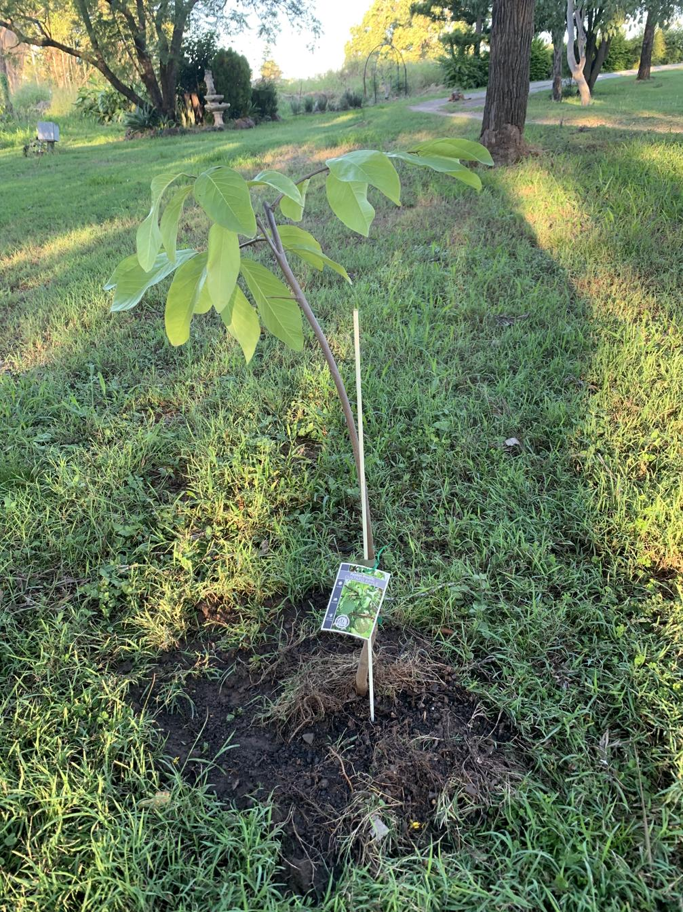

See also: [[individual-plants]], [[rocky-creek-frontage]]

A custard apple cultivar planted in the [[rocky-creek-frontage]] during the great March 2025 planting.

<figure markdown>

<caption>Custard apple (Paxton Prolific) in the rocky creek frontage, just after planting in March 2025</caption>
</figure>

[//begin]: # "Autogenerated link references for markdown compatibility"
[individual-plants]: individual-plants "Individual plants"
[rocky-creek-frontage]: ../rocky-creek-frontage "Rocky Creek Frontage"
[//end]: # "Autogenerated link references"