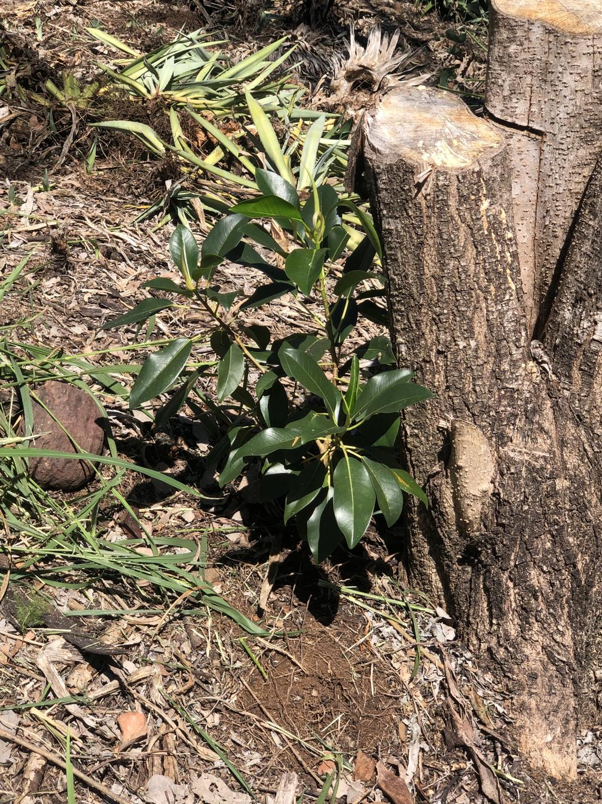

See also: [[individual-plants]], [[wood-duck-meadows]], [[plants]], [[gatton-creek-frontage]]

Making friends is one of the benefits of volunteering at [Redwood Park](https://fep.org.au/our-parks/redwood-park/) with the [Friends of the Escarpment Parks](https://fep.org.au). Friends who have surplus plants, including the odd ficus to give away. Planted in late 2024 in the [[gatton-creek-frontage]] this ficus is growing well. Thanks Gary.

!!! info "Early identification -- Ficus rubiginosa (Port Jackson fig)"

    [PlantNet](https://identify.plantnet.org/en-au/k-australia/species/Ficus%20rubiginosa%20Desf.%20ex%20Vent./data) identified the photo below as Ficus rubiginosa. To be revisited as it grows and fruits.

<figure markdown>

<caption>Gary's ficus (Ficus obliqua) growing well in the [[gatton-creek-frontage]] as of April, 2025</caption>
</figure>

[//begin]: # "Autogenerated link references for markdown compatibility"
[individual-plants]: individual-plants "Individual plants"
[wood-duck-meadows]: ../wood-duck-meadows "Wood duck meadows"
[plants]: ../plants/plants "Plants"
[gatton-creek-frontage]: ../gatton-creek-frontage "Gatton creek frontage"
[//end]: # "Autogenerated link references"