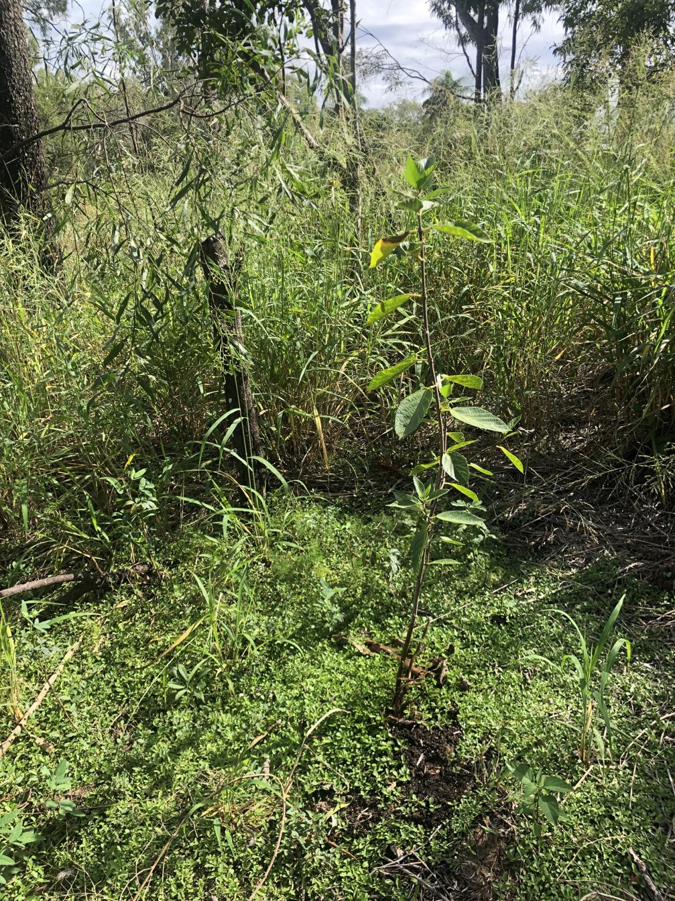

See also: [[individual-plants]], [[the-island]]

With [[the-dam]] level low during 2024 we planted out a [[sandpaper-fig]] onto [[the-island]]. Though we are yet to identify the specific type. [Cyclone Alfred](https://en.wikipedia.org/wiki/Cyclone_Alfred_(2025)) and a subsequent low kept the dam level high, making it interesting to water the fig.

<figure markdown>

<caption>Slowly growing sandpaper fig on the island surrounded by green panic grass</caption>
</figure>

[//begin]: # "Autogenerated link references for markdown compatibility"
[individual-plants]: individual-plants "Individual plants"
[the-island]: ../the-island "The Island"
[the-dam]: ../the-dam "The Dam"
[sandpaper-fig]: ../plants/sandpaper-fig "Sandpaper fig"
[//end]: # "Autogenerated link references"