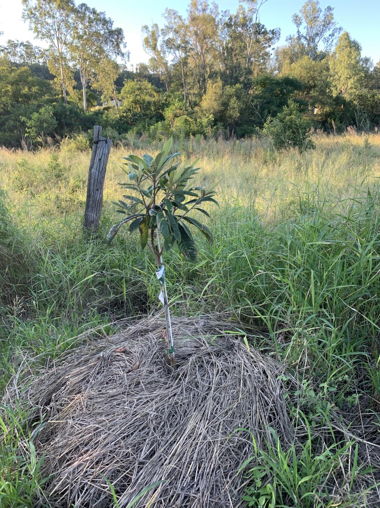

See also: [[individual-plants]], [[lower-dam]], [[wood-duck-meadows]]

Our first planting on the [[lower-dam]] was a [loquat](https://en.wikipedia.org/wiki/Loquat). A variety called _Honey Dew_, which is meant to develop larger fruits.

## Early photo

<figure markdown>

<caption>The loquat from the [[lower-dam]] a few months after planting.</caption>
</figure>

[//begin]: # "Autogenerated link references for markdown compatibility"
[individual-plants]: individual-plants "Individual plants"
[lower-dam]: ../lower-dam "The lower dam"
[wood-duck-meadows]: ../wood-duck-meadows "Wood duck meadows"
[//end]: # "Autogenerated link references"