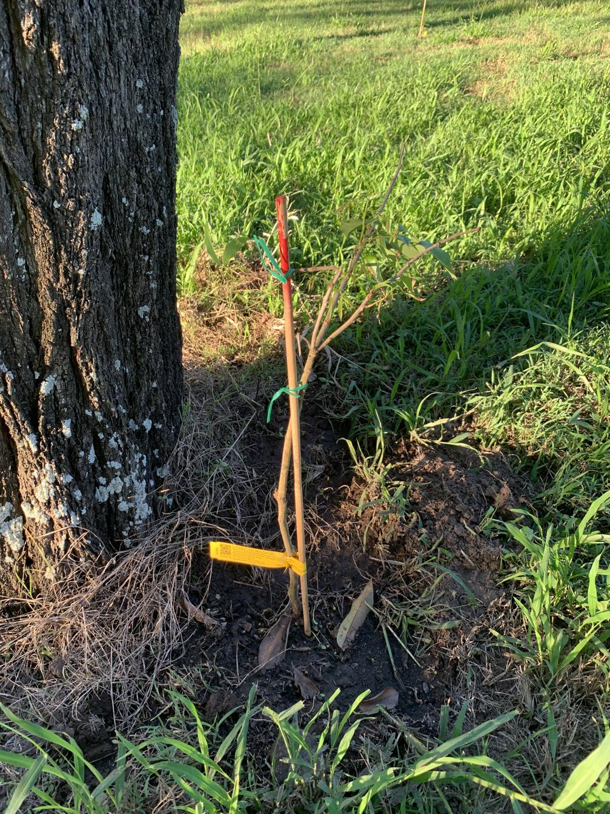

See also: [[individual-plants]], [[rocky-creek-frontage]]

Another of the fruit trees planted along the [[rocky-creek-frontage]] during the great planting of March, 2025. A lychee cultivar which is apparently "cherished for its exceptional sweetness and exquisite flavour". Another lychee cultivate - [[lychee-salathiel]] - is planted nearby.

<figure markdown>

<caption>Lychee (No Mai Chee) tree</caption>
</figure>

[//begin]: # "Autogenerated link references for markdown compatibility"
[individual-plants]: individual-plants "Individual plants"
[rocky-creek-frontage]: ../rocky-creek-frontage "Rocky Creek Frontage"
[lychee-salathiel]: lychee-salathiel "Lychee (Salathiel)"
[//end]: # "Autogenerated link references"