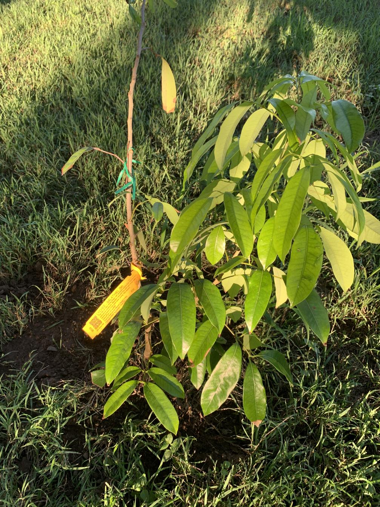

See also: [[individual-plants]], [[rocky-creek-frontage]]

Another lychee (see also [[lychee-no-mai-chee]]) planted along the [[rocky-creek-frontage]] in March 2025.

<figure markdown>

<caption>Lychee (Salathiel) sapling soon after planting in March, 2025</caption>
</figure>

[//begin]: # "Autogenerated link references for markdown compatibility"
[individual-plants]: individual-plants "Individual plants"
[rocky-creek-frontage]: ../rocky-creek-frontage "Rocky Creek Frontage"
[lychee-no-mai-chee]: lychee-no-mai-chee "Lychee (No Mai Chee)"
[//end]: # "Autogenerated link references"