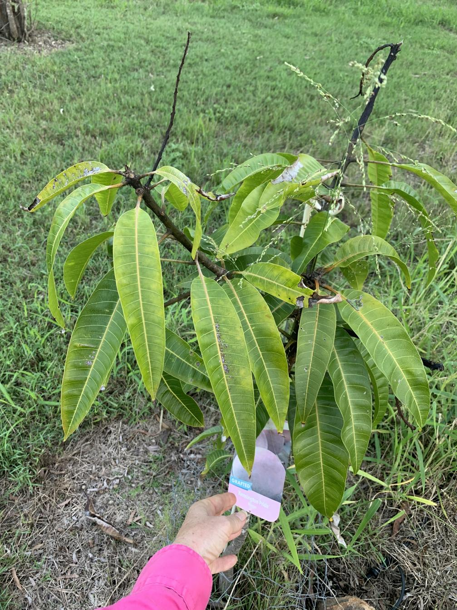

See also: [[individual-plants]], [[mango-paddock]]

An [Australian mango cultivar](https://en.wikipedia.org/wiki/Kensington_Pride) and the first mango planted in the [[mango-paddock]].

<figure markdown>

<figcaption>Mango tree planted in mango paddock</figcaption>
</figure>

[//begin]: # "Autogenerated link references for markdown compatibility"
[individual-plants]: individual-plants "Individual plants"
[mango-paddock]: ../mango-paddock "Mango paddock"
[//end]: # "Autogenerated link references"