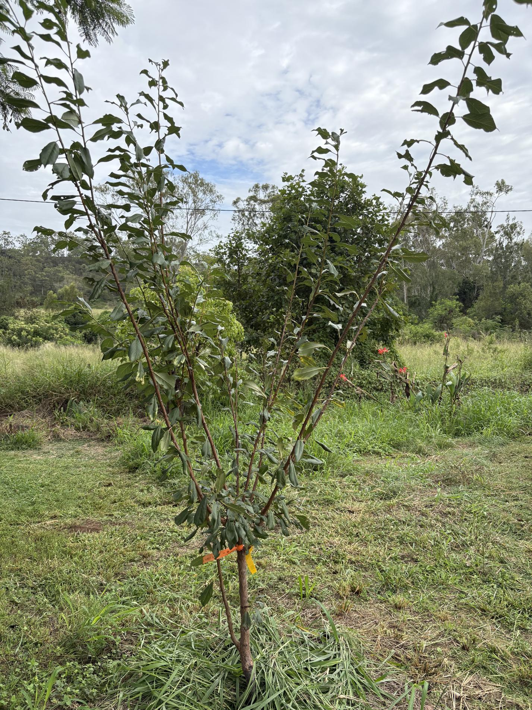

See also: [[individual-plants]], [[pecan-corner]], [[wood-duck-meadows]]

This [plumcot](https://en.wikipedia.org/wiki/Plucot) - a Spring Satin variety - was one of the fruit trees planted in the great planting of March 2025. It was planted on the edge of the [[pecan-corner]] edging onto [[pecan-corner]]

<figure markdown>

<figcaption>Plumcot tree planted in pecan corner</figcaption>
</figure>

[//begin]: # "Autogenerated link references for markdown compatibility"
[individual-plants]: individual-plants "Individual plants"
[pecan-corner]: ../pecan-corner "Pecan corner"
[wood-duck-meadows]: ../wood-duck-meadows "Wood duck meadows"
[//end]: # "Autogenerated link references"