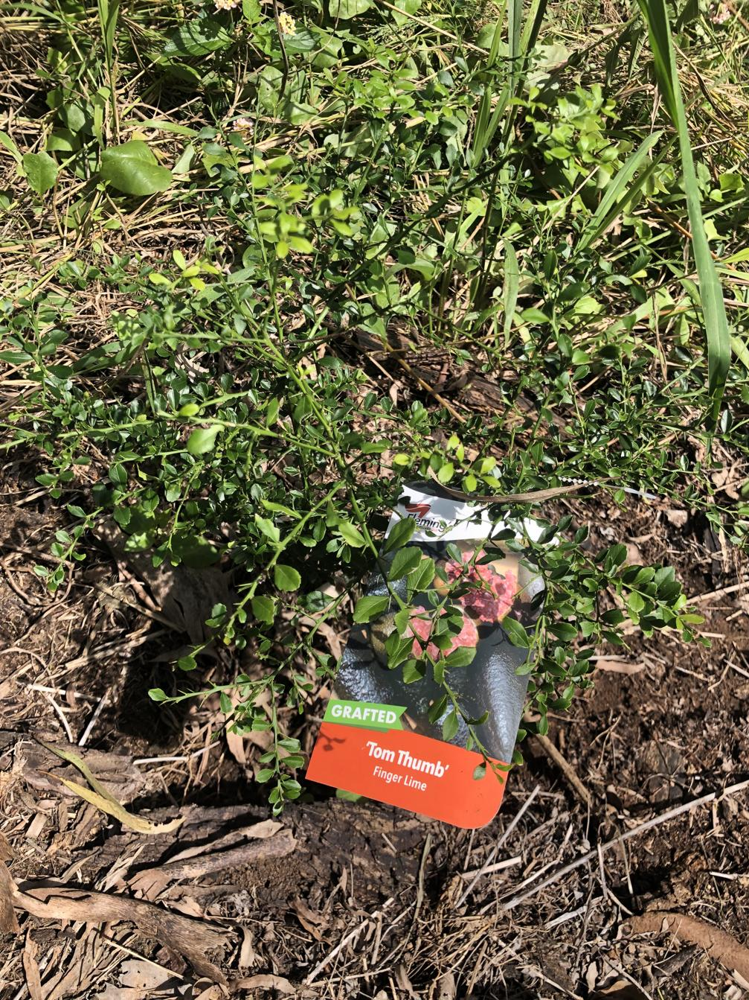

One of Sandy's numerous attempts to plant native food trees is this example of a finger lime ([Citrus australasica](https://en.wikipedia.org/wiki/Citrus_australasica)).

<figure markdown>
 
 <caption>Barely visible finger lime highlighted a bright identification card </caption>
</figure>

