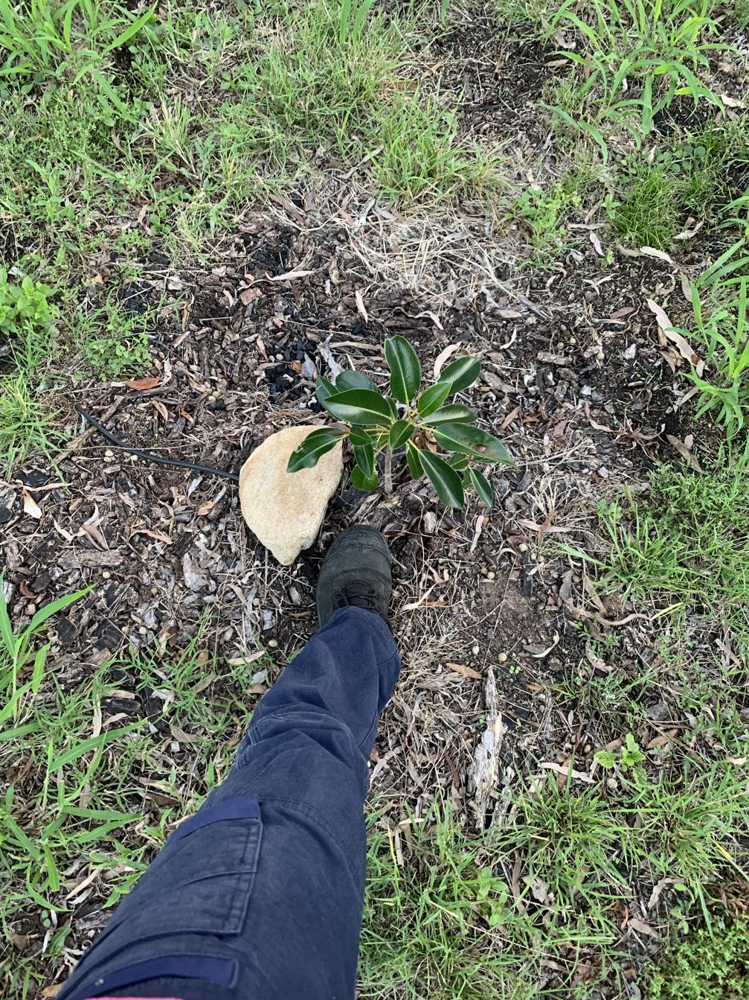

See also: [[individual-plants]]

Yet another (unknown) ficus planted in the great March planting of 2025 in the [[mango-paddock]]

<figure markdown>

<caption>The unknown ficus and a boot</caption>
</figure>

[//begin]: # "Autogenerated link references for markdown compatibility"
[individual-plants]: individual-plants "Individual plants"
[mango-paddock]: ../mango-paddock "Mango paddock"
[//end]: # "Autogenerated link references"