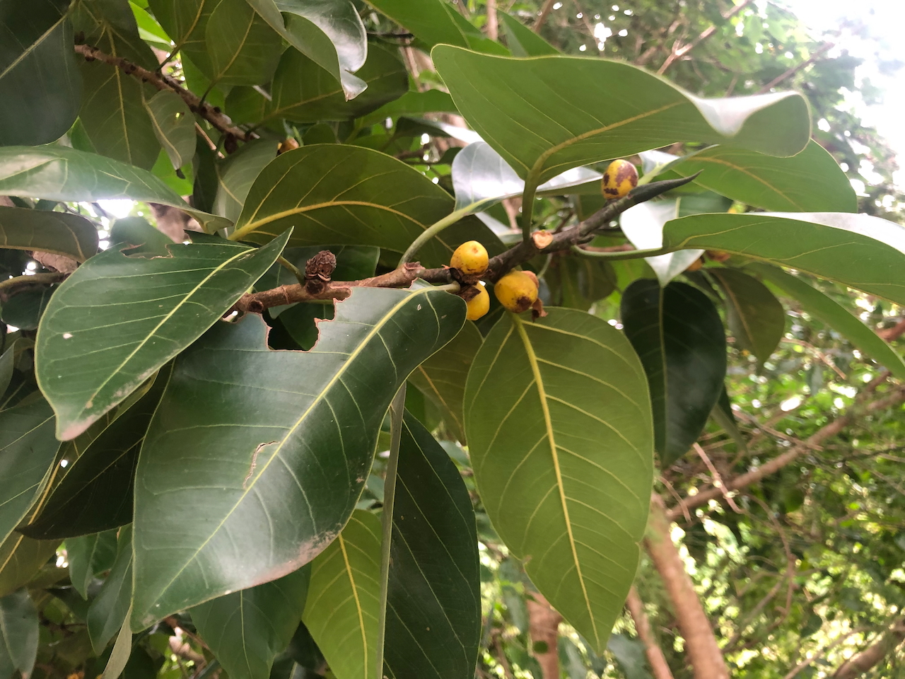

See also: [[plants]]

The [[roundabout]] includes a mature, very large Ficus (fig tree). We're yet to formally identify. At various stages we've labelled it a Moreton Bay fit or a Council tree (Ficus altissima).

## History at Wood Duck Meadows

The first was planted by previous owners in the [[roundabout]]. Hopefully many more to come.

<figure markdown>

<caption>Closeup of the leaves and fruit of the unknown ficus in the [[roundabout]]</caption>
</figure>

[//begin]: # "Autogenerated link references for markdown compatibility"
[plants]: ../plants/plants "Plants"
[roundabout]: ../roundabout "Roundabout"
[//end]: # "Autogenerated link references"