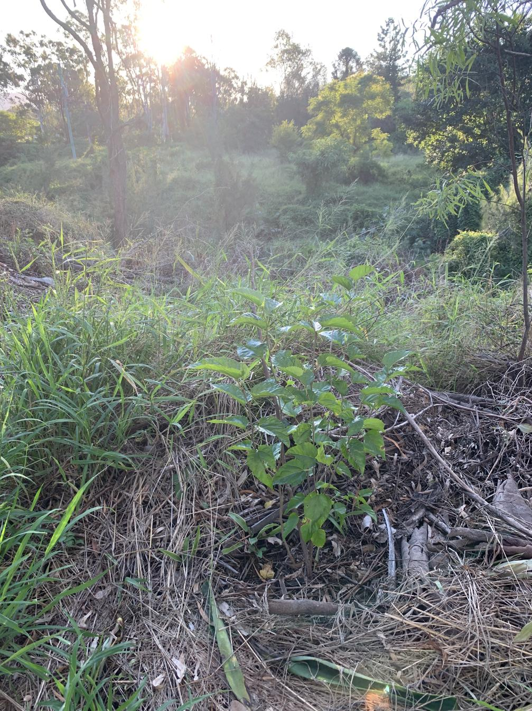

See also: [[individual-plants]], [[rocky-creek-frontage]]

This mulberry was planted out in 2023/2024 (or perhaps earlier) right on the border between the [[rounabout]] and the [[rocky-creek-frontage]]. The lack of identity indicates the level of care that's been given the plant. Even though it was been thriving more recently.

<figure markdown>

<caption>Artfully backlit shot of the unknown mulberry with the "wilds" of Rocky Creek visible in the background</caption>
</figure>

[//begin]: # "Autogenerated link references for markdown compatibility"
[individual-plants]: individual-plants "Individual plants"
[rocky-creek-frontage]: ../rocky-creek-frontage "Rocky Creek Frontage"
[//end]: # "Autogenerated link references"