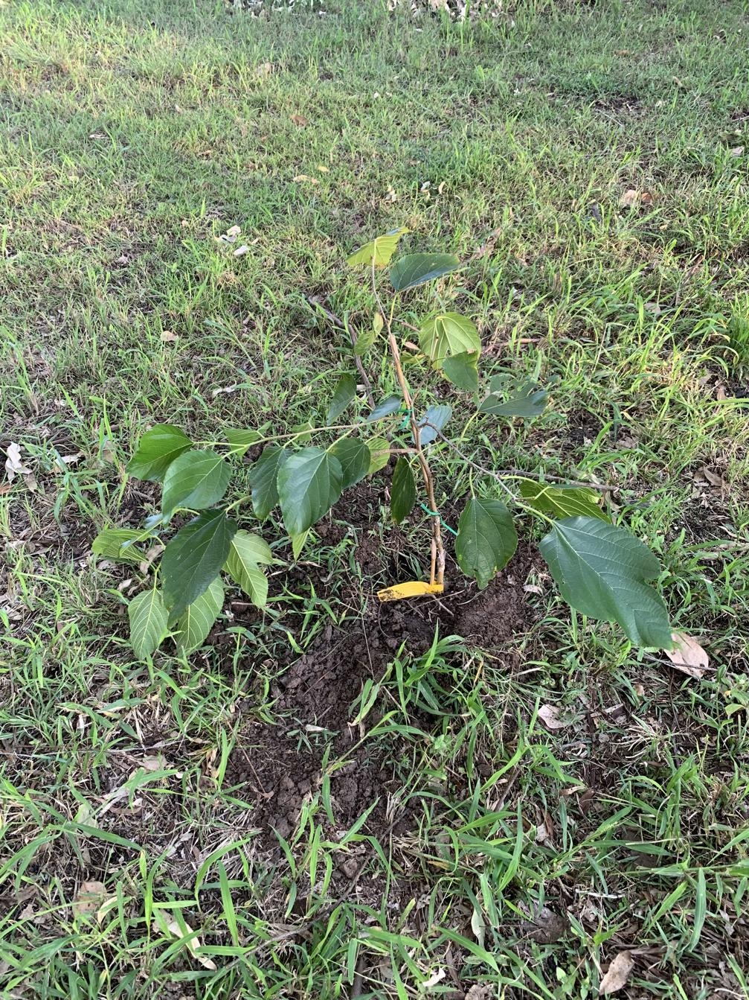

See also: [[individual-plants]], [[rocky-creek-frontage]], [[wood-duck-meadows]]

Located right on the border between the [[rocky-creek-frontage]] and the [[roundabout]] this example of [Morus macroura](https://en.wikipedia.org/wiki/Morus_macroura) was the second of the mulberry's planted.

<figure markdown>

<figcaption>Mulberry tree planted on the border between rocky creek frontage and roundabout</figcaption>
</figure>

[//begin]: # "Autogenerated link references for markdown compatibility"
[individual-plants]: individual-plants "Individual plants"
[rocky-creek-frontage]: ../rocky-creek-frontage "Rocky Creek Frontage"
[wood-duck-meadows]: ../wood-duck-meadows "Wood duck meadows"
[roundabout]: ../roundabout "Roundabout"
[//end]: # "Autogenerated link references"