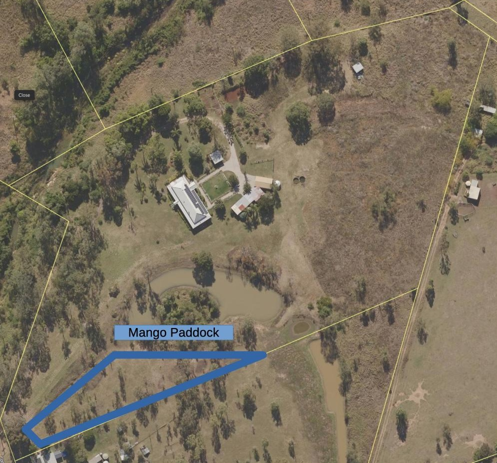

See also: [[wood-duck-meadows]]

The Mango paddock is a south-western paddock and titled after the two mango trees planted recently. It's also home to two [[bunya-pine]] trees, a fig tree, and miscellaneous other trees.

## Location

<figure markdown>

<caption>The Mango paddock is in the south-western portion of the property below the [[cherry-tree-walk]] and [[the-dam]] </caption>
</figure>

[//begin]: # "Autogenerated link references for markdown compatibility"
[wood-duck-meadows]: wood-duck-meadows "Wood duck meadows"
[bunya-pine]: plants/bunya-pine "Bunya Pine"
[//end]: # "Autogenerated link references"