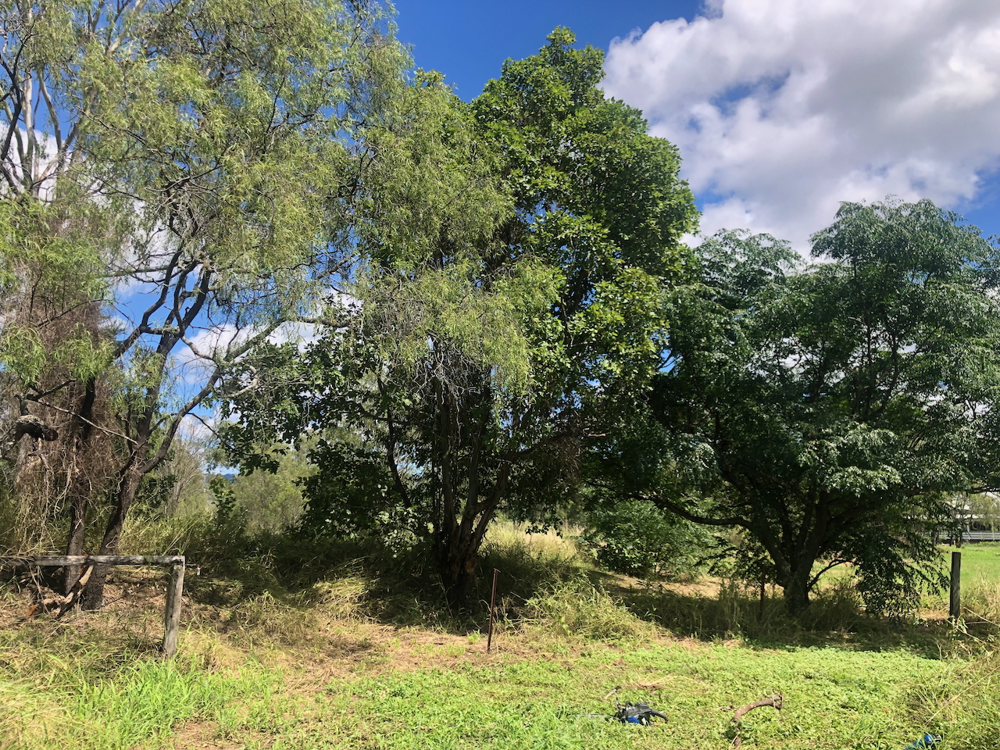

See also: [[wood-duck-meadows]]

Small orchard with 6 fruit trees planted around a collection of existing trees and along the bottom boundary of the property heading toward the dam.

!!! info "Current status"

    Half a dozen fruit trees have been planted around a collection of existing trees that include gums, [[schinus-terebinthifolia]] and [[corymbia-torelliana]]

<figure markdown>

<caption>The corner's existing trees after the [[schinus-terebinthifolia]] was removed and just before the removal of the [[corymbia-torelliana]] (the middle tree)</caption>
</figure>

## Location 

<figure markdown>

<caption>Orchard corner located along the south-eastern boundary of Wood duck meadows, just to the east of [[the-dam]]</caption>
</figure>

## History

| Date | Work |
| --- | --- |
| Mar 2025 | Remove [[asparagus-africanus]] regrowth and cut down [[schinus-terebinthifolia]] tree Commence removal of the  [[corymbia-torelliana]] tree |
| 2024 | Initial removal of [[asparagus-africanus]] |

[//begin]: # "Autogenerated link references for markdown compatibility"
[wood-duck-meadows]: wood-duck-meadows "Wood duck meadows"
[asparagus-africanus]: plants/asparagus-africanus "Asparagus africanus (Climbing asparagus fern)"
[schinus-terebinthifolia]: plants/schinus-terebinthifolia "Schinus Terebinthifolia (Brazilian pepper tree)"
[corymbia-torelliana]: plants/corymbia-torelliana "corymbia-torelliana"
[//end]: # "Autogenerated link references"