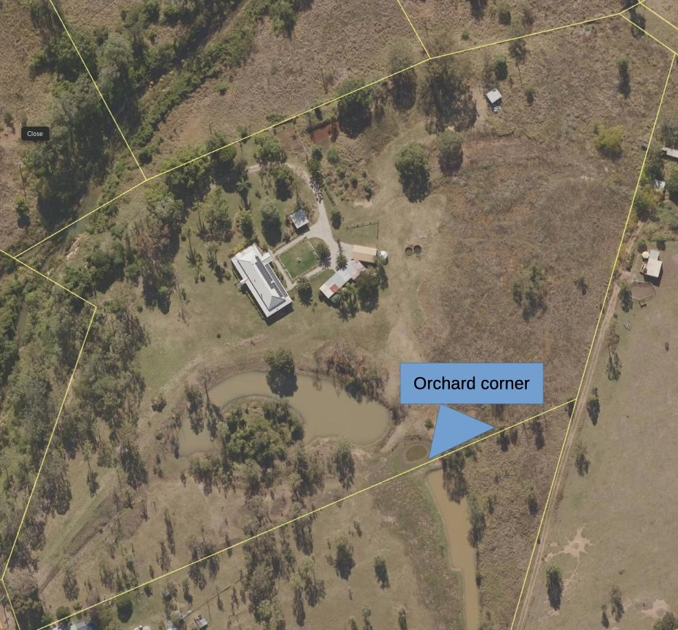

See also: [[wood-duck-meadows]]

Small orchard with 6 fruit trees.

!!! info "Current status"

    **2025** Follow up removal of [[asparagus-africanus]] and [[schinus-terebinthifolia]] tree

    **2024** Initial clean up of [[asparagus-africanus]]

    **2023** Numerous fruit trees planted

## Location 

<figure markdown>

<caption>Orchard corner located along the south-eastern boundary of Wood duck meadows, just to the east of [[the-dam]]</caption>
</figure>

## History

| Date | Work |
| --- | --- |
| 2024 | Initial removal of [[asparagus-africanus]] |
| Mar 2025 | Remove [[asparagus-africanus]] regrowth and cut down [[schinus-terebinthifolia]] tree |

[//begin]: # "Autogenerated link references for markdown compatibility"
[wood-duck-meadows]: wood-duck-meadows "Wood duck meadows"
[asparagus-africanus]: plants/asparagus-africanus "Asparagus africanus (Climbing asparagus fern)"
[schinus-terebinthifolia]: plants/schinus-terebinthifolia "Schinus Terebinthifolia (Brazilian pepper tree)"
[//end]: # "Autogenerated link references"