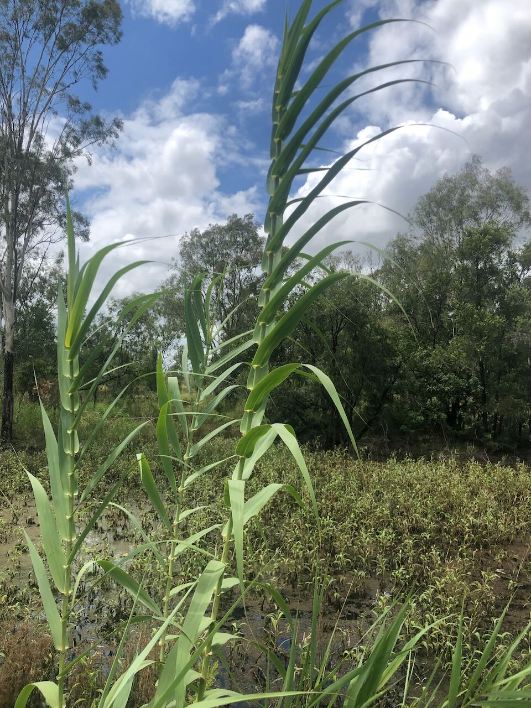

See also: [[plants]]

Elephant Grass (aka Giant Reed) is a large perennial grass that is [weed in Australia](https://weeds.org.au/profiles/giant-reed-elephant/). Can be removed in small batches, but rhizomes need to be removed. Cut stump and foliar spraying are other options. 

## History at Wood Duck Meadows

Stumbled across some growing along the dam bank whilst removing [[schinus-terebinthifolia]]. 

<figure markdown>

<figcaption>Hey look, Elephant Grass</figcaption>
</figure>

[//begin]: # "Autogenerated link references for markdown compatibility"
[plants]: plants "Plants"
[schinus-terebinthifolia]: schinus-terebinthifolia "Schinus Terebinthifolia"
[//end]: # "Autogenerated link references"