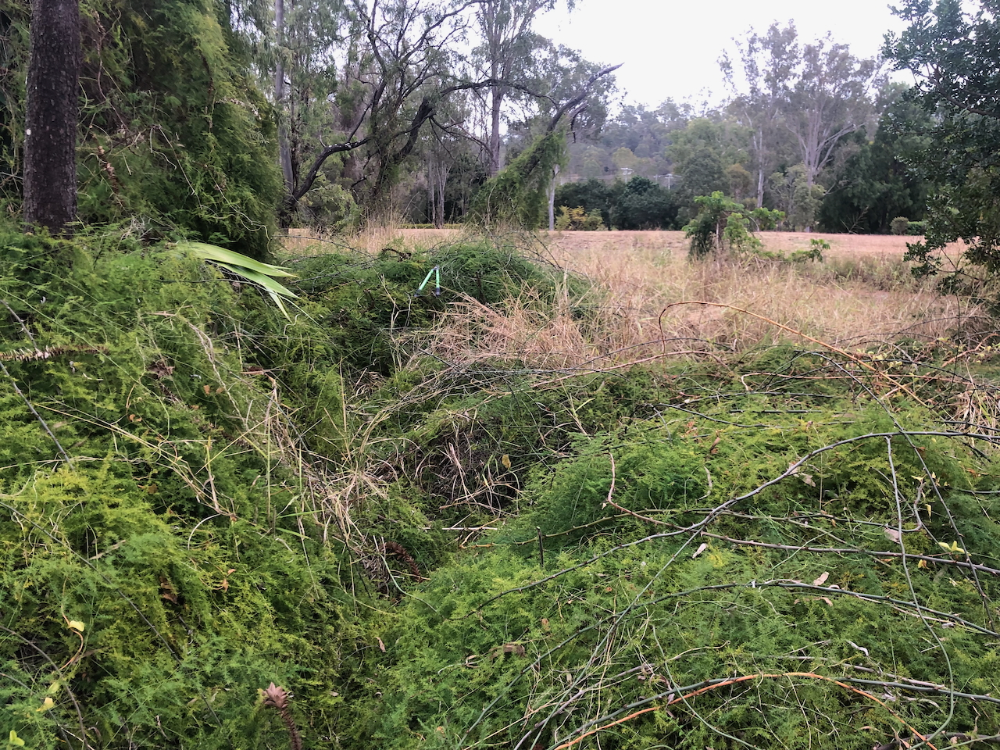
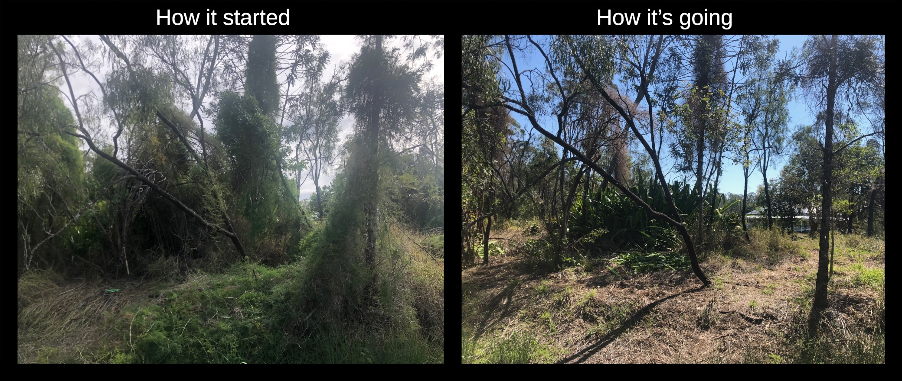

See also: [[plants]]

Climbing asparagus (Asparagus africanus) is the first [environmental weed](https://weeds.brisbane.qld.gov.au/weeds/climbing-asparagus-fern) aggressively removed from [[wood-duck-meadows]]. Where it grew as a long-lived climber with prickly stems with tiny "leaves" giving a fern-like appearance.

<figure markdown>

<caption>Numerous "shrubs" formed by Asparagus africanus sprawling over long grass (early work on [[the-island]])</caption>
</figure>

## Wood duck meadows

Asparagus africanus has been found throughout [[wood-duck-meadows]], including: [[the-island]]; on the [[gatton-creek-frontage]] near the [[lower-dam]]; [[orchard-corner]]; on the [[fig-tree-berm]]; within the [[brigalow-scrub]]; and, other areas at the front of the property. 

All removal has been done by hand. Often requiring two or three passes to remove entirely.

<figure markdown>

<caption>Before and after clearing of Asparagus africanus from [[the-island]]</caption>
</figure>

[//begin]: # "Autogenerated link references for markdown compatibility"
[plants]: plants "Plants"
[wood-duck-meadows]: ../wood-duck-meadows "Wood duck meadows"
[the-island]: ../the-island "The Island"
[gatton-creek-frontage]: ../gatton-creek-frontage "Gatton creek frontage"
[lower-dam]: ../lower-dam "The lower dam"
[orchard-corner]: ../orchard-corner "The Orchard (Orchard corner)"
[fig-tree-berm]: ../fig-tree-berm "Fig tree berm"
[brigalow-scrub]: ../brigalow-scrub "Brigalow scrub"
[//end]: # "Autogenerated link references"