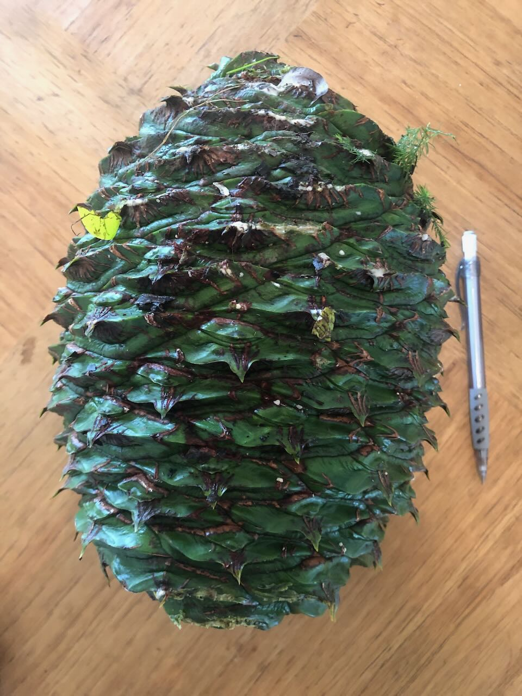
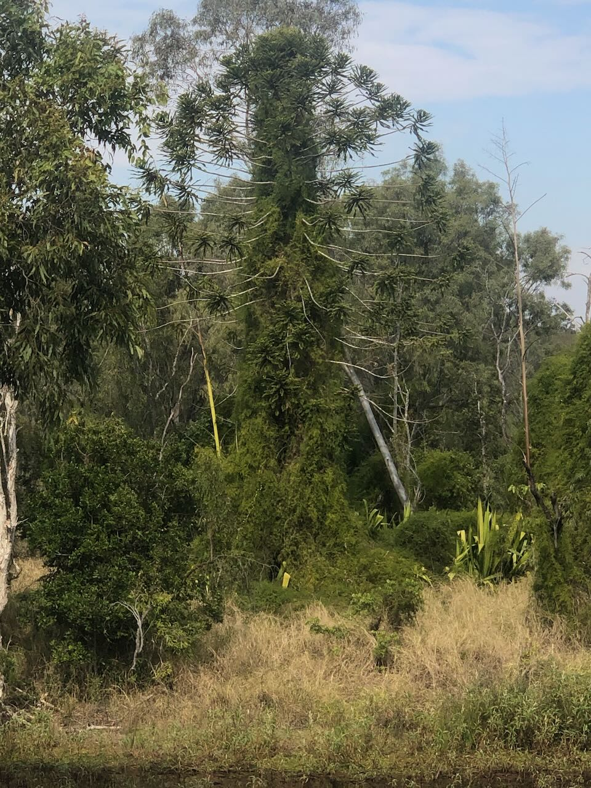
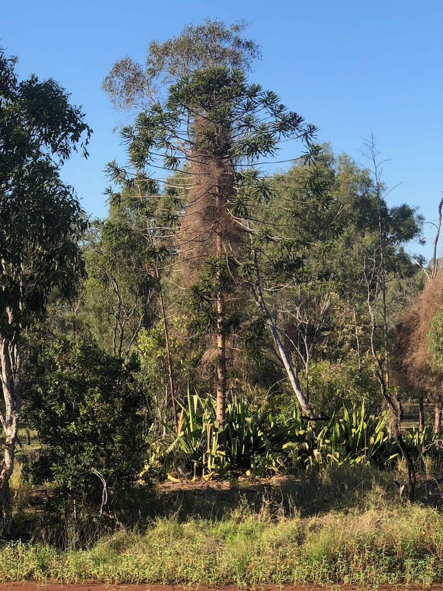

See also: [[plants]]

The [bunya pine (Araucaria bidwillii)](https://theconversation.com/bunya-pines-are-ancient-delicious-and-possibly-deadly-96003) is a evergreen coniferous tree that can grow up to 50m tall. It is native to our local area (south-east Queensland) and have been labelled [as "living fossils"](https://theconversation.com/bunya-pines-are-ancient-delicious-and-possibly-deadly-96003) arising during the Jurassic period.

There are at least four bunya pines at [[wood-duck-meadows]]. One on [[the-island]], two near the [[brigalow-scrub]], and one on the edge of the [[gatton-creek-frontage]].

## Bunya pine cone

The pine cones are large (amongst the largest produced by conifers) and dangerous. Roughly the size of rugby ball (up to 30cm long and 20cm wide) and weighing up to 10 kilograms. Falling from the top of the tree they make an impact.

<figure markdown>

<caption>Our first (found) Bunya Pine Cone</caption>
</figure>

## Uses

Bunya nuts (from the pine cone) are edible and were an important food source for local indigenous people. There are numerous web pages and videos explaining how to prepare and eat them. The following is a distillation.

### Extract the nuts from the cone

The cone is very tough but may contain 40+ nuts. The cone needs to be pulled apart to extract the nuts. Advice differs. Some suggest doing this ASAP as the husk dries out and becomes harder. Others suggest leaving the cone in the sun for at least a day to make it easier.  

### Extract the nut flesh from the nut shell

Nuts are encased in a very hard shell. The flesh needs to be removed from the shell. Methods include:

- Boiling until the shell softens and opens up. This can take up to and beyond 60 minutes boiling. Once opened up the shell must be cut in half.
- Focused brute force using a hammer or rock (not recommended).
- More technical methods, for example using [garden loopers held in place via a vice](https://www.littleecofootprints.com/2015/03/how-to-open-and-cook-bunya-nuts.html)

### Removing the cotyledon (optional)

The cotyledon forms the centre of the nut. Some suggest it is either not edible and/or causes stomach issues. History seems to suggest that indigenous people left it.

Removing the cotyledon can be done by squeezing from the sides nuts that have been split in half. Squeezing the cotyledon out.

### Cooking

The nuts can be eaten raw but it's suggested they are tastier cooked. Options include:

- stir-fryed with oil, garlic etc. 
- roasted.
- ground up and used in baking (e.g. flat breads)
- boiled and eaten as is or further preparation (e.g. used like gnochi)

## History at Wood Duck Meadows

### Bunya Pines at Wood Duck Meadows

- [[the-original-island-bunya-pine]] - the one pictured below in the section ["2024 clearing the island"](#2024-clearing-the-island)

### 2024 clearing the island 

The bunya pine on [[the-island]] - like much of [[the-island]] - was suffering from the impact of [[asparagus-africanus]]. The following images illustrate our work to rescue it.

<figure markdown>

<caption>The island's Bunya Pine being suffocated by asparagus fern</caption>
</figure>

Clearing the asparagus fern from around the tree left disconnected vines high in the bunya pine tree. As illustrated in the following image, this vine died.

<figure markdown>

<caption>Evidence of the asparagus fern dying</caption>
</figure>

### 2025 bunya nut season

The pine cone shown above was the first found (Jan 14) of the 2025 bunya nut season.

## References

- [Bunya Pine](https://en.wikipedia.org/wiki/Araucaria_bidwillii) on Wikipedia
- [Bunya pines are ancient, delicious, and possibly deadly](https://theconversation.com/bunya-pines-are-ancient-delicious-and-possibly-deadly-96003)

[//begin]: # "Autogenerated link references for markdown compatibility"
[plants]: plants "Plants"
[wood-duck-meadows]: ../wood-duck-meadows "Wood duck meadows"
[the-island]: ../the-island "The Island"
[brigalow-scrub]: ../brigalow-scrub "Brigalow scrub"
[gatton-creek-frontage]: ../gatton-creek-frontage "Gatton creek frontage"
[the-original-island-bunya-pine]: the-original-island-bunya-pine "The original island bunya pine"
[asparagus-africanus]: asparagus-africanus "Asparagus africanus (Climbing asparagus fern)"
[//end]: # "Autogenerated link references"