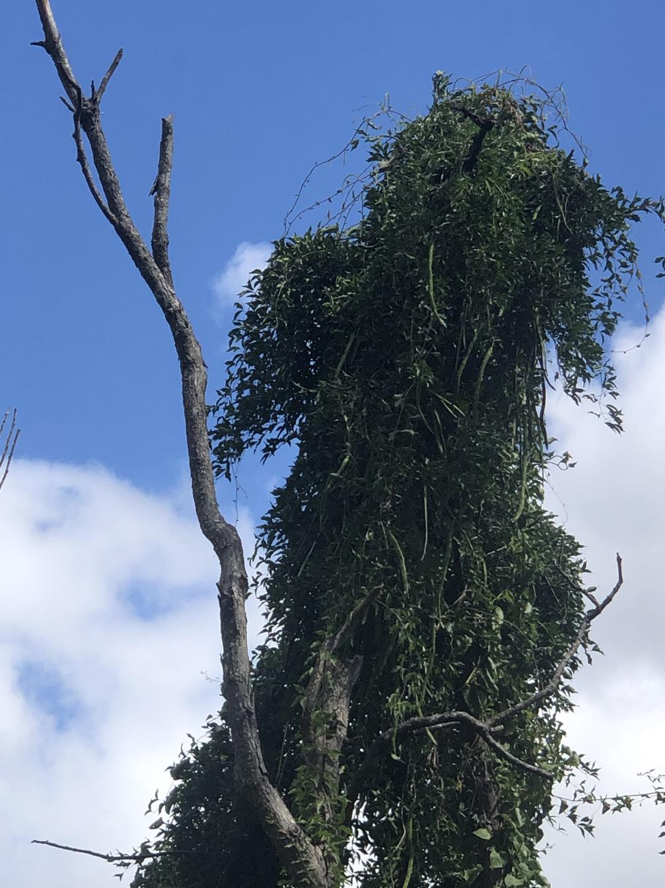

[Cat's claw creeper](https://en.wikipedia.org/wiki/Dolichandra_unguis-cati) is a woody vine native to central/southern America and the Caribbean. A long-lived, aggressive climber considered [one of the worst weeds in Australia](https://profiles.ala.org.au/opus/weeds-australia/profile/Dolichandra%20unguis-cati) and is known to smother native vegetation.

Seeds are winged (2 papery wings), 2-4cm long and contained in seedpods 15-45cm long. Flowering in spring and summer. Leaves are oblong ovals with a pointed tip, usually in groups of two leaflets (opposite). The climbing stems are green and hairy with three-pronged tendrils.

<figure markdown>

<caption>Cat's claw creeper smothering a dead tree in Rocky Creek near the [[roundabout]]</caption>
</figure>

## Control

Difficult, multiple methods more successful.

For large plants 

- Cut the climbing stems at about 1-2m above ground leaving the aerial parts to die. 
- Re-cut all stems as close to the ground as possible.
- Cut and scrape the stumps of thicker stems.
- APply herbicide to the scraped surface within 15 seconds

Do not pull climbing stems out of the canopy to avoid damaging desirable plants. Physically cut all stems, perhaps spraying with round-up. Check and treat for at least 5 years. Dig out tubers as much as possible. Larger, older tuber mass removal may not be suitable due to soil disturbance.

Remove tubers from site.

Spray new growth.

## Experience

Initial introduction when working with the [Friends of Redwood Park](https://fep.org.au/our-parks/redwood-park/) where it is one of the major weeds. 

Subsequent identification on [[wood-duck-meadows]], but very obvious and widespread in the Gatton and Rocky creeks running alongside the property.

## References

- [Weeds Brisbane](https://weeds.brisbane.qld.gov.au/weeds/cats-claw-creeper) - good info
- [NSW DPI](https://weeds.dpi.nsw.gov.au/Weeds/Details/33) includes numerous images included above
- [Qld government PDF](https://www.publications.qld.gov.au/ckan-publications-attachments-prod/resources/3b1dfe71-8d68-409a-a2ad-a9e2739432c0/cats-claw-creeper.pdf?ETag=0167385ad2e69f2c7f0b664fd76697e1)

[//begin]: # "Autogenerated link references for markdown compatibility"
[wood-duck-meadows]: ../wood-duck-meadows "Wood duck meadows"
[//end]: # "Autogenerated link references"