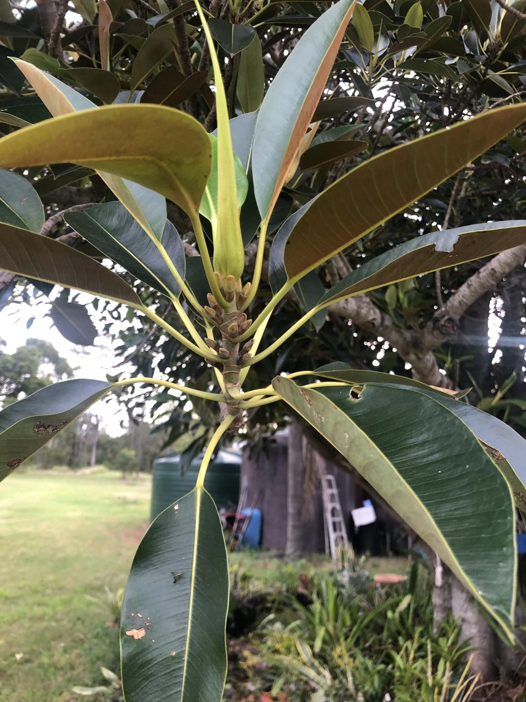

The [Moreton Bay fig (Ficus macrophylla)](https://en.wikipedia.org/wiki/Ficus_macrophylla) is a large evergreen tree native to eastern Australia. Broad, leathery leaves and distinctive aerial roots that can grow down from the branches to the ground - it is a banyan.  

<figure markdown>

<caption>Leaves from the Moreton Bay fig behind the shed. The typical reddish tinge visible underneath the leaves.</caption>
</figure>

## Wood duck meadows

After a bit of uncertainty we figured out in April 2025 that the existing fig behind the stables near the the [[house]] is a Moreton Bay fig. As of April 2025 numerous seedlings have been developed and will be planted elsewhere on the property.

[//begin]: # "Autogenerated link references for markdown compatibility"
[house]: ../house "House"
[//end]: # "Autogenerated link references"