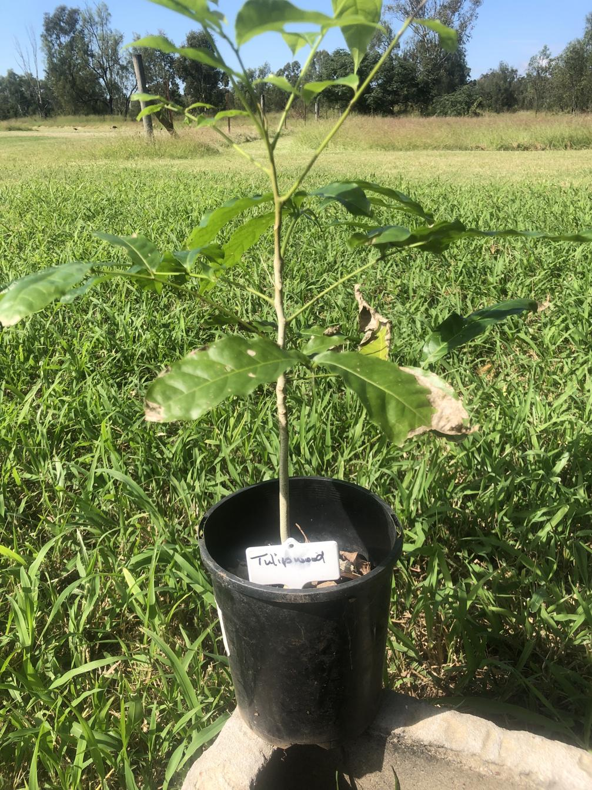

[Harpullia pendula](https://en.wikipedia.org/wiki/Harpullia_pendula) (aka Moreton Bay Tulipwood) is a dry rainforest tree endemic to Eastern Australia.

## History at [[wood-duck-meadows]]

Existing mature tree planted by previous owners in the the [[roundabout]] not far from the [[unknown-ficus]].

Hugh and Kay donated a Tulipwood sapling in April, 2025. Remains some uncertainty about the exact species of [Australian tulipwood](https://en.wikipedia.org/wiki/Tulipwood#Australian) it is.

<figure markdown>

<caption>H&K's donated sapling</caption>
</figure>

## Resources

[SOWN page](https://sown.com.au/harpullia-pendula-sapindacea-australian-tulipwood/)

[//begin]: # "Autogenerated link references for markdown compatibility"
[wood-duck-meadows]: ../wood-duck-meadows "Wood duck meadows"
[roundabout]: ../roundabout "Roundabout"
[unknown-ficus]: ../individual-plants/unknown-ficus "Unknown ficus"
[//end]: # "Autogenerated link references"