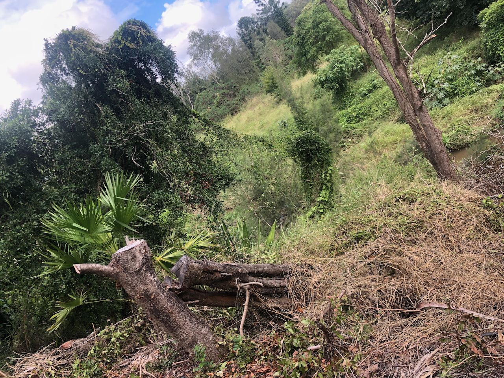

See also: [[plants]], [[macadamia]]

A small to medium rainforest tree native to northern NSW and southern QLD. Growing to 15/20 metres tall producing edible nuts. It is listed as vulnerable.

## Wood duck meadows

After doing some work clearing the [[roundabout]] we discovered a mature macadamia integrifolia growing just down the creek bank covered in [[cats-claw-creeper]] and [[madeira-vine]]. 

<figure markdown>

<caption>A macadamia integrifolia hiding under a curtain of [[cats-claw-creeper]] and [[madeira-vine]]</caption>
</figure>

[//begin]: # "Autogenerated link references for markdown compatibility"
[plants]: plants "Plants"
[macadamia]: macadamia "Macadamia"
[roundabout]: ../roundabout "Roundabout"
[cats-claw-creeper]: cats-claw-creeper "Cats claw creeper"
[madeira-vine]: madeira-vine "Madeira vine"
[//end]: # "Autogenerated link references"