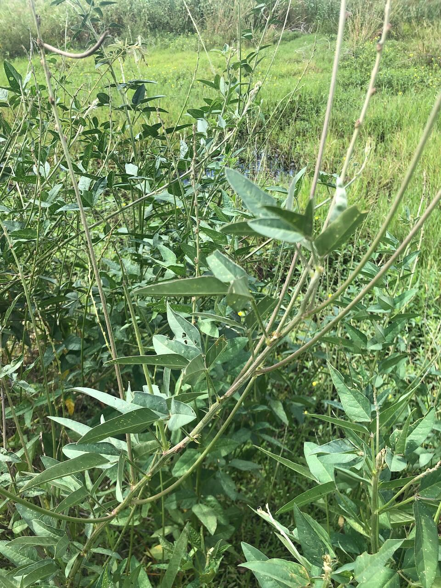

[Macroptilium lathyroides (aka Phasey Bean)](https://en.wikipedia.org/wiki/Macroptilium_lathyroides) is a legume native to the Americas and introduced to Queensland as a pasture legume and is now [considered a weed](https://en.wikipedia.org/wiki/Macroptilium_lathyroides).

## History at Wood Duck Meadows

Found growing on the [[fig-tree-berm]] in February 2025.

<figure markdown>

<caption>Phasey Bean</caption>
</figure>

[//begin]: # "Autogenerated link references for markdown compatibility"
[fig-tree-berm]: ../fig-tree-berm "Fig tree berm"
[//end]: # "Autogenerated link references"