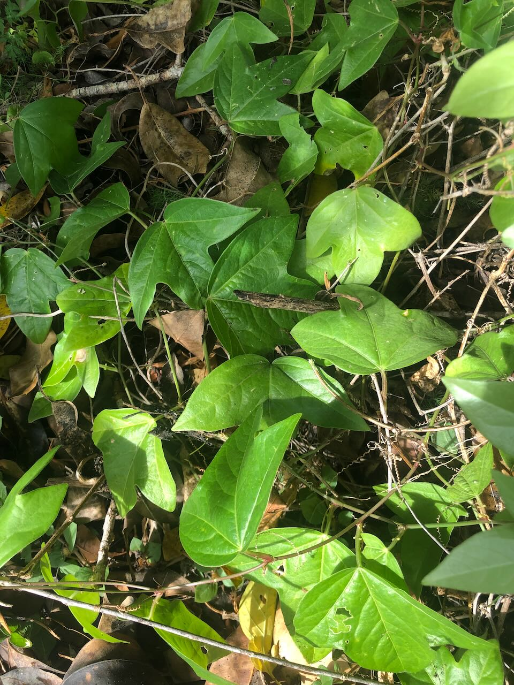

See also: [[plants]]

[Passiflora suberosa (aka Corky passion vine)](https://en.wikipedia.org/wiki/Passiflora_suberosa) is a creeping/climbing perennial native to the Americas.
It is considered an [environmental weed in Queensland](https://weeds.brisbane.qld.gov.au/weeds/corky-passion-vine).

<figure markdown>

<caption>Corky passion vine</caption>
</figure>

## History at Wood Duck Meadows

First identified growing on the [[fig-tree-berm]] in February 2025, increasingly evidence of small incursions in other areas.

[//begin]: # "Autogenerated link references for markdown compatibility"
[plants]: plants "Plants"
[fig-tree-berm]: ../fig-tree-berm "Fig tree berm"
[//end]: # "Autogenerated link references"