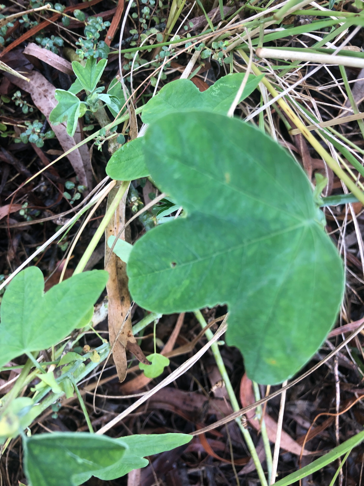

See also: [[plants]]

Vine with slender stems, small white flowers and pale green with three rounded lobes. [Considered an environmental weed](https://weeds.brisbane.qld.gov.au/weeds/white-passionflower) in Queensland and NSW.

<figure markdown>

<caption>White passionflower vine found on the southern edge of [[the-dam]]</caption>
</figure>

## Wood duck meadows

Spotted creeping slowly through in numerous places at [[wood-duck-meadows]] including [[the-dam]]. Generally not as widespread as [[passiflora-suberosa]] (Corky passionvine).

[//begin]: # "Autogenerated link references for markdown compatibility"
[plants]: plants "Plants"
[wood-duck-meadows]: ../wood-duck-meadows "Wood duck meadows"
[the-dam]: ../the-dam "The Dam"
[passiflora-suberosa]: passiflora-suberosa "Passiflora suberosa (Corky passion vine)"
[//end]: # "Autogenerated link references"