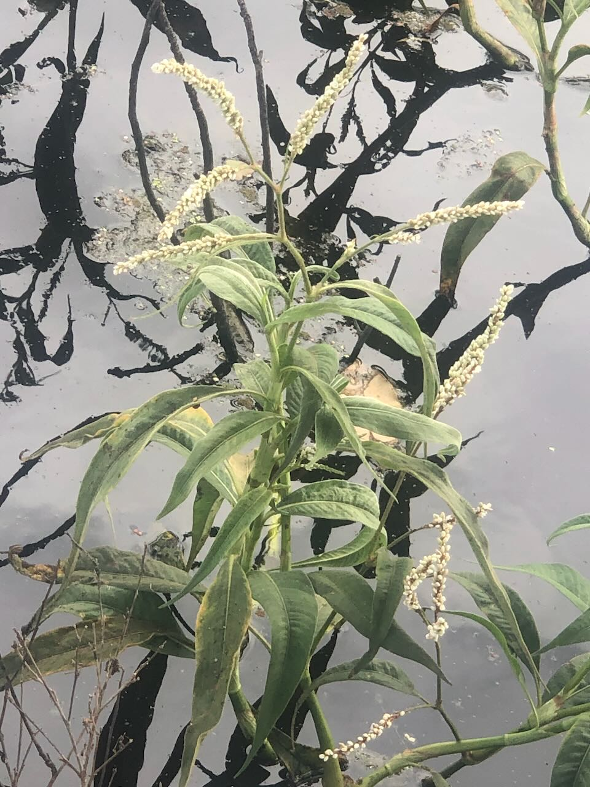

See also: [[plants]]

Tentative identification of plant growing profusely in [[the-dam]] around [[the-island]]. Not a lot of resources found after a quick search online.

<figure markdown>

<caption>Senegal knotweed growing in the dam</caption>
</figure>

[//begin]: # "Autogenerated link references for markdown compatibility"
[plants]: plants "Plants"
[the-dam]: ../the-dam "The Dam"
[the-island]: ../the-island "The Island"
[//end]: # "Autogenerated link references"