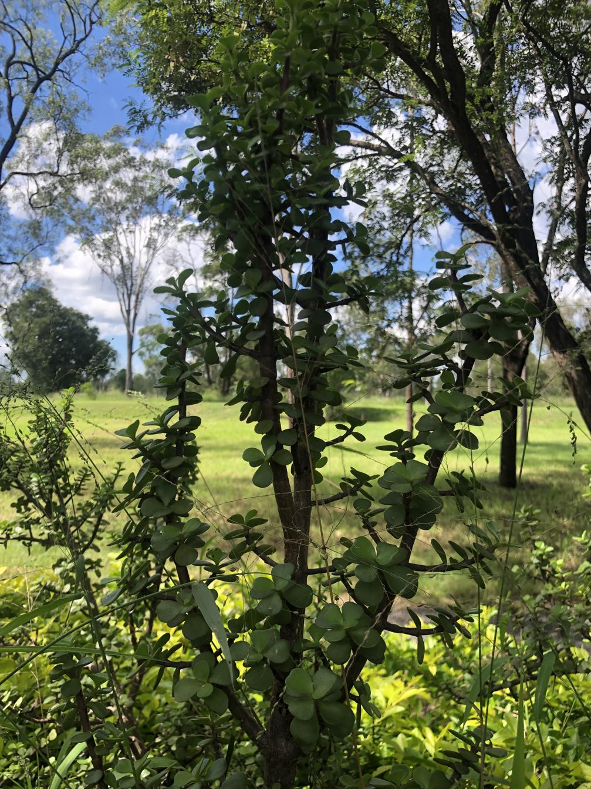

See also: [[plants]], [[wood-duck-meadows]]

A small-leaved succulent from South Africa, [[portulacaria-afra]] (aka Elephant bush) is a drought-tolerant shrub or small tree. Given its apparent non-invasiveness, existing plants will be retained.

## History at [[wood-duck-meadows]]

Identified in April 2025, [[portulacaria-afra]] has been present in the [[gatton-creek-frontage]] for many years. 

<figure markdown>

<caption>Portulacaria afra (Elephant bush) on April 5, 2025</caption>
</figure>

[//begin]: # "Autogenerated link references for markdown compatibility"
[plants]: plants "Plants"
[wood-duck-meadows]: ../wood-duck-meadows "Wood duck meadows"
[portulacaria-afra]: portulacaria-afra "Portulacaria afra (Elephant bush)"
[gatton-creek-frontage]: ../gatton-creek-frontage "Gatton creek frontage"
[//end]: # "Autogenerated link references"