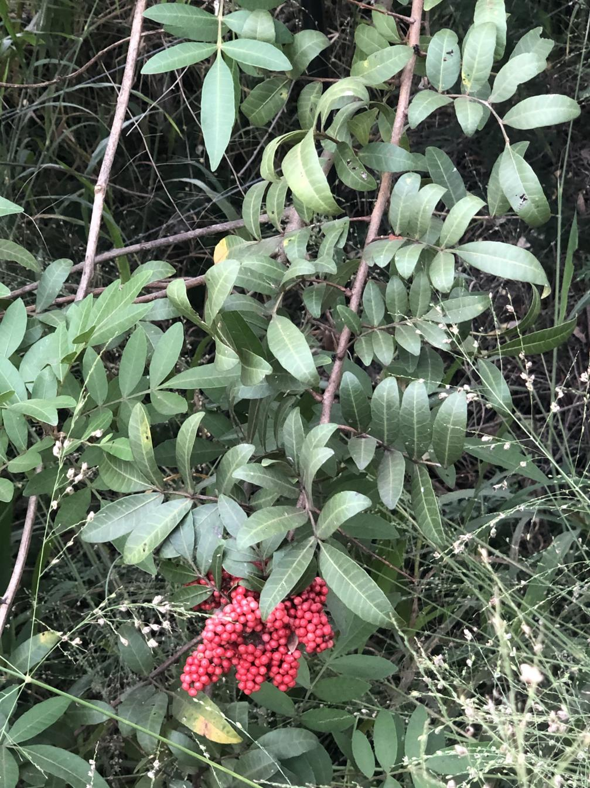

See also: [[plants]]

The Schinus Terebinthifolia (aka Brazilian pepper tree) is a small tree that can grow up to 10m tall. It is native to South America and is considered a weed in Australia. 

## History at Wood Duck Meadows

Apparently planted by previous owners. Visible and removed from the [[roundabout]] and [[the-island]]. However, not before it's influence has spread. With odd "pepper trees" popping up all over the place, including a mini-forest of them growing beneath the [[roundabout]] in Rocky Creek. Late January/early February 2025 saw a concerted effort at removal. An on-going effort that continued to reveal just how effectively Schinus Terebinthifolia can spread with small and larger examples being found everywhere.

<figure markdown>

<caption>Closeup of fruit and leaves of one of the Schinus Terebinthifolia (Brazilian pepper) trees from the [[roundabout]]</caption>
</figure>

<figure markdown>

<caption>Before & after of the pepper tree mini-forest - 2 Feb 2025</caption>
</figure>

[//begin]: # "Autogenerated link references for markdown compatibility"
[plants]: plants "Plants"
[roundabout]: ../roundabout "Roundabout"
[the-island]: ../the-island "The Island"
[//end]: # "Autogenerated link references"