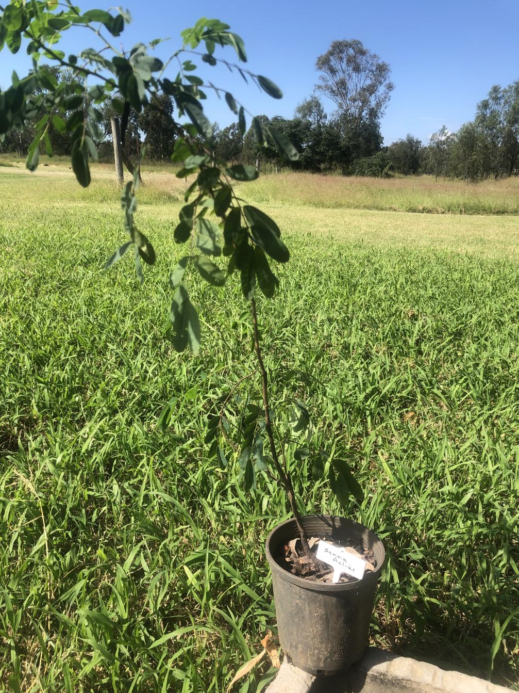

See also: [[plants]], [[wood-duck-meadows]]

[Senna acclinis](https://en.wikipedia.org/wiki/Senna_acclinis), commonly known as rainforest cassia or brush senna, is a shrub native to the rainforests of eastern Australia. Is [bee friendly](https://sown.com.au/senna-acclinis-caesalpinaceae-edge-senna/) and two butterflies - Small Grass-yellow and Yellow Migrant - breed on it.

Threatened by habitat clearance, invasive weeds, timber harvesting, and accidental removal during weed control.

## History at [[wood-duck-meadows]]

Hugh and Kay provided a young plant in April, 2025.

<figure markdown>

<caption>H&K's donated Senna</caption>
</figure>

[//begin]: # "Autogenerated link references for markdown compatibility"
[plants]: plants "Plants"
[wood-duck-meadows]: ../wood-duck-meadows "Wood duck meadows"
[//end]: # "Autogenerated link references"