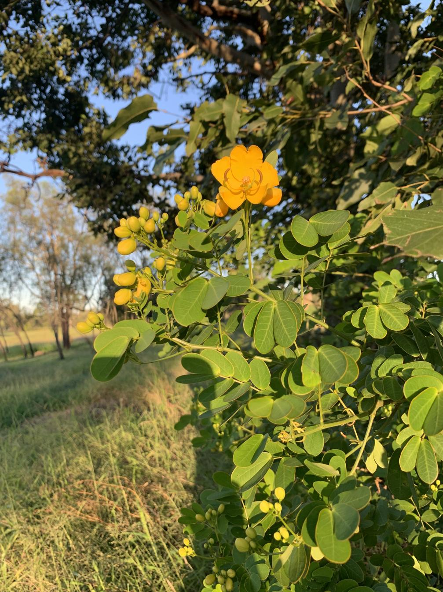

See also: [[plants]], [[wood-duck-meadows]]

South American shrub considered an environmental [weed in Australia](https://weeds.brisbane.qld.gov.au/weeds/easter-cassia). Can grow up to 4m tall with bright yellow flowers. Prolific fruit production and rapid growth rate means it will outcompete native plants.

## History at [[wood-duck-meadows]]

First sighted along [[the-dam]] bank closest to house in April 2025. Two small examples became evident when they flowered. This was not long after ex-Cyclone Alfred and some additional wet weather. Perhaps brought in by road runoff coming into [[the-dam]].

<figure markdown>

<caption>Senna pendula with a single yellow flower with many more yet to come.</caption>
</figure>

[//begin]: # "Autogenerated link references for markdown compatibility"
[plants]: plants "Plants"
[wood-duck-meadows]: ../wood-duck-meadows "Wood duck meadows"
[the-dam]: ../the-dam "The Dam"
[//end]: # "Autogenerated link references"