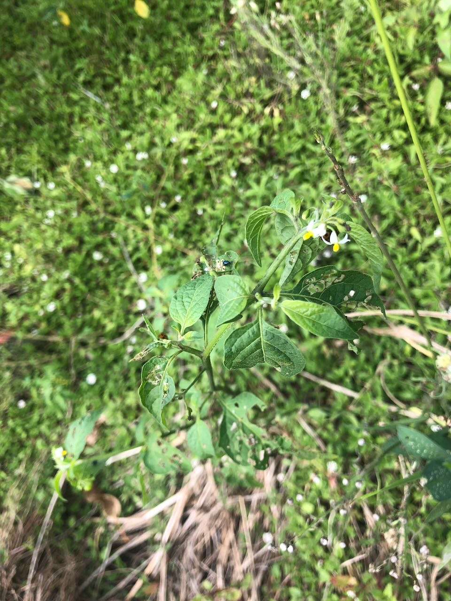

See also: [[plants]]

[Solanum americanum](https://en.wikipedia.org/wiki/Solanum_americanum) (American black nightshade) is a herbaceous flowering plant initially found on the [[fig-tree-berm]]. The entire plant - except ripe fruit - [is toxic](https://www.poisonsinfo.health.qld.gov.au/plants-and-mushrooms/blackberry-nightshade-solanum-nigrum-solanum-americanum).

## History at Wood Duck Meadows

Found on the [[fig-tree-berm]] in February 2025

<figure markdown>

<figcaption>American black (common) nightshade</figcaption>
</figure>

[//begin]: # "Autogenerated link references for markdown compatibility"
[plants]: plants "Plants"
[fig-tree-berm]: ../fig-tree-berm "Fig tree berm"
[//end]: # "Autogenerated link references"