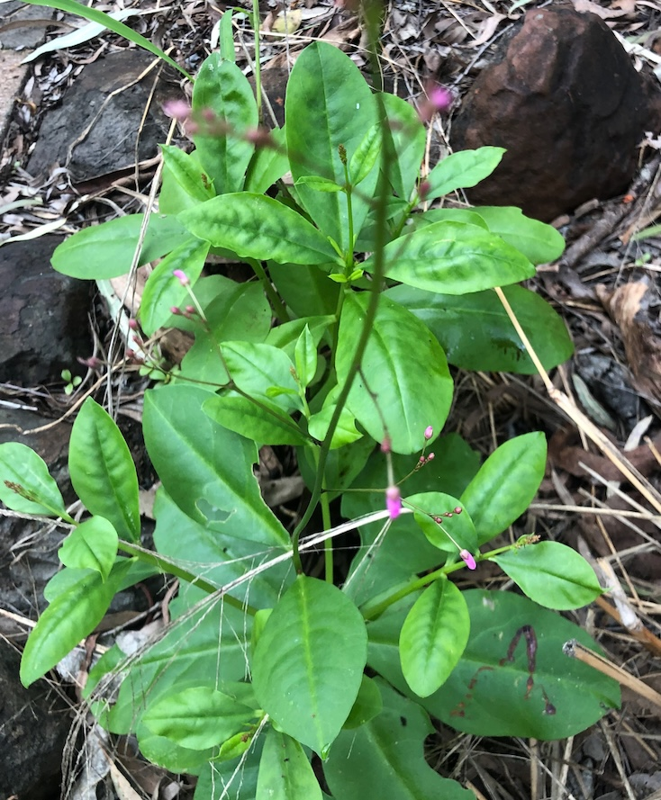

With succulent, shiny leaves not unlike [[madeira-vine]] this native of the Americas was initially confused with [[madeira-vine]] (when small). The plant has tuberous roots and produces panicles of pink flowers (hence the alternate name _pink baby's breath_). It has a long orange root that can be up to 80cm long.

[Some suggest](https://fairdinkumseeds.com/products-page/ethnobotanical-or-medicinal-plants/jewels-of-opar-talinum-paniculatum-babies-breath-seeds/) it has benefits including drought tolerance, leaves that can be eaten in various ways, and historical use as a medicinal plant. However, it self-seeds readily and can be invasive, especially in moister areas. Hence considered by some as a [weed to whack](https://sown.com.au/talinum-paniculatum-portulacaceae-pink-baby-breath-jewels-of-opar/). A task which can prove difficult with its tuberous roots.

<figure markdown>

<caption>Small shrub with shiny green succulent leaves and a few small pink flowers slowly appearing atop long, thin stems</caption>
</figure>

## Wood duck meadows history

Initially spotted around the tank and old pathways on the border between the [[gatton-creek-frontage]] and [[roundabout]] zones. Since spotted in numerous different locations.

[//begin]: # "Autogenerated link references for markdown compatibility"
[madeira-vine]: madeira-vine "Madeira vine (Anredera cordifolia)"
[gatton-creek-frontage]: ../gatton-creek-frontage "Gatton creek frontage"
[roundabout]: ../roundabout "Roundabout"
[//end]: # "Autogenerated link references"