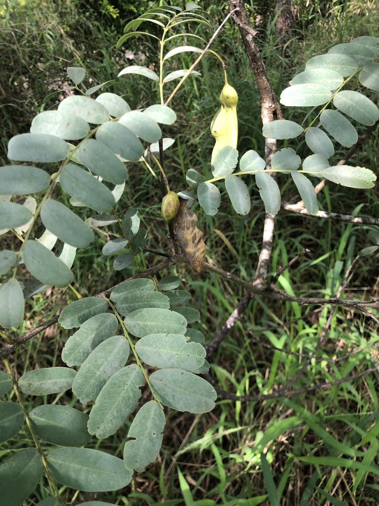
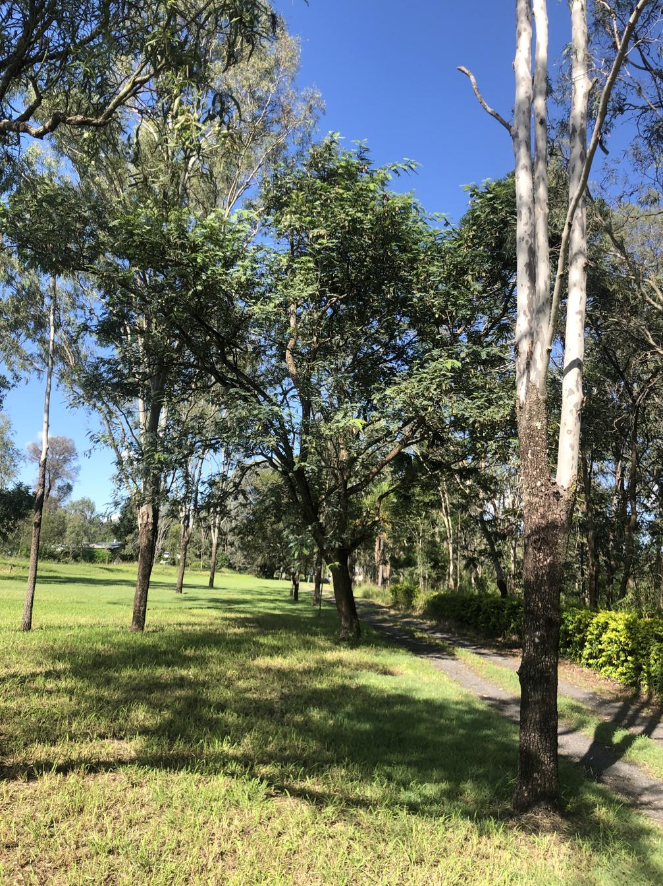

See also: [[plants]], [[wood-duck-meadows]]

The [Tipuana tip](https://en.wikipedia.org/wiki/Tipuana) (aka rosewood, Pride of Boliva) is a native South American tree that is considered a [weed in Australia](https://weeds.org.au/profiles/tipu-tree-rosewood/). Growing up to 10m with a distinct elevated crown the Tipuana makes an effective shade tree. It has also been useful for its timber and as stock feed. It spreads easily due to seeding prolifically and its winged fruit improving dispersal.

<figure markdown>

<caption>Leaves and seeds of a Tipuana tipu tree found on the [[gatton-creek-frontage]]
</caption>
</figure>

## History at [[wood-duck-meadows]]

Tipuana tipu has likely been on the property for a long time. Identification wasn't made until April, 2025 in the [[gatton-creek-frontage]] zone which led us to the larger tree in the [[front-yard]]. The proximity of two Tipuana tipu trees nearby in the [[gatton-creek-frontage]] seems to demonstrate the ability of the tree to spread. All three trees were cut down in early April 2025.

<figure markdown>

<caption>The original Tipuana tipu tree in the [[front-yard]], just before cutting it down.</caption>
</figure>

[//begin]: # "Autogenerated link references for markdown compatibility"
[plants]: plants "Plants"
[wood-duck-meadows]: ../wood-duck-meadows "Wood duck meadows"
[gatton-creek-frontage]: ../gatton-creek-frontage "Gatton creek frontage"
[front-yard]: ../front-yard "Front yard"
[//end]: # "Autogenerated link references"