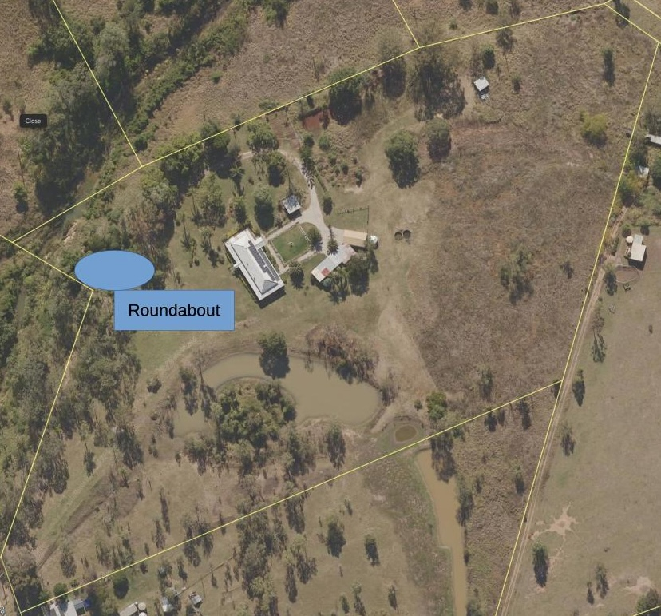

See also: [[wood-duck-meadows]]

The "roundabout" is a small section that splits the [[gatton-creek-frontage]] and the [[rocky-creek-frontage]]

<figure markdown>

<figcaption>Roundabout location</figcaption>
</figure>

## History 

| Date | Activity |
| --- | --- |
| Late Dec 2024 | [[privet]] found and removed. |

[//begin]: # "Autogenerated link references for markdown compatibility"
[wood-duck-meadows]: wood-duck-meadows "Wood duck meadows"
[gatton-creek-frontage]: gatton-creek-frontage "Gatton creek frontage"
[rocky-creek-frontage]: rocky-creek-frontage "Rocky Creek Frontage"
[privet]: plants/privet "Privet"
[//end]: # "Autogenerated link references"