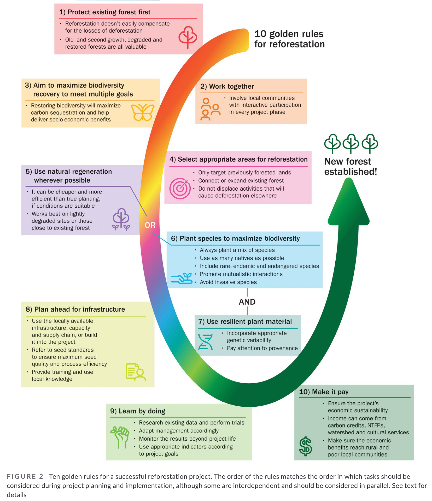

See also: [[ecosystem-restoration]], [[regeneration]]

[Open access research](https://onlinelibrary.wiley.com/doi/10.1111/gcb.15498) (Di Sacco et al, 2021) arising from [Botanic Gardens Conservation International (BGCI)](https://www.bgci.org/news-events/scientists-lay-out-10-golden-rules-for-restoring-forests/) developed 10 "golden rules" for reforestation.

1. Protect existing forest first; 

    Start with what we have.
2. Work together (involving all stakeholders); 
3. Aim to maximize biodiversity recovery to meet multiple goals; 
4. Select appropriate areas for restoration; 
5. Use natural regeneration wherever possible; 
6. Select species to maximize biodiversity; 
7. Use resilient plant material (with appropriate genetic variability and provenance); 
8. Plan ahead for infrastructure, capacity and seed supply; 
9. Learn by doing (using an adaptive management approach); and 
10. Make it pay (ensuring the economic sustainability of the project).

<figure markdown>

<caption>Adapted from Di Sacco et al (2021, p. 1332)<caption>
</figure>

## Misc quotes

> Trees, and the forests they form, are highly complex. Their interactions with other plants, animals and fungi, and environmental phenomena such as fires and flooding, have led to the evolution of a remarkable diversity of species, genes, functions and ecosystems (Di Sacco et al, 2021, p, 1329).

## References

Di Sacco, A., Hardwick, K. A., Blakesley, D., Brancalion, P. H. S., Breman, E., Cecilio Rebola, L., Chomba, S., Dixon, K., Elliott, S., Ruyonga, G., Shaw, K., Smith, P., Smith, R. J., & Antonelli, A. (2021). Ten golden rules for reforestation to optimize carbon sequestration, biodiversity recovery and livelihood benefits. *Global Change Biology*, *27*(7), 1328--1348. <https://doi.org/10.1111/gcb.15498>

[//begin]: # "Autogenerated link references for markdown compatibility"
[ecosystem-restoration]: ecosystem-restoration "Ecosystem restoration (aka bush regneration)"
[regeneration]: regeneration "Bush regeneration (Wood duck meadows)"
[//end]: # "Autogenerated link references"