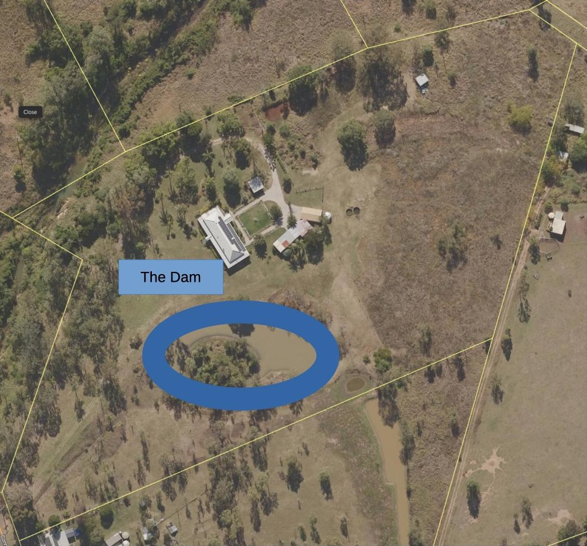
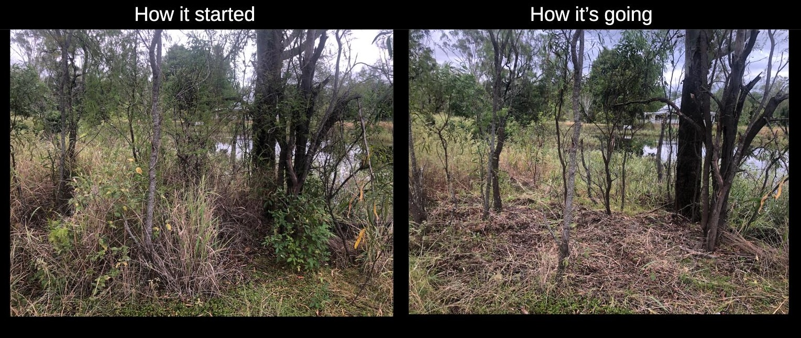

See also: [[wood-duck-meadows]]

Fed by road runoff the dam surrounds [[the-island]] and (occasionally) provides some nice water views from the house.

!!! information "Current status"

    **2025** Initial clearing of the bank surrounding the dam and initial experiments in regeneration

## Location

<figure markdown>

<caption>Location of the dam to the south of the house</caption>
</figure>

## History

Most of the work around the dam has been clearing out various weeds in an attempt to give the native vegetation a chance.

<figure markdown>

<caption>Before and after example of removing some [[asparagus-africanus]] and [[megathyrsus-maximus]] from the dam bank</caption>
</figure>

| Date | Work |
| --- | --- |
| Mar 2025 | Cutting down of [[schinus-terebinthifolia]] and [[schotia-brachypetala]] trees. Weed eating a lot of [[megathyrsus-maximus]] (green panic) grass and removing [[asparagus-africanus]]. |

[//begin]: # "Autogenerated link references for markdown compatibility"
[wood-duck-meadows]: wood-duck-meadows "Wood duck meadows"
[the-island]: the-island "The Island"
[schinus-terebinthifolia]: plants/schinus-terebinthifolia "Schinus Terebinthifolia (Brazilian pepper tree)"
[schotia-brachypetala]: plants/schotia-brachypetala "Schotia brachypetala (Drunken Parrot Tree)"
[megathyrsus-maximus]: plants/megathyrsus-maximus "Megathyrsus maximus (Guinea grass)"
[asparagus-africanus]: plants/asparagus-africanus "Asparagus africanus (Climbing asparagus fern)"
[//end]: # "Autogenerated link references"