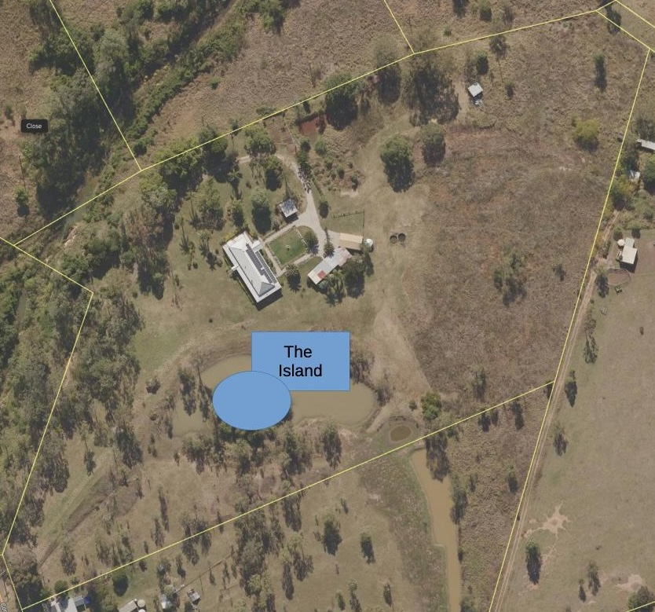
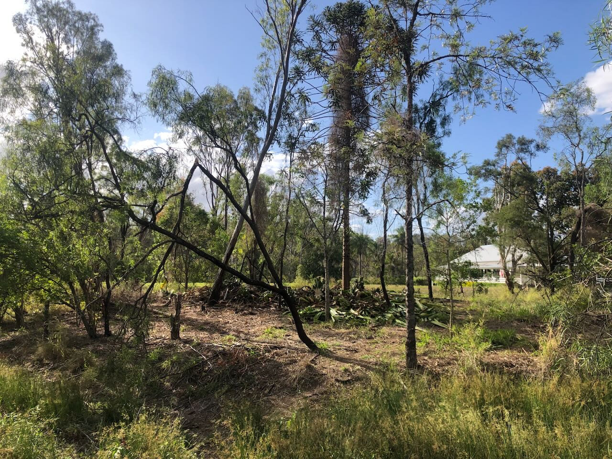

See also: [[wood-duck-meadows]]

_The Island_ is a man made island crafted by the property's dam and the earthworks that direct run-off into the dam. It is at least 500 square metres. 

A previous owner had spent had placed irrigation on the island and planted numerous plants including: a [[bunya-pine]]; [Maruritius-hemp](https://en.wikipedia.org/wiki/Furcraea_foetida); bamboo, and, a [Paperbark tree](https://en.wikipedia.org/wiki/Melaleuca_quinquenervia) amongst other things. However, for sometime the island had been ignored and suffered during drought seasons. The bamboo and paperbark have died. With [[asparagus-africanus]] (climbing asparagus) having taken over most of the island and making it all but impassable.

!!! info "Current status"

    **2025** [[schinus-terebinthifolia]] trees removed, Sandpaper fig tree planted

    **2024** We're embarking on a regeneration project for the island. Initial clearing of the climbing asparagus and Mauritius hemp has been completed. 

<figure markdown>

<figcaption>The island</figcaption>
</figure>

## Design ideation

Early thoughts include:

- A focus on native plants creating a habitat for local wildlife.
- Increased blocking of the neighbours and the highway.
- Providing a space for sitting to look back at the house.
- Creating a [[dry-rainforest]] like setting in the middle of the island for shade and the ecosystem benefits.

## Clearing weeds and unwanted vegetation

### Climbing asparagus

The first step was getting rid of the climbing asparagus and other unwanted plants. Mostly done by hand.

Following image shows progress from an early stage where some bamboo and [[asparagus-africanus]] (Climbing asparagus fern) had been removed. Though with large amounts still visible climbing up the trees and just about anything else. In the _how it's going_ image the house and the Mauritius hemp are now visible.

<figure markdown>

<figcaption>Early clearing progress</figcaption>
</figure>

### Mauritius hemp

After removing the climbing asparagus, it was time for the Mauritius hemp to go.

<figure markdown>
![Maurtitius hemp plants growing amongst the [[asparagus-africanus]] (climbing asparagus) near the [[bunya-pine]] on [[the-island]] ](./plants/images/maruritius-hemp.jpeg)
<caption></caption>
</figure>

<figure markdown>

<figcaption>Removing the Mauritius hemp</figcaption>
</figure>

### Madeira vine

With the above it became evident the island had become home to numerous [Madeira vine tuberlings](https://weeds.brisbane.qld.gov.au/weeds/madeira-vine). [Recommended control measures](https://www.publications.qld.gov.au/ckan-publications-attachments-prod/resources/71a76eb4-d6eb-4d75-870f-14fee5b13839/madeira-vine.pdf?ETag=209013df91fcee28410bbf693318c772) suggest that physical control may be appropriate. Digging out the tubers and freezing/microwaving them to prevent reshooting.

## History

| Date | Activity | 
| --- | --- |
| 2024-12-21 | Finally cut down the last dead tree and cut down some shoulder high grass |
| Late 2024 | Planting of sandpaper fig |
| Jan 2025 | Harvesting (picking up from the ground) of the first [[bunya-pine]] cones |
| Jan 2025 | Removal of numerous [[schinus-terebinthifolia]] trees and cleaning up regrowth of [[asparagus-africanus]], [[madeira-vine]] |

[//begin]: # "Autogenerated link references for markdown compatibility"
[wood-duck-meadows]: wood-duck-meadows "Wood duck meadows"
[bunya-pine]: plants/bunya-pine "Bunya Pine"
[asparagus-africanus]: plants/asparagus-africanus "Asparagus africanus (Climbing asparagus fern)"
[dry-rainforest]: dry-rainforest "Dry Rainforest"
[schinus-terebinthifolia]: plants/schinus-terebinthifolia "Schinus Terebinthifolia (Brazilian pepper tree)"
[madeira-vine]: plants/madeira-vine "Madeira vine (Anredera cordifolia)"
[//end]: # "Autogenerated link references"