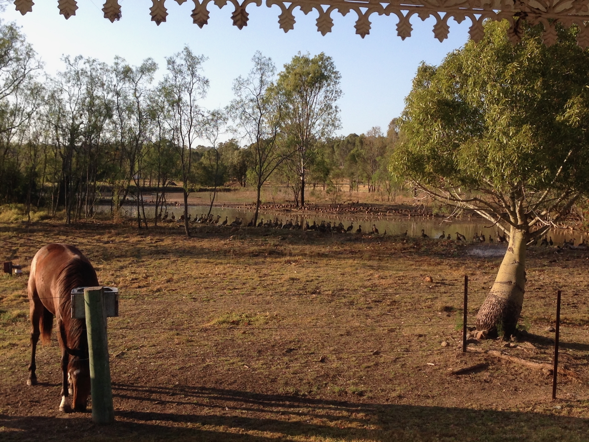

See also: [wood-duck-gallery](./wood-duck-gallery.md), [[plants]], [[individual-plants]], [plant-locations](./individual-plants/plant-location.html)

Home since 2012. Property was historically used for small scale farming/market garden before being broken up into smaller lots. Our block being the original homestead and the largest at 10 acres. 

More recently largely used as for horse paddocks. Closer to the house being planted with many different ornamental/non-native trees and plants (e.g. [[agave]]). More recently many areas have been increasingly over grown with various weeds (e.g. climbing asparagus fern ([[asparagus-africanus]]), lantana, [[madeira-vine]], [[cats-claw-creeper]] etc).

Our plan is to undertake a process of bush [[regeneration]] to bring back various regionally [appropriate habitat types](https://www.qld.gov.au/environment/plants-animals/habitats/habitat). We're slowly developing a specific [[regeneration]] to achieve this.

The [[house]] is also undergoing a regeneration to be more appropriate to the changing context.

!!! info "Photo gallery"

    Check out the [Wood duck gallery](./wood-duck-gallery.md) to view all that photos of the property available here.

    Click on an image to view the photos in a galley mode.

<figure markdown>

<caption>2013 photo (yes we did have horses for a while) taken from the veranda of the house looking towards [[the-dam]] offering an insight into the origins of the name "Wood duck meadows"</caption>
</figure>

## Position

The property is located in western side of the Lockyer Valley, Queensland. In the region of Postman's Ridge.

- [Lockyer Valley Catchment Story](https://qgsp.maps.arcgis.com/apps/MapJournal/index.html?appid=e64a7303aff74f2e83454e6baf35651a)

    Queensland Government part of a series providing details on SE Qld catchments. **Look more into this**

## Zones

To aid discussion and planning we're slowly dividing the property into the different zones list in the following table.

| Zone | Description |
| --- | --- |
| [[brigalow-scrub]] | A small stand at the front of the property |
| [[gatton-creek-frontage]] | Creek frontage to the west of the round about |
| [[cherry-tree-walk]] | Path along the front berm lined with cherry trees |
| [[front-yard]] | Semi-open area between the house the front entrance |
| [[mango-paddock]] | South-western paddock now with two mango trees |
| [[the-island]] | The island in [[the-dam]] |
| [[the-dam]] | Surrounds [[the-island]] and fed by road run-off |
| [[roundabout]] | Long established lawn and path |
| [[rocky-creek-frontage]] | Creek frontage to the east of the round about |
| [[house]] | House, stables, sheds and surrounding gardens |
| [[pecan-corner]] | Pecan and other fruit/nut trees |
| [[lower-dam]] | Dam area on the Gatton creek frontage |
| [[orchard-corner]] | A nascent grove at the southern end of the property | 
| [[horse-paddock]] | The largest cleared space on the property that used to form the main horse paddock. Contains the [[the-circle]]. |
| [[the-circle]] | Small collection of trees in the middle of the main horse paddock |
| [[fig-tree-berm]] | Pre-existing berm near the bunker |
| The [[bunker]] | Small building and the area in front of it in the north-eastern corner of the propery |
| [[back-corner]] | The far north-eastern corner of the property (the least visited part) |

## Measurement

### Tools and external projects

List of projects/tools to help with various forms of measurement of what we're doing.

- Sketch up may be useful for mapping/planning.
- eBird for bird observations - see [[life-list]]
- [BioCollect](https://www.ala.org.au/biocollect/) from the [Atlas of Living Australia](https://www.ala.org.au/) or related [iNaturalist Australia](https://inaturalist.ala.org.au/)
- Qld government
    - [Regrowth benefits interactive map](https://www.qld.gov.au/environment/plants-animals/habitats/regrowth/regrowth-mapping) - part of a re-growing native forest site, including [regrowth management guides](https://www.qld.gov.au/environment/plants-animals/habitats/regrowth/regrowth-guides)
    - [Rainforests: Regrowth benefits - management guidelines](https://www.qld.gov.au/__data/assets/pdf_file/0035/68588/rainforest-management-guideline.pdf)

- [Lockyer Upland Catchements Inc](https://www.lockyeruplandscatchmentsinc.org.au/)

- [TREAT](https://www.treat.net.au) - Trees for Evelyn and Atherton Tablelands

### State of the region

[Healthy Land & Water](https://www.hlw.org.au/region/about/natural-assets/nature#gsc.tab=0) provides statistics showing a decline in vegetation across the broader south-east Queensland region since 2001, including:

- Losses of 7,384 hectares of remnant vegation, 54,983 hectares of woody vegetation, and 1,220 hectares of natural wetlands.
- Fragmentation of remaining vegetation tracts.

## To do

1. Plant categorisation and selection

    - Categories of plans (top layer, ground cover etc)
    - Improvements to soil
    - Companion plants to fig tree

2. Process for working on a berm (and other areas)

3. Clearing 

    - [ ] Remove pepper/parrot trees from round about
    - [ ] Work on clearing existing macadamia tree.
    - [ ] Finish clearing the southern bank of [[the-dam]]

[//begin]: # "Autogenerated link references for markdown compatibility"
[plants]: plants/plants "Plants"
[individual-plants]: individual-plants/individual-plants "Individual plants"
[agave]: plants/agave "Agave"
[asparagus-africanus]: plants/asparagus-africanus "Asparagus africanus (Climbing asparagus fern)"
[madeira-vine]: plants/madeira-vine "Madeira vine (Anredera cordifolia)"
[cats-claw-creeper]: plants/cats-claw-creeper "Cat's claw creeper (Dolichandra unguis-cati)"
[regeneration]: regeneration "Bush regeneration (Wood duck meadows)"
[house]: house "House"
[brigalow-scrub]: brigalow-scrub "Brigalow scrub"
[gatton-creek-frontage]: gatton-creek-frontage "Gatton creek frontage"
[cherry-tree-walk]: cherry-tree-walk "Cherry Tree walk"
[front-yard]: front-yard "Front yard"
[mango-paddock]: mango-paddock "Mango paddock"
[the-island]: the-island "The Island"
[the-dam]: the-dam "The Dam"
[roundabout]: roundabout "Roundabout"
[rocky-creek-frontage]: rocky-creek-frontage "Rocky Creek Frontage"
[pecan-corner]: pecan-corner "Pecan corner"
[lower-dam]: lower-dam "The lower dam"
[orchard-corner]: orchard-corner "The Orchard (Orchard corner)"
[horse-paddock]: horse-paddock "Horse paddock"
[the-circle]: the-circle "The Circle"
[fig-tree-berm]: fig-tree-berm "Fig tree berm"
[bunker]: bunker "The Bunker"
[back-corner]: back-corner "The back corner"
[life-list]: ../birdwatching/life-list "Life list"
[//end]: # "Autogenerated link references"