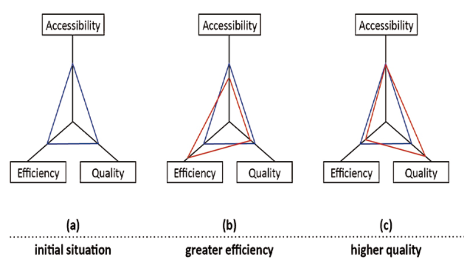
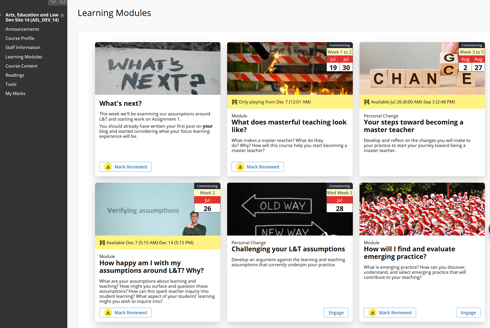
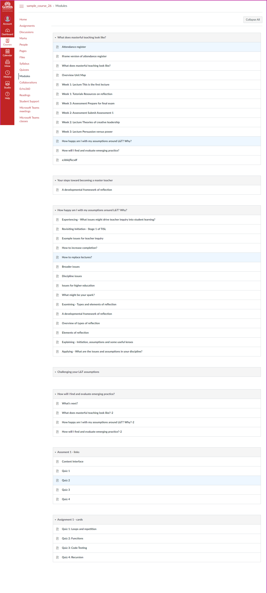
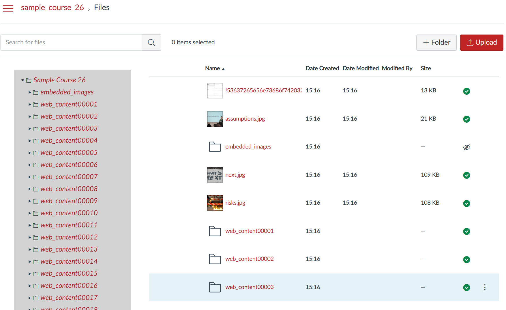
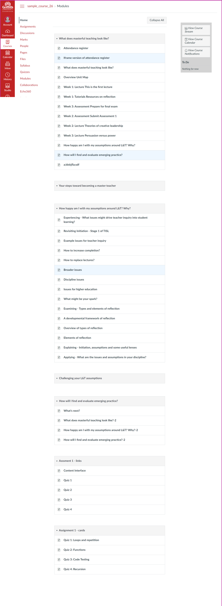
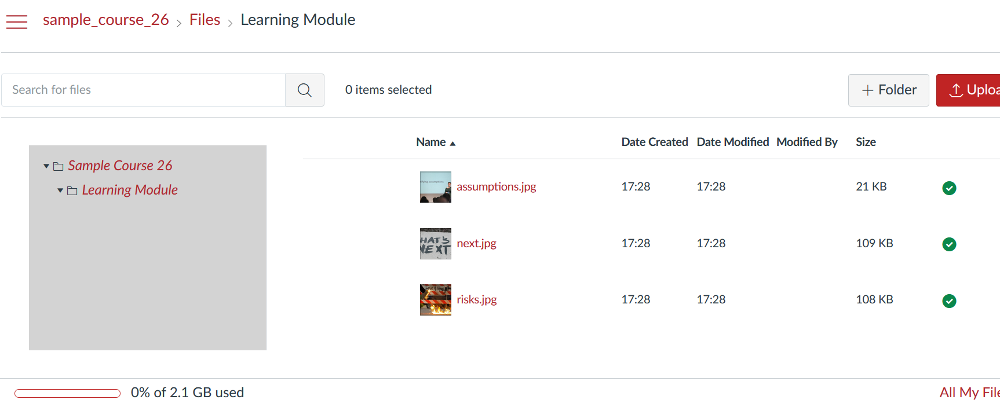
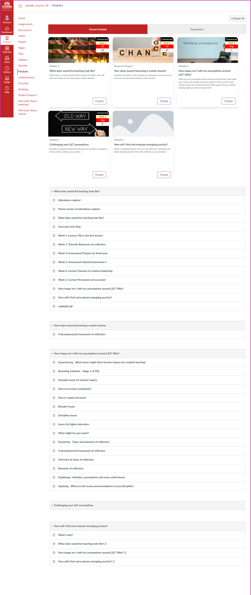
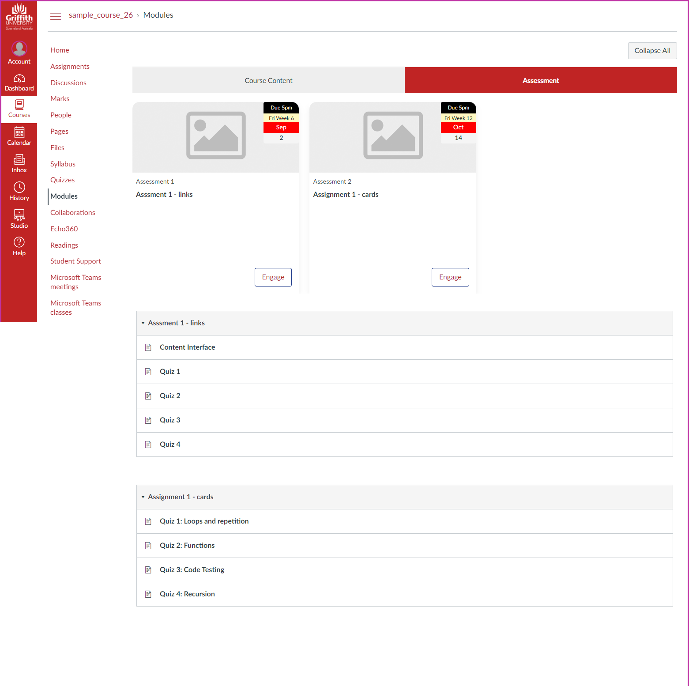

---
title: "Orchestrating entangled relations to break the iron triangle: examples from a LMS migration"
---
```toml
post_title='Orchestrating entangled relations to break the iron triangle: examples from a LMS migration'
layout="post"
published=true
id=18226
link="https://djon.es/blog/2022/07/03/orchestrating-entangled-relations-to-break-the-iron-triangle-examples-from-a-lms-migration"
category="casa"
img_base_url="https://djplaner.github.io/memex/share/blog/2022/"
```

## Introduction

All university strategies for learning and teaching by necessity are variations on maximising to different levels accessibility (as many people as possible can participate - feel the scale - in as many ways as possible), quality (it's good), and cost effectiveness (it's cheap to produce and offer). Seeking to maximise all three is argued by Ryan et al (2021) as a "key issue for contemporary higher education" (p. 1383) due to inevitable cost constraints, the benefits of increased access to higher education, and requirements to maintain quality standards. However, the literature on the "iron triangle" in higher education formed by these three vectors (Daniel et al, 2009; Mulder, 2013; Ryan et al, 2021) suggests that maximising all three is difficult, if not impossible. As illustrated in Figure 1 (adapted from Mulder, 2013, p. 100), the iron triangle suggests that changes in one quality (e.g. changing accessibility due to COVID) will have negatively impact at least one of the other qualities (e.g. the COVID response involving increase in workload for staff and resulting in less than happy participants). 

| Figure 1: Illustrating the iron triangle (adapted from Mulder, 2013, p. 100) |
|-----------------------------------------------------------------------------|
|   |

Much of the iron triangle literature identifies different strategies to breaking the iron triangle. Mulder (2013) suggests OER. Daniel et al (2009) suggest open and distance eLearning. Ryan et al (2021) suggest high-quality large group teaching and learning; alternative curriculum structures; and automation of assessment and feedback. I'm not convinced that any of these will work. Not due to the inherent validity of the specific solutions (though there are questions), instead my doubts arise from how such suggestions would be implemented in contemporary higher education. Each would be implemented via variations on common methods. My suspicion is that these  methods are likely to hinder any attempts to break the iron triangle. 

Largely because those methods are based on atomistic, and deterministic understandings of education, technology, and organisations. The standard methods - based on practices like [stepwise refinement](http://sunnyday.mit.edu/16.355/wirth-refinement.html) and [loose coupling](https://en.wikipedia.org/wiki/Loose_coupling) - may be necessary but aren't sufficient for breaking the iron triangle. These methods decompose problems into smaller black boxes (e.g. [[pedagogy-before-technology]], requirements and implementation; enrolment, finance, and HR; learning objects etc.) for easier and separate resolution and assume that solving larger problems (e.g. designing a quality learning experience or migrating to a new LMS) is simply a matter of assembling a solution by combining component black boxes like lego blocks. Entangled views of pedagogy (Fawns, 2022), educational technology (Dron, 2022), and [associated "distributed" views (Jones and Clark, 2014)](https://djon.es/blog/2014/09/21/breaking-bad-to-bridge-the-realityrhetoric-chasm/#how-you-see-the-world-distributed-or-tree-like) argue that atomistic views are naive and simply don't match the reality of learning and teaching. Relying on such views to break the iron triangle appears unlikely to work.

We're in the process of migrating from Blackboard Learn to Canvas. I work with one part of an institution responsible for migrating some 1400 courses (some with multiple course sites) over 18 months. An LMS migration "is one of the most complex and labor-intensive initiatives that a university might undertake" (Cottam, 2021, p. 66). Hence much of the organisation is expending effort to make sure it succeeds. This includes enterprise information technology players such as the new LMS vendor, our organisational IT division, and various other enterprise systems and practices. The following seeks to illustrate the mismatch between these practices and what we have to actually do as part of an LMS migration. The three standard LMS migration tasks discussed are:

1. Connect the LMS with an ecosystem of tools using the [Learning Tools Interoperability (LTI) standard](https://www.imsglobal.org/lti-advantage-overview).
2. Moving content from one LMS to another using the [common cartridge standard](https://www.imsglobal.org/activity/common-cartridge).
3. ["to make teaching and learning easier"](https://www.instructure.com/en-gb/canvas/resources/home/canvas-lms-adopted-by-teachers-and-students-worldwide) using a vanilla LMS.

The following shares the challenges we faced as each of these standardised black boxes fell short. Each were so disconnected from our context and purpose to require significant manual re-entanglement to even approach being fit-for-purpose. Rather than persevere with an inefficient, manual approach to re-entanglement we did what many, many project teams have done before. We leveraged digital technologies to help automate the re-entanglement of these context-free and purposeless black boxes into fit-for-purpose assemblages that were more efficient, effective, and provided a foundation for on-going improvement and practice. Importantly, a key part of this re-entanglement was injecting some knowledge of learning design. Our improved assemblages are described below. 

What we're doing is not new. In the information systems literature it has been labelled light-weight Information Technology (IT) development, which Bygstad (2017) defines as "a socio-technical knowledge regime driven by competent users' need for solutions, enabled by the consumerisation of digital technology, and realized through innovation processes" (p. 181). Light-weight IT development is how users leverage technology to orchestrate the entangled relations into contextually appropriate assemblages to solve their own needs. Rather than the generic, context and purpose free problems solved by the black boxes of heavyweight IT.

These "light-weight IT" practices aren't new in universities or learning and teaching. Pre-designed templates for the LMS(Perämäki, 2021) are an increasingly common, simple example. The common practice within the Canvas community of [developing and sharing userscripts](https://community.canvaslms.com/t5/Canvas-Developers-Group/UserScript-development-help-request/td-p/119615) or [sharing Python code](https://github.com/search?q=canvas+instructure+python) are examples. A more surprising examples is that many Universities have significant enterprise projects in the form of [Robotic Process Automation (RPA)](https://en.wikipedia.org/wiki/Robotic_process_automation) (e.g. the [University of Melbourne](https://www.automationanywhere.com/resources/customer-stories/university-of-melbourne), the [Australian National University](https://services.anu.edu.au/information-technology/software-systems/robotic-process-automation), [Griffith University](https://intranet.secure.griffith.edu.au/work/robotic-process-automation), and the [University of Auckland](https://www.uipath.com/resources/automation-case-studies/university-of-auckland)). RPA is a poster child example of lightweight IT development. These significant enterprise RPA projects are designed to develop the capability to more efficiently and effectively re-entangle the black boxes of enterprise IT. But to date universities appear to be focusing RPA efforts on administrative processes such as HR, Finance, and student enrolment. I'm not aware of any evidence of institutional projects explicitly focused on applying these methods to learning and teaching. Instead, leaving it to us tinkerers.

The argument here is that more effective orchestration of entangled relations will be a necessary (though not sufficient) enabler for breaking the iron triangle in learning and teaching. On-going reliance on the black-boxes of heavyweight IT will be a barrier to breaking the iron triangle. A big part of the struggle is that lightweight and heavyweight IT are different socio-technical knowledge regimes (Bygstad, 2017). They have different [umwelten](https://doctorow.medium.com/james-bridles-ways-of-being-e1a43bf6d013) and in L&T practice the heavyweight umwelten reigns supreme. Hence, I'm not sure if I'm more worried about the absence of lightweight approaches to L&T at universities, or the nature of the "lightweight" approach that universities might develop given their current knowledge regimes. On the plus side, some really [smart folk are starting to explore the alternatives](https://twitter.com/mwjtweet/status/1543264417156153344).

## Connect the LMS with an ecosystem of tools using the LTI standard

Right now we're working on migrating ~500 Blackboard course sites. [Echo360](https://echo360.com/) is used in these course sites for lecture capture and for recording and embedding other videos.  Echo360 is an external tool, it's not part of the LMS (Blackboard or Canvas). Instead, the [Learning Tools Interoperability (LTI) standard](https://www.imsglobal.org/lti-advantage-overview) is used to embed and link echo360 videos into the LMS. LTI is a way to provide loose coupling between the separate black boxes of the LMS and other tools. It makes it easy for the individual vendors - both LMS and external tools - to develop their own software. They focus on writing software to meet the LTI standard without a need to understand (much of) the internal detail of each other's software. Once done, their software can interconnect (via a very narrow connection). For institutional information technology folk the presence of LTI support in a tool promises to make it easy to connect one piece of software to another. i.e. it makes it easy to connect the Blackboard LMS and Echo360; or, to connect the Canvas LMS and Echo360.

From the teacher perspective, one practice LTI enables is a way for an Echo360 button to appear in the LMS content editor. Press that button and you access your Echo360 library of videos from which you select the one you wish to embed. From the student perspective, the echo360 video is embedded in your course content within the LMS. All fairly seamless.

### Wrong purpose, no relationship, manual assemblage

Of the ~500 course sites we're currently working on there are 2162 echo360 embeds. Those are spread across 98 of the course sites. Those 98 course sites have on average 22 echo360 videos. 62 of the course sites have 10 or more echo360 embeds. One course has 142 echo360 embeds. The ability to provide those statistics is not common, more on that in the next section.

The problem we face in migrating these videos to Canvas is that our purpose falls outside the purpose of LTI. Our purpose is not focused on connecting an individual LMS to echo360. We're moving from one LMS to another LMS. LTI is not designed to help with that purpose. LTI's purpose (one LMS to echo360) and how it's been implemented in Blackboard creates a problem for us. The code to embed an echo360 video in Blackboard (via LTI) is different to the code to embed the same video in Canvas (via LTI). If I use Blackboard's Echo360 LTI plugin to embed an echo360 video into Blackboard the id will be f34e8a01-4f72-46e1-XXXX-105XXXXXf75f. If I use the Canvas Echo360 LIT plugin to embed the very same video into Canvas it will use a very different id (49dbc576-XXXX-4eb0-b0d6-6bXXXXX0707).  This means that for each echo360 video you wish to migrate from Blackboard to Canvas you need to regenerate/identify a new id. 

The initial solution to this problem was:

1. A migration person goes through a course site and generates a list of names for all the echo360 videos.
2. That list is provided to a central helpdesk who use the echo360 search mechanism to find and generate a new id for each video

    Necessary because in echo360 only the owner of the video or the echo360 "root" user can access/see the video. So either the video owner (typically an academic) or the "root" user generate the new ids. From a risk perspective, only a very small number of people should have root access, it can't be given to all the migration people.
3. The migration person receives the list of new video ids and manually updates the new Canvas course site.

It's evident that this process involves a great deal of manual work and a bottleneck in terms of "root" user access to echo360.

### Orchestrating the relationships into a semi-automated assemblage

A simple improvement to this approach would be to automate step #2 using something like [Robotic Process Automation](https://en.wikipedia.org/wiki/Robotic_process_automation). With RPA the software (i.e. the "robot") could step through a list of video names, login to the echo360 web interface, search for the video, find it, generate a new echo360 id for Canvas, and write that id back to the original list. Ready for handing back to the migration person.

A better solution would be to automate the whole process. i.e. have software that will

1. Search through an entire Blackboard course site and identify all the echo360 embeds.
2. Use the echo360 search mechanism to find and generate a new id for each video.
3. Update the Canvas course site with the new video ids.

That's basically what we did. The Python code helps orchestrate the relationship between Blackboard, Canvas, and Echo360. It helps improve the cost effectiveness of the process though doesn't shift the dial on access or quality.

But there's more to this better solution than echo360. The software needs to know what's in the Blackboard course site and how to design content for Canvas. The software has to be more broadly connected. As explained in the next example.

## Moving content from one LMS to another using the common cartridge standard

[Common Cartridge](https://www.imsglobal.org/activity/common-cartridge) provides "a standard way to represent digital course materials". Within the context of an LMS migration common cartridge (and some similar approaches) provide the main way to migrate content from one LMS to another. Providing the promised lego block encapsulation promise for LMS content. Go to Blackboard and use it to produce a common cartridge export. Head over to the Canvas and use its import feature to bring the content in. Hey presto migration complete.

If only it were that simple.

### Migrating content without knowing anything about it or how it should end up

Of course it's not as simple as that, there are known problems, including:

1. Not all systems are the same so not all content can be "standardised".

    Vendors of different LMS seek to differentiate themselves from their competitors. Hence they tend to offer different functionality, or implement/label the same functionality differently. Either way there's a limit to how standardised digital content can be and not all LMS support the same functionality (e.g. [quizzes](https://community.canvaslms.com/t5/Canvas-Question-Forum/Migrating-Quizzes-that-Use-Pools-of-Questions-from-Blackboard-to/td-p/142448)). Hence a lot of manual work arounds to identify and remedy issues.

2. Imports are ignorant of learning design in both source and destination LMS.

    Depending on the specific learning design in a course, the structure and nature of the course site can be very different. Standardised export formats - like common cartridge - use standardised formats. They are ignorant of the specifics of course learning design as embodied in the old LMS. They are also ignorant of how best to adapt the course learning design to the requirements of the new LMS. 

3. Migrating information specific to the old LMS.

	Since common cartridge just packages up what is in the old LMS, detail specific to the old LMS gets ported to the new and has to be manually changed.  e.g. echo360 embeds as outlined above, but also language specific to the old lms (e.g. _Blackboard_) but inappropriate to the new.

4. Migrating bad practice.

    e.g. it's quite common for the "content collection" area of Blackboard courses to collect a large number of files. Many of these files are no longer used. Some are mistaken left overs, some are just no longer used. Most of the time the content collection is one long list of files with names like _lecture 1.pptx_, _lecture 1-2019.pptx_, _lectures 1a.pptx_. The common cartridge approach to migration, migrates any bad practice to the new LMS.

All these problems contribute to the initial migration outcome not being all that good. For example, the following images. Figure 2 is the original Blackboard course site. A common cartridge of that Blackboard course site was created and imported into Canvas. Figure 3 is the result.

It's a mess and that's just the visible structure. What were separate bits of content are now all combined together, because common cartridge is ignorant of that design. Some elements that were not needed in Canvas have been imported. Some information (_Staff Information_) was lost. And did you notice the default "scroll of death" in Canvas (Figure 3)?

| **Figure 2: Source LMS** | **Figure 3: Destination LMS** |
| --------- | -------------- |
|  |      |

The [Canvas Files area](https://community.canvaslms.com/t5/Canvas-Basics-Guide/What-are-Files/ta-p/7) is even worse off. Figure 4 shows the files area of this same course after common cartridge import. Only the first four or five files were in the Blackboard course. All the _web_content0000X_ folders are added by the common cartridge import.

| **Figure 4: Canvas files area - common cartridge import** |
| -------------- |
|   |

You can't leave that course in that stage. The next step is to manually modify and reorganise the Canvas site into a design that works in Canvas. This modification relies on the Canvas web interface (e.g. the Canvas interface still [does not provide a way to delete all the pages in a course](https://community.canvaslms.com/t5/Canvas-Admin-Blog/Bulk-Publish-Delete-Pages/ba-p/262944)). Not the most effective or efficient interface for that purpose. Importantly, remember that this manual tidy up process has to be performed for each of the 1400+ course sites.

The issue here is the common cartridge is a generic standard. It is purpose (in part) is to take content from any LMS (other other tool) and enable it to be imported into another LMS/tool. It has no contextual knowledge.

### Driving the CAR: Migration scaffolded by re-entangling knowledge of source and destination structure

On the other hand, we know we are migrating from a specific version of Blackboard to a specific version of Canvas. We know the common approaches used in Blackboard by our courses. We eventually develop the knowledge of how what was common in Blackboard must be modified to work in Canvas. Rather than engage in the manual, de-contextualised process above, a better approach would leverage our additional knowledge and use it to increase the efficiency and the effectiveness of the migration.

To do this we developed the Course Analysis Report (CAR) approach. Broadly this approach automates the majority of the following steps:

1. Pickle the Blackboard course site.

    Details of the structure, make up, and the HTML content of the Blackboard course site is [extracted](https://en.wikipedia.org/wiki/Web_scraping) out of Blackboard and stored into a file. A single data structure (residing in a shared network folder) that contains a snapshot of the Blackboard course site.

2. Analyse the pickle and generate a CAR.

    Perform various analysis and modifications to the pickle file (e.g. look for Blackboard specific language, modify echo360 embeds, identify which content collections files are actually attached to course content etc.) and generate a Word document providing a summary of the course site.

3. Download the course files and generate specially formatted Word documents representing course site content.

    Using our knowledge of how our Blackboard courses are structured and the modifications necessary for an effective Canvas course embodying a similar design intent create a couple of folders in the shared course folder containing all of the files and Word documents containing the web content of the Blackboard course. Format these files, folders, and documents to scaffold modification (using traditional desktop tools).

4. Upload the modified files and Word documents directly into Canvas as mostly completed course content.

    Step #3 is where almost all the design knowledge necessary gets applied to the migrate the course. All that's left is to upload it into Canvas. Uploading the files is easy and supported by Canvas. Uploading the Word documents into Canvas as [modules](https://community.canvaslms.com/t5/Canvas-Basics-Guide/What-are-Modules/ta-p/6) is done via [word2Canvas](https://github.com/djplaner/word-to-canvas-module#word-to-canvas-word2canvas-module) a semi-automated tool.

Steps #1 and #2 are entirely automatic as is the download of course content and generation of the Word documents in step #3. These are stored in shared folders available to the entire migration team (the following table provides some stats on those folders). From there the migration is semi-automated. People leveraging their knowledge to make decisions and changes using common desktop tools.

| **Development Window** | **# course sites** | **# of files** | **Disk Usage** | 
| -------------- | -------------- | -------------- | -------------- |
| 1 | 219 | 15,213 | 163Gb |
| 2 | 555 | 2531 | 336Gb |

Figures 5 and 6 show the end result of this improved migration process using the same course as the Figures 3 and 4. Figure 5 illustrates how the structure of "modules" in the Blackboard site has been recreated using the matching Canvas functionality. What it doesn't show is that Step 3 of the CAR process has removed or modified Blackboard practices to fit the capabilities of Canvas.

Figure 6 illustrates a much neater Files area compared to Figure 4. All of the unnecessary common cartridge crud is not there. Figure 5 also illustrates Step 3's addition of structure to the Files area. The three files shown are all within a _Learning Module_ folder. This folder was not present in the Blackboard course site's content collection. It's been added by the CAR to indicate where in the course site structure the files were used. These images were all used within the _Learning Modules_ content area in the Blackboard course site (Figure 2). In a more complex course site this additional structure makes it easier to find the relevant files.

Figure 5 still has a pretty significant whiff of the 'scroll of death' but that's a ["feature"](https://www.wired.com/story/its-not-a-bug-its-a-feature/) of Canvas. As part of this the highly visual [card interface](https://djplaner.github.io/Card-Interface-Tweak/) used in the Blackboard course site is also lost. Another "feature" of Canvas. More on that next.

| **Figure 5: Canvas site via CAR** | **Figure 6: Canvas files via CAR** |
| ------------------- | -------------- |
|  |   |

## ["to make teaching and learning easier"](https://www.instructure.com/en-gb/canvas/resources/home/canvas-lms-adopted-by-teachers-and-students-worldwide) using a vanilla LMS.

There's quite a bit of literature and other work arguing about the value to learning and the learning experience of the aesthetics, findability, and usability of the LMS and LMS courses. Almost as much as there is literature and work expounding on the value of consistency as a method for addressing those concerns (misguided IMHO). Migrating to a new LMS typically includes some promise of making the experience of teaching and learning easier, better, and more engaging. For example, one of the apparent advantages of Canvas is it looks prettier than the competitors.  People using Canvas generally report the user interface as feeling cleaner.  [Apparently it ](https://usc.custhelp.com/app/answers/detail/a_id/1907/~/why-is-blackboard-changing-to-canvas%3F) "provides students with an accessible and user-friendly interface through which they can access course learning materials".

### Using a overly linear, visually unappealing, context-free, generic tool constrained by the vendor

Of course beauty is in the eye of the beholder and familiarity can breed contempt. Some think Canvas ["plain and ugly"](https://community.canvaslms.com/t5/Canvas-Question-Forum/Why-is-Canvas-so-plain-and-ugly/m-p/211923). As illustrated above by Figures 2 and 4 the Canvas Modules view - the core of how students interact with study material - is known widely (e.g. [University of Oxford](https://canvas.ox.ac.uk/courses/12009/pages/course-presentation-and-navigation-tool?module_item_id=894826)) to be overly linear, involve lots of vertical scrolling, and not be very visually appealing. Years of experience has also shown that the [course navigation experience is less than stellar](https://community.canvaslms.com/t5/Canvas-Instructional-Designer/Improving-Course-Navigation-Experience-for-Students/m-p/205042) for a variety of reasons.

There are [common manual workarounds](https://community.canvaslms.com/t5/Canvas-Question-Forum/Why-is-Canvas-so-plain-and-ugly/m-p/211930/highlight/true#M112248) that are widely recommended to teaching staff. There is also a community of [third party design tools](https://community.canvaslms.com/t5/Canvas-Instructional-Designer/Improving-Course-Navigation-Experience-for-Students/m-p/205045/highlight/true#M1000) intended to improve the Canvas interface and navigation experience. As well as requests to Canvas to respond to these observations and improve the system. Some examples include: a [2015 request](https://community.canvaslms.com/t5/Canvas-Question-Forum/Module-groupings/td-p/115610); a [suggestion from 2016](https://community.canvaslms.com/t5/Idea-Conversations/Modules-within-Modules/idi-p/357681) to allow modules within modules; and [another grouping modules request in 2019](https://community.canvaslms.com/t5/Canvas-Question-Forum/Is-there-a-way-to-group-modules-together/m-p/179757). The last of which [includes a comment](https://community.canvaslms.com/t5/Canvas-Question-Forum/Is-there-a-way-to-group-modules-together/m-p/179757/highlight/true#M84952) touching on the shortcomings of most of the existing workarounds.

As Figure 2 demonstrates, we've been able to do aspects of this since 2019 in **Blackboard Learn**, but we can't do in wonderful new system we're migrating to. We'll be losing functionality. 

### Canvas Collections: Injecting context, visual design, and alternatives into the Canvas' modules page

[Canvas Collections](https://github.com/djplaner/canvas-collections#canvas-collections) is a work-in-progress designed to address the shortcomings of the current Canvas modules page. We're working through the prevailing heavyweight umwelt in attempt to move it into production. For now, it's working as a [userscript](https://en.wikipedia.org/wiki/Userscript) and being used to semi-automate the typical Canvas workaround for creating visual home pages using cards. Further illustrating the flexibility of the light-weight approach and how Canvas Collections was inspired by related approaches within the Canvas Community, including: [CSS-based approaches to creating interactive cards](https://www.howtocanvas.com/theme-editor/interactive-cards); and, Javascript methods for [inserting cards into Canvas](https://learntech.medsci.ox.ac.uk/wordpress-blog/a-dashboard-view-of-modules-in-canvas-v2/) which appears to have [gone into production at the University of Oxford](https://canvas.ox.ac.uk/courses/12009/pages/course-presentation-and-navigation-tool?module_item_id=894826). But also draw upon the experiences of developing and supporting the use of [the Card Interface in Blackboard](https://djon.es/blog/2021/03/12/reflecting-on-the-spread-of-the-card-interface-for-blackboard-learn/).

Canvas Collections is Javascript to modify the Canvas modules view through a combination of three new abstractions:

1. Collections;

    Rather than a single, long list of modules. Modules can be grouped into collections that align with the design intent of the course. Figures 7 and 8 illustrate a common use of two collections: course content and assessment. A navigation bar is provided to switch between the two collections. When viewing a collection you only see the modules that belong to that collection.

2. Representations; and,

    Rather than just a text-based list of modules and their contents, collections supports the development of different ways of representing a collection of modules. Figures 7 and 8 demonstrate use of a representation that borrows heavily from [the Card Interface](https://djplaner.github.io/Card-Interface-Tweak/). Such representations - implemented in code - can perform additional tasks to further embed context and design intent. 

3. Additional module "meta-data".

    Canvas stores a large collection of [generic information about Modules](https://canvas.instructure.com/doc/api/modules.html) for its purposes. However, as you engage in learning design you assign additional information and purpose to modules. The collections abstraction allows you to assign modules for different purposes (e.g. content, assignments, resources for Professional Experience) but may also be useful to assign: a description or driving question to a module to help learners understand the module's intent; a date or date period when learners should pay attention to a module; a different label to a module to further refine its purpose; a picture to ....etc.

Figures 7 and 8 illustrate each of these abstractions. The modules for this sample course have been divided into two collections: _Course Content_ (Figure 7) and _Assessment_ (Figure 8). Perhaps not very creative, but mirroring common organisational practice. Each Canvas module is represented by a card, which includes the title (Canvas), a specific image, a description, relevant dates, and a link to the module. 

The dates are a further example of injecting context into a generic tool to save time and manual effort. The provision of specific dates (e.g. July 18, Friday, September 2) would require manual updating everytime a course site was rolled over to a new offering (at a new time). Alternatively, Canvas Collections _Griffith Cards_ representation knows both the Griffith University calendar and how Griffith's approach to Canvas course ids specify the study period for a course. This means dates can be specific in a generic study period format (e.g. Week 1, or Friday Week 11) and the representation can figure out the actual date.

Not only does Canvas Collections improve the aesthetics of a Canvas course site it improves the findability of information within the course site by making it possible to move explicitly represent the information architecture. Research (Simmunich et al, 2015) suggests that course sites with higher findability lead to increases in student reported self-efficacy and motivation, and a better overall experience. Experience with the Card Interface and early experience with Canvas Collections suggest that it is just not the students which benefit. Being able to improve a course site using Canvas Collections appears to encourage teaching staff to think more explicitly about the design of their course sites.

| **Figure 7: Canvas Collections - content collection** | **Figure 8: Canvas Collections - assessment collection** |
| ----------- | ------ |
|     |      |

## References

Bygstad, B. (2017). Generative Innovation: A Comparison of Lightweight and Heavyweight IT: *Journal of Information Technology*. <https://doi.org/10.1057/jit.2016.15>

Cottam, M. E. (2021). An Agile Approach to LMS Migration. *Journal of Online Learning Research and Practice*, *8*(1). <https://doi.org/10.18278/jolrap.8.1.5>

Daniel, J., Kanwar, A., & Uvalić-Trumbić, S. (2009). Breaking Higher Education's Iron Triangle: Access, Cost, and Quality. *Change: The Magazine of Higher Learning*, *41*(2), 30--35\. <https://doi.org/10.3200/CHNG.41.2.30-35>

Dron, J. (2022). Educational technology: What it is and how it works. *AI & SOCIETY*, *37*, 155--166\. <https://doi.org/10.1007/s00146-021-01195-z>

Fawns, T. (2022). An Entangled Pedagogy: Looking Beyond the Pedagogy---Technology Dichotomy. *Postdigital Science and Education*. <https://doi.org/10.1007/s42438-022-00302-7>

Jones, D., & Clark, D. (2014). Breaking BAD to bridge the reality/rhetoric chasm. In B. Hegarty, J. McDonald, & S. Loke (Eds.), *Rhetoric and Reality: Critical perspectives on educational technology. Proceedings ascilite Dunedin 2014* (pp. 262--272). <http://ascilite2014.otago.ac.nz/files/fullpapers/221-Jones.pdf>

Mulder, F. (2013). The LOGIC of National Policies and Strategies for Open Educational Resources. *International Review of Research in Open and Distributed Learning*, *14*(2), 96--105\. <https://doi.org/10.19173/irrodl.v14i2.1536>

Perämäki, M. (2021). *Predesigned course templates: Helping organizations teach online* [Masters, Tampere University of Applied Sciences]. <http://www.theseus.fi/handle/10024/496169>

Ryan, T., French, S., & Kennedy, G. (2021). Beyond the Iron Triangle: Improving the quality of teaching and learning at scale. *Studies in Higher Education*, *46*(7), 1383--1394\. <https://doi.org/10.1080/03075079.2019.1679763>

[//begin]: # "Autogenerated link references for markdown compatibility"
[pedagogy-before-technology]: ../../../sense/Design/pedagogy-before-technology "Pedagogy before technology"
[//end]: # "Autogenerated link references"