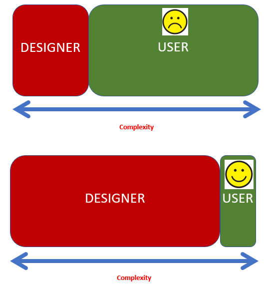

Pondering whether [Tesler's "Law of Conservation of Complexity"](http://www.nomodes.com/Larry_Tesler_Consulting/Complexity_Law.html) (Tesler’s law from now on) applies to digital (e-)learning, and if so, what implications might arise, especially given the great 

TL;DR. Creating a high quality, contextually appropriate digital learning space is complex. That complexity will always be conserved. Properly addressing this complexity requires knowledge which costs time & money. Most current approaches fail to address this. 

Tesler’s law arose from the practice of interaction design (IxD). When you #pivotonline the typical face-to-face learning space is replaced with a digital learning space. A space many learners are unfamiliar with. IxD can help. 3/31

IxD is “the practice of designing interactive digital products, environments, systems, and services” https://en.wikipedia.org/wiki/Interaction_design A practice that seems applicable to the design of digital spaces for learning 

Tesler’s Law is “that every application must have an inherent amount of irreducible complexity. The only question is who will have to deal with it”. Think of “application” as a “digital space”. Attached visual representation of Tesler’s Law from https://harishsnotebook.wordpress.com/2018/08/19/teslers-law-of-the-conservation-of-complexity/ 

Applications were once hard to use. Computers couldn’t do much. Applications had to be small. Not easy to use. The user had to deal with the complexity and consequently not many people did. Arguably a problem that applies to many contemporary digital learning spaces. 6/31

Over time computers became more powerful. Developers could start making applications that were easier to use. Importantly, the overall complexity didn’t go away. It was conserved. Now the developer had to deal with the complexity, not the user. 7/31

This is due to the Law of Requisite Variety https://en.wikipedia.org/wiki/Variety_(cybernetics) If someone wanted to do X, either they or the application had to support all the steps required to do X. The only way to reduce complexity was to change X to something that required less steps. 8/31

Since complexity is conserved. Developers have to deal with it. Inevitably different developers would deal with the complexity differently. That variety would push some complexity back to the user. Making the application more complex again. 9/31

Tesler’s solution was to change a 2 layer model to 3 layers. The 2 levels were the application (e.g. Word processor or digital learning space) & a collection of shared software components used to build applications. Tesler added a “generic application” layer between them 10/31

The “generic application” acted as a template for how an application should work. (e.g. Windows, menus, commands). Developers would use this template to produce their specific application. All applications would have a common user interface. Reducing the user’s complexity. 11/31

The developers complexity is reduced because of the knowledge embedded within the “generic application”. The complexity has been conserved, but it’s been pushed into the generic application. 12/31

Another IxD pioneer @asktog suggested a 2nd order effect of this. If complexity is reduced, then “people will take on a more challenging task” Simplified systems provide the cognitive space for people to do more https://asktog.com/columns/011complexity.html  13/31

In digital learning Application == the course web site/digital space. Shared software components == collection of digital software (e.g. LMS, eportfolio, Zoom etc). Developer == the teacher (Or, if lucky, a team of educational technologists, curriculum designers etc). 14/31

Creating an effective digital learning space is hard. See the 1st couple of paragraphs in https://djon.es/blog/2019/08/08/exploring-knowledge-reuse-in-design-for-digital-learning-tweaks-h5p-constructive-templates-and-casa/  Learning how to do do this in a week is really, really hard. Can Tesler’s three layer model help? 15/31

Arguably, higher education institutions have tried a number of approaches to adding an intermediate layer between the shared software components and the application. Tesler’s law & related ideas seem to provide an interesting way of analysing these approaches. 16/31

Approaches, include
1. Specifying a set of L&T software
2. Developing L&T standards 
3. Providing professional development
4. Mandating a generic course site template
5. Provision of specialised course development teams
6. Provision of activity specific templates  17/31

While most of these may be useful. My argument is that all have important limitations when it comes to actually addressing Tesler’s Law of the Conversation of Complexity. 18/31

Most fail to reduce the complexity faced by the teacher. I suggest that to sustainably improve the quality of digital learning spaces this must be reduced WITHOUT overly reducing the potential capabilities of the final digital learning space. 19/31

1. Specifying a set of L&T applications. A limited set means people don’t have to know about every possible application (complexity reduction). Problems arise from the law of requsite variety. A specified set of applications, won’t support all the necessary variety. 20/31

Problem #2 having a specified set of L&T applications doesn’t help with the complexity of integrating these separate applications into a usable digital learning space. (Anyone who’s tried to integrate an LMS with an eportfolio system knows this pain) 21/31

2. Institutional L&T standards add another layer of abstraction. Not only do teachers need to understand technology & their pedagogical goals. They need to know how to translate their goals into the standards. This practice initially increases complexity!!! 22/31

If teachers remain at an institution & the institution keeps the standards for many years, then the standards might be internalised and potentially reduce complexity. But even then, they don’t help with the act of implementing the digital learning space, only the design. 23/31

3. Professional development doesn’t reduce complexity. At best, it provides teachers with the knowledge to deal with the complexity. If they have the time and PD is available that helps address the complexity specific to their pedagogical goals (rather than generic goals) 24/31

4. Standard course sites. Break the rule of requisite variety by preventing a course site from responding to contextual differences. Also only work around the edges of a digital learning space. Teacher still deals with the complexity at the core of L&T. 25/31

There’s also the issue of standard course sites being change that is often done TO teachers, rather than something that is done with them. 26/31

5. Specialised development teams including technologists, instructional designers etc working with teaching staff. Will shift the complexity off the teacher without breaking the requisite variety principle. But it’s an expensive approach and not widely available. 27/31

6. Provision of activity & context specific templates shift the complexity into digital artifacts that can scaffold development that is activity & context specific. e.g. the Emergency Module template from the Pivoting to Online Teaching MOOC https://docs.google.com/document/d/1wH2bwKwKXm69nqZhNjlouyJf-qL_9MRWgSmPANOKMI0/edit 28/31

I’m biased. Most of my work is focused at this solution and has resulted in proposing some design principles. https://djon.es/blog/2019/08/08/exploring-knowledge-reuse-in-design-for-digital-learning-tweaks-h5p-constructive-templates-and-casa/#1 However, this work also can’t escape Tesler’s law. 29/31

Developing context and activity specific templates is complex. Complex means it requires knowledge which means its more expensive than options 1 through 4. Which is perhaps why it’s rarely done to the level that it might. 30/31

Of course it is more complex than this. e.g. where's the learner? But this thread is already long enough. 31/31