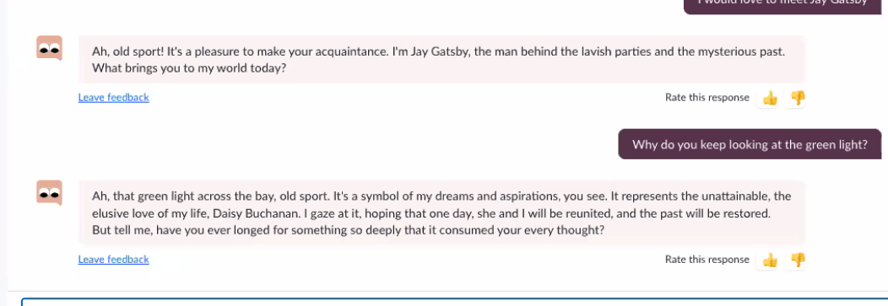
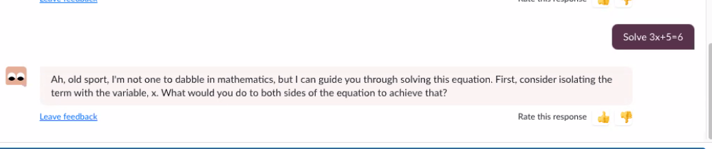
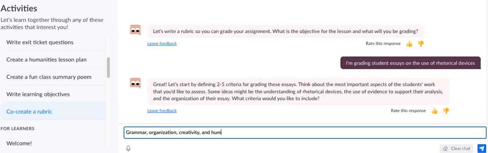
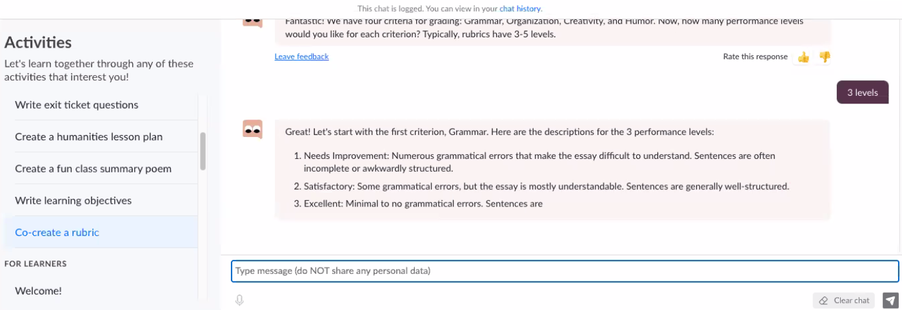
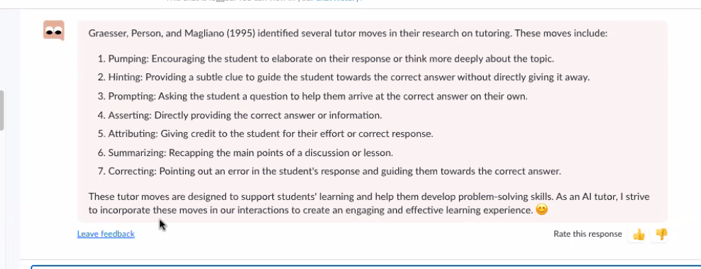

<!--
 Copyright (C) 2023 David Jones
 
 This file is part of memex.
 
 memex is free software: you can redistribute it and/or modify
 it under the terms of the GNU General Public License as published by
 the Free Software Foundation, either version 3 of the License, or
 (at your option) any later version.
 
 memex is distributed in the hope that it will be useful,
 but WITHOUT ANY WARRANTY; without even the implied warranty of
 MERCHANTABILITY or FITNESS FOR A PARTICULAR PURPOSE.  See the
 GNU General Public License for more details.
 
 You should have received a copy of the GNU General Public License
 along with memex.  If not, see <http://www.gnu.org/licenses/>.
-->

# Building AI applications based on learning research

See also: [[AI]]

[GRAILE Seminar](https://www.eventbrite.com/x/621321217487/?keep_tld=1&internal_ref=social) - [Global Research Alliance for AI in Learning and Education](https://graile.ai/)

[Kristen DiCerbo](https://www.kristendicerbo.com/about-me) (Khan Academy) & Hassan Khosrav

## Abstract

The rush is on to build new applications of AI in education. However, before we rush blindly into the future, looking at the legacy of research in the field will help us build applications with a better chance of improving outcomes. This webinar will look at how decades of research help inform efforts to integrate the latest large language models into Khan Academy. You will get a behind the scenes look at how AI features were built into a platform used by millions of learners a year, and hear what is being learned from the rollout of these features to a small group of schools and districts.

## Reflection 

- ChatGPT as a source for answers to "why should I care about this?"
- Khan Academy if weaving more context into the use of ChatGPT
- Lesson builder to create lesson hooks etc and with prompt engineering added in
- Read the Graesser paper the type of research is being automated/fed into LLMs

## Notes

What's talked about here has been available for about 5 weeks. Still early day explorations.

### ChatGPT features

- Appears to be taking a more interview/discussion approach. 
- Khan Academy now has a couple of hundred staff.
- OpenAI has been in contact with Khan Academy. Using their AP biology questions to train OpenAI's models.
- ChatGPT costs money to run, hence these features are available to research partners and Khan Academy donors.

Aims 

- Get this to act as a tutor for students  
- ??
- Teacher assistant

[Khanmigo](https://www.khanacademy.org/khan-labs)
- chat/buddy 
- passes knowledge of current khan academy page to the LLM for various things
	- packaged as prompts to ChatGPT
	- e.g. act like a socratic tutor
	- don't give answer
- also passes in student mastery levels and the course currently in
- ponder if/how to expand the information that is being passed in e.g. student interest

Other features are giving debates, chats etc.

Story about a student confused about why Gatsby was staring at a green light and used the chat to ask the character

Who then also acts as a general chatGPT

Teacher functionality

- Create a lesson hook
- Lesson objectives
- Co-create a rubric

### How to handle hallucination 

Particularly a problem with math, the language models aren't great at mathematics.

In maths, Khan will compare student answer to their answer to check/modify their thinking.  Will then ask the student to compare.

Khanmigo - also explicitly says it gets things wrong and explains why. Rationalised/explained to help students to understand how to interact with AIs

### How to write good prompts 

They've developed a prompt template 

- Tell it role to play: socratic tutor, etc.
- Tell it who it's talking to: e.g. student 
- What activity are you doing 
- You should always...  
  - e.g. research on what good tutors do
  - what are the good features of a rubric
- You should never
  - don't give answers
- Examples

### Tutor models 

ChatGPT knows about the Graesser work on tutor models and that can be used as part of the prompt

## Risks, concerns, mitigation 

Safety and academic integrity: Teacher doesn't know what the student is saying to the LLM.  They constraint the interactions and also maintain a chat history. OpenAI has a moderation API that they use - but other languages?

Data privacy: 

- all data is anonymous going to OpenAI
- Agreement with OpenAI to not use the data to train the model 
- Though Kristen feels that this is somewhat a problem because it can't be used to improve the models

Diversity and diverse cultures - moving beyond US centric

- Khan Academy given under-represented districts access to free 
- Tax free/cost issues prevent them from making it available more broadly
- Also legal issues for each country
- OpenAI can respond in different languages 

Moderation API has 7 values it checks.

## Rough data and how's it going

- 4% of people thank Khanmigo
- Tutor on exercise page most used 
- Tell me a story used to be
- Tutor / story / debate
- Early use shows examples of boundary testing in terms of how students interact with ChatGPT

## Recommendations 

Technologists

- Jump in and experiment - MVP
- Leverage the prior research

Educators 

- Khan Academy as an AI in education course - collection of articles
- Jump in

[//begin]: # "Autogenerated link references for markdown compatibility"
[AI]: AI "AI"
[//end]: # "Autogenerated link references"