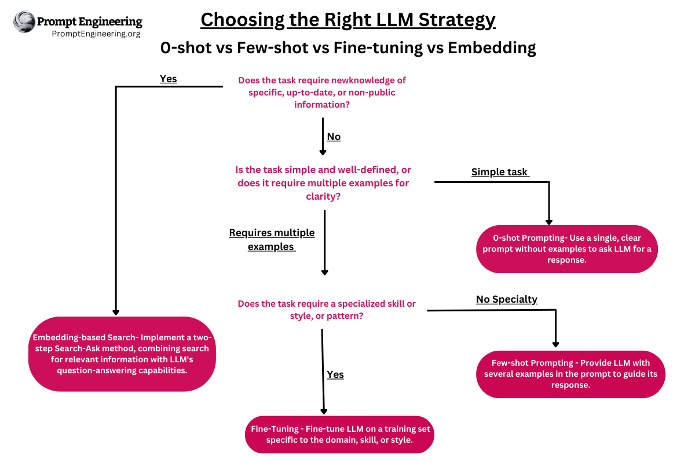
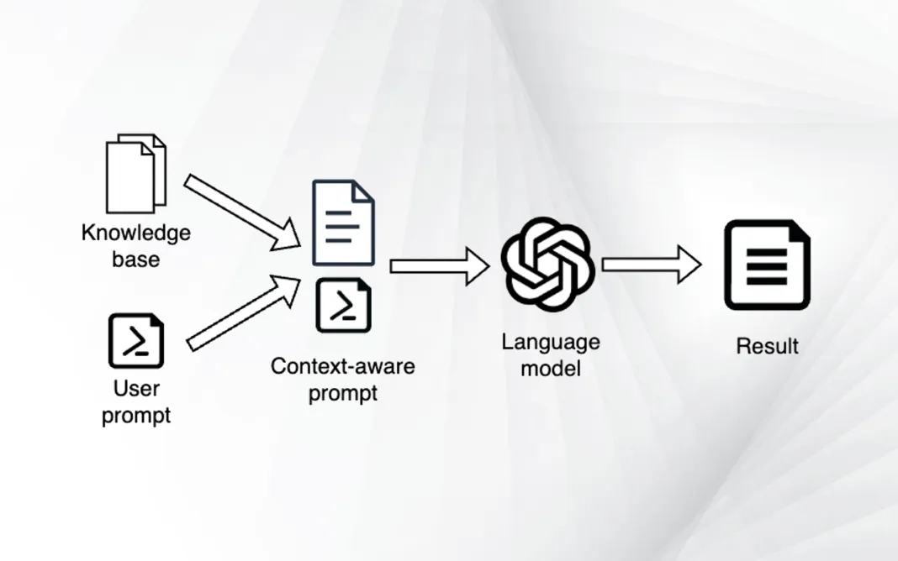

<!--
 Copyright (C) 2023 David Jones
 
 This file is part of memex.
 
 memex is free software: you can redistribute it and/or modify
 it under the terms of the GNU General Public License as published by
 the Free Software Foundation, either version 3 of the License, or
 (at your option) any later version.
 
 memex is distributed in the hope that it will be useful,
 but WITHOUT ANY WARRANTY; without even the implied warranty of
 MERCHANTABILITY or FITNESS FOR A PARTICULAR PURPOSE.  See the
 GNU General Public License for more details.
 
 You should have received a copy of the GNU General Public License
 along with memex.  If not, see <http://www.gnu.org/licenses/>.
-->

# Customising LLMs

## [LLM Embedding and Fine Tuning](https://www.promptengineering.org/master-prompt-engineering-llm-embedding-and-fine-tuning/)

Both fine-tuning and embeddings have challenges.

> Fine-tuning concentrates on teaching the model new tasks via transfer learning, while semantic embeddings involve converting the text's meaning into a numerical representation, which can be employed in tasks such as semantic search and information retrieval

## Summary 

Fine-tuning GPT-3/3.5/4

1.  Teaches new tasks or patterns
1.   Originally created for image models, now applies to NLP tasks
1.    Used for classification, sentiment analysis, and named entity recognition
1.    Does not teach new information, only new tasks
1.    Prone to confabulation and hallucination
1.    Expensive, slow, and difficult to implement
1.    Not scalable for large datasets

Embedding & Semantic Search

1.    Also known as neural search or vector search
1.    Adds to the LLMs knowledge base
1.    Uses semantic embeddings to represent text meaning
1.    Scales well, fast, and cost-effective
1.    Searches based on context and topic, not just keywords
1.    Easily updates with new information
1.    Solves half of the QA problem by retrieving relevant information

Comparing Fine-tuning and Semantic Search
Fine-tuning

1.    Slow, difficult, and expensive
1.    Prone to confabulation
1.    Teaches new tasks, not new information
1.    Requires constant retraining
1.    Not ideal for QA tasks

Semantic Search

1.    Fast, easy, and cheap
1.    Recalls exact information
1.    Easy to add new information
1.    Scalable and efficient
1.    Solves half of QA tasks by retrieving relevant documents

## [Document embeddings](https://bdtechtalks.com/2023/05/01/customize-chatgpt-llm-embeddings/)

Provides an overview of a specific process. Breaking it down and pointing to related software that can help.  [LangChain](https://python.langchain.com/en/latest/index.html) - a Python project, but also [a javascript version](https://js.langchain.com/docs/) - appears to be an attempt to provide a higher order abstraction than rolling your own entirely.

Echoing the idea being [[first-llm-api-experiments]]

> Say you have a website that has thousands of pages with rich content on financial topics and you want to create a chatbot based on the ChatGPT API that can help users navigate this content. You need a systematic approach to match users’ prompts with the right pages and use the LLM to provide context-aware responses. This is where document embeddings can help.

Presents the following high level model. Planning to use _document embeddings_ to provide the context aware information 

Which translates into this specific

1- The user enters a prompt
2- Create the embedding for the user prompt
3- Search the embedding database for the document that is nearest to the prompt embedding
4- Retrieve the actual text of the document
5- Create a new prompt that includes the user’s question as well as the context from the document
6- Give the newly crafted prompt to the language model
7- Return the answer to the user
8- Bonus: provide a link to the document where the user can further obtain information

### Document embeddings 

A list of numbers (numerical vector) representing the features of some information.

Process

1. Generate embeddings from your documents 

	Options for generating an embedding include 

      - [OpenAI's Embeddings API](https://platform.openai.com/docs/guides/embeddings/what-are-embeddings)
      - [Hugging Face](https://huggingface.co/blog/getting-started-with-embeddings)
      - [Training your own custom transformer model](https://bdtechtalks.com/2022/05/02/what-is-the-transformer/)

2. Storing the embeddings.

	1. Python associated [Faiss](https://github.com/facebookresearch/faiss)
	2. [Pinecone](https://www.pinecone.io/) (online)

[//begin]: # "Autogenerated link references for markdown compatibility"
[first-llm-api-experiments]: first-llm-api-experiments "First experiments with LLM APIs"
[//end]: # "Autogenerated link references"