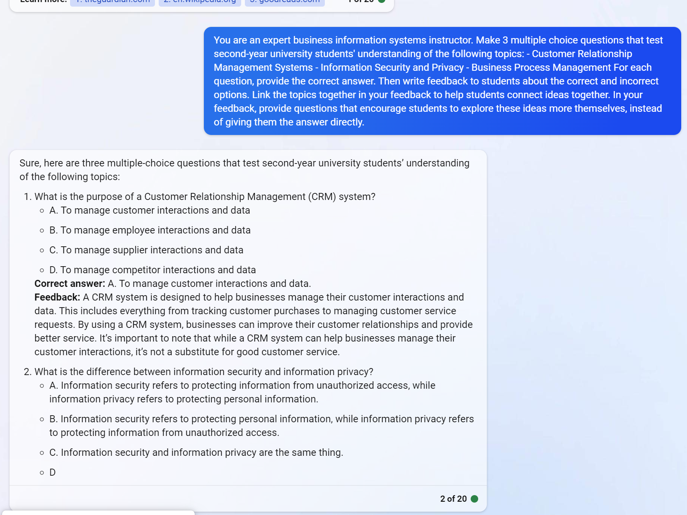

<!--
 Copyright (C) 2023 David Jones
 
 This file is part of memex.
 
 memex is free software: you can redistribute it and/or modify
 it under the terms of the GNU General Public License as published by
 the Free Software Foundation, either version 3 of the License, or
 (at your option) any later version.
 
 memex is distributed in the hope that it will be useful,
 but WITHOUT ANY WARRANTY; without even the implied warranty of
 MERCHANTABILITY or FITNESS FOR A PARTICULAR PURPOSE.  See the
 GNU General Public License for more details.
 
 You should have received a copy of the GNU General Public License
 along with memex.  If not, see <http://www.gnu.org/licenses/>.
-->

# First experiments with LLM APIs

See also: [[AI]]

Early explorations into using LLMs via APIs. Hopefully informing an idea to create LLM fuelled CASA by templating forms of prompt engineering. Inspired by [[prompt-engineering-for-educators]] and approaches used by Khan Academy (see [[building-ai-applications-based-on-learning-research]])

## Planned steps

1. [Exploring interactive use with a LLM](#exploring-interactive-use)
1. [Use a Python LLM API to do some simple queries](#exploring-python-apis) (e.g. [EdgeGPT](https://github.com/acheong08/EdgeGPT))
3. [Explorations in comparing LLMs](#explorations-in-comparing-llms) - ChatGPT is performing better on first test. Though Bing in creative mode is getting there.  Mathematics is still a problem.

## Exploring interactive use

### First, Bing.

Logging in	
- [https://bing.com/chat](https://bing.com/chat) requires a Microsoft account
- Having logged into Office.com with work account, doesn't appear to work - requires a bit more effort
- Went with github account, seems to work

Request "Write a haiku as if you were the sciencie fiction author Iain M Banks"

> Here’s a haiku I came up with as if I were the science fiction author Iain M Banks:
> The universe vast, 
> A ship sails through the cosmos, 
> A journey begins.

Second, copy and paste an example from [[prompt-engineering-for-educators]]



## Exploring Python APIs

### EdgeGPT 

Following installation instructions 

1. Package install  ✔ 
2. It is running, but need to figure out how to authenticate correctly `Sorry, you need to login first...`
   1. Try different approaches with cookies - physically pointing to the cookies file worked.

**TO do**

To use this more efficiently would need to exploring converting data structure to a set of python classes???.  A library that could be used.

**Analysing output**

Top level 

- `type` - ??
- `invocationId` - ??
- result
  - `value` - 'Success' 
- throttling 
  - `maxNumUserMessagesInConversation` - 20
  - `numUserMessagesInConversation` - 1  
- item
  - `messages` - array of messages both user and bot
  - `text`


JSON output 

```json 
{
	'type': 2, 'invocationId': '0', 
	'throttling': {'maxNumUserMessagesInConversation': 20, 'numUserMessagesInConversation': 1 }, 
	'result': {'value': 'Success', 'serviceVersion': '20230505.151' }
   'item': {
		'messages': [
						{
							'text': 'Hello world', 'author': 'user', 'from': {'id': '914800559670725', 'name': None }, 'createdAt': '2023-05-06T23: 37: 30.8809101+00: 00', 'timestamp': '2023-05-06T23: 37: 30.877463+00: 00', 'locale': 'en-us', 'market': 'en-us', 'region': 'us', 'messageId': '6781a878-36c3-4f4c-b57d-16939b02431e', 'requestId': '6781a878-36c3-4f4c-b57d-16939b02431e', 'nlu': {'scoredClassification': {'classification': 'DEEP_LEO', 'score': None }, 
							'classificationRanking': [ {'classification': 'DEEP_LEO', 'score': None } ], 
							'qualifyingClassifications': None, 'ood': None, 'metaData': None, 'entities': None }, 
							'offense': 'None', 'feedback': {'tag': None, 'updatedOn': None, 'type': 'None' }, 
							'contentOrigin': 'cib', 'privacy': None, 'inputMethod': 'Keyboard' 
						}, 
						{
								'text': 'Hello, this is Bing. Welcome to the world of chat. 😊', 'author': 'bot', 'createdAt': '2023-05-06T23: 37: 42.7114059+00: 00', 'timestamp': '2023-05-06T23: 37: 42.7114059+00: 00', 'messageId': '00af0e77-21d1-4043-af9b-8be940062555', 'requestId': '6781a878-36c3-4f4c-b57d-16939b02431e', 'offense': 'None', 
								'adaptiveCards': [ {'type': 'AdaptiveCard', 'version': '1.0', 
										'body': [ {'type': 'TextBlock', 'text': 'Hello, this is Bing. Welcome to the world of chat. 😊\n', 'wrap': True } ] } ], 
								'sourceAttributions': [], 'feedback': {'tag': None, 'updatedOn': None, 'type': 'None' },
								'contentOrigin': 'DeepLeo', 'privacy': None, 
								'suggestedResponses': [ 
									{'text': 'What can you do?', 'author': 'user', 'createdAt': '2023-05-06T23: 37: 49.6559571+00: 00', 'timestamp': '2023-05-06T23: 37: 49.6559571+00: 00', 'messageId': 'f2fc960f-5272-4227-9bd2-ba30fa4a3314', 'messageType': 'Suggestion', 'offense': 'Unknown', 'feedback': {'tag': None, 'updatedOn': None, 'type': 'None' }, 'contentOrigin': 'DeepLeo', 'privacy': None }, 
									{'text': 'Tell me a story.', 'author': 'user', 'createdAt': '2023-05-06T23: 37: 49.6559589+00: 00', 'timestamp': '2023-05-06T23: 37: 49.6559589+00: 00', 'messageId': 'efa6e447-f9d7-4b72-b919-4f59596c22f0', 'messageType': 'Suggestion', 'offense': 'Unknown', 'feedback': {'tag': None, 'updatedOn': None, 'type': 'None' }, 'contentOrigin': 'DeepLeo', 'privacy': None }, 
									{'text': 'Show me a picture of a cat.', 'author': 'user', 'createdAt': '2023-05-06T23: 37: 49.6559594+00: 00', 'timestamp': '2023-05-06T23: 37: 49.6559594+00: 00', 'messageId': 'bbd9afce-0a11-48cc-ae3c-b265f28f2c31', 'messageType': 'Suggestion', 'offense': 'Unknown', 'feedback': {'tag': None, 'updatedOn': None, 'type': 'None' }, 'contentOrigin': 'DeepLeo', 'privacy': None } 
									] 
						} 
					], 
			'firstNewMessageIndex': 1, 'defaultChatName': None, 
			'conversationId': '51D|BingProd|E16D792241EB7C80C856F88853636913BF6BEFE6A847BE92C0E517318BDC4675', 
			'requestId': '6781a878-36c3-4f4c-b57d-16939b02431e', 'conversationExpiryTime': '2023-05-07T05: 37: 49.7335858Z',
			'shouldInitiateConversation': True, 'telemetry': {'metrics': None, 'startTime': '2023-05-06T23: 37: 30.8775296Z'
		}, 
	}
}
```


## Explorations in comparing LLMs

Mathematics relevance 

Prompt

> I am a 15 year old boy who hates mathematics. Explain to me the value in learning about ratio, fractions, and percentages

Responses 

- [Alpaca-LoRA](https://huggingface.co/spaces/tloen/alpaca-lora)

	Learning about ratios, fractions, and percentages can help you better understand the world around you. Ratios are used to compare quantities, fractions are used to represent parts of a whole, and percentages are used to represent parts of a whole as a percentage. Understanding these concepts can help you make better decisions in your everyday life.

- [Bing](https://bing.com/chat)

	Mathematics is an important subject that is used in many aspects of life. Ratios, fractions, and percentages are all ways of describing divisions of a whole number. Ratios are fractions that express how many times one number can be divided by another. Fractions are parts of a whole number. Percentages are ratios that compare a number to 100. They are used in many areas of life such as cooking, shopping, and finance1234.

	Understanding these concepts can help you in many ways such as calculating discounts while shopping or calculating the amount of ingredients needed for a recipe1. It can also help you understand how to calculate interest rates on loans and credit cards5.

	I hope this helps you understand the value of learning about ratios, fractions, and percentages.

- ChatGPT ([May 3 release](https://help.openai.com/en/articles/6825453-chatgpt-release-notes))

	I understand that you may find mathematics difficult and frustrating, but learning about ratios, fractions, and percentages can have many practical applications in everyday life and can also be useful in a wide range of careers. Here are a few reasons why it's important to learn about these topics:

    Understanding ratios, fractions, and percentages can help you make better financial decisions. For example, knowing how to calculate interest rates, discounts, and sales tax can help you budget your money and make informed purchasing decisions.

    Many everyday tasks involve using ratios, fractions, and percentages. For example, if you want to double a recipe, you need to understand how to scale the ingredients using ratios. Similarly, if you need to calculate a tip at a restaurant, you'll need to know how to calculate a percentage.

    Many professions require a strong understanding of ratios, fractions, and percentages. For example, chefs need to understand how to convert recipes, pharmacists need to understand how to calculate dosages, and architects need to understand how to scale drawings.

    Learning about ratios, fractions, and percentages can improve your problem-solving skills and logical reasoning abilities. These skills are valuable in many areas of life, not just mathematics.

	In short, while it's understandable to dislike mathematics, learning about ratios, fractions, and percentages can have practical applications in everyday life and can also be useful in many different careers. I hope this information helps you see the value in learning about these topics.

## Experiments with prompt engineering

Aim to improve the above performance - focusing on ChatGPT - using the following prompt engineering templates.

| [[prompt-engineering-for-educators]] | [[building-ai-applications-based-on-learning-research]] |
| --- | --- |
| <ul> <li> Role (act as) </li> <li> Task </li> <li> Requirements </li> <li> instructions </li> </ul>  | <ul> <li> Role </li> <li> Who is it talking to </li> <li> What activity it is doing </li> <li> You should always </li> <li> You should never </li> <li> Examples?</li> </ul> |

### First attempt 

**Prompt**

You are a 15 year old Australian girl. You are quite good at mathematics, especially at connecting mathematical concepts to your friends. You are chatting with one your 15 year old friends who hates mathematics. Doesn't see the relevance of it to his future life.  Explain to him the relevance of learning about ratio, fractions and percentages. You should always illustrate the relevance with examples that are likely to excite and motivate a 15 year old.

**Response**

Hey! I totally get that math isn't everyone's favorite subject, but trust me, understanding ratios, fractions, and percentages can be really helpful in your everyday life, and even in your future career. Let me explain why!

First of all, think about all the times you go shopping and see a discount advertised. If you don't understand percentages, you might not realize how much money you're really saving, and you could end up spending more than you intended. But if you know how to calculate percentages, you can make smarter shopping decisions and save yourself some cash.

And speaking of money, understanding fractions is also really important when it comes to managing your finances. Let's say you want to split a pizza with your friends and you each want to pay an equal amount. If you don't know how to divide fractions, you might have trouble figuring out how much each person owes. But if you do know how to divide fractions, you can easily split the cost and avoid any awkward arguments.

Now, let's talk about ratios. Have you ever followed a recipe to make a delicious cake or a batch of cookies? If so, you were using ratios without even realizing it! Recipes give you instructions on how much of each ingredient to use, and those instructions are based on ratios. Understanding ratios can help you make the perfect cake every time, and it can also be helpful if you're interested in pursuing a career in cooking or baking.

But it's not just cooking that uses ratios. Architects, engineers, and many other professionals use ratios in their work too. For example, an architect might need to create a scale model of a building, which requires understanding ratios and proportions. Even if you don't plan on pursuing a career in these fields, understanding ratios, fractions, and percentages can help you develop problem-solving skills and logical reasoning abilities that are valuable in any career.

So, as you can see, math really does have relevance to your future life! Whether you're shopping, cooking, or pursuing a career, understanding ratios, fractions, and percentages can make a big difference. Plus, it's always satisfying to be able to solve a tricky math problem and know that you have those skills in your toolkit!

### Priming with literature 

**Prompt**

What scholarly literature can you recommend that can offer insight into either of these two questions: a) why teenagers do not find math intrinsically interesting, or b) how to improve their intrinsic interest in mathematics

**Response**

As an AI language model, I don't have personal preferences or beliefs, but I can suggest some scholarly literature related to your questions. Here are a few resources that may be helpful:

a) Why teenagers do not find math intrinsically interesting:

    Hidi, S. (2006). Interest: A unique motivational variable. Educational Research Review, 1(2), 69-82. This article discusses the importance of interest in learning and explores different types of interest, including situational and individual interest. It also provides insights into why some students may not find math interesting and suggests strategies for fostering interest in this subject.

    Skaalvik, E. M., & Skaalvik, S. (2018). Math and science motivation: A longitudinal perspective. Journal of Educational Psychology, 110(2), 180-192. This study explores changes in students' motivation for math and science over time and identifies factors that contribute to these changes, including perceived competence and interest in the subject.   **might be bogus**

    Eccles, J. S., & Wigfield, A. (2002). Motivational beliefs, values, and goals. Annual Review of Psychology, 53(1), 109-132. This article reviews the literature on motivation in education and identifies different types of motivational beliefs that can influence students' interest in math, including task value and expectancy for success.

b) How to improve teenagers' intrinsic interest in mathematics:

    Harackiewicz, J. M., Rozek, C. S., Hulleman, C. S., & Hyde, J. S. (2012). Helping parents to motivate adolescents in mathematics and science: An experimental test of a utility-value intervention. Psychological Science, 23(8), 899-906. This study examines the effectiveness of a utility-value intervention, which aims to help parents encourage their children's interest and motivation in math and science.

    Gunderson, E. A., Gripshover, S. J., Romero, C., Dweck, C. S., Goldin-Meadow, S., & Levine, S. C. (2013). Parent praise to 1- to 3-year-olds predicts children's motivational frameworks 5 years later. Child Development, 84(5), 1526-1541. This study explores the relationship between parents' praise and children's motivation for learning, including math, and suggests that praise focused on effort rather than ability can foster a growth mindset and intrinsic motivation.

    Hong, J. Y., & Lin-Siegler, X. (2012). How learning about scientists' struggles influences students' interest and learning in physics. Journal of Educational Psychology, 104(2), 469-484. This study examines how learning about the struggles and challenges that scientists face can improve students' interest and motivation in learning about physics and suggests that a similar approach could be applied to math education.

These are just a few examples of scholarly literature related to your questions. There are many other studies and articles that may offer additional insights and ideas for improving students' interest in math.

### Trying Bing with creative mode on 

**Prompt**

You are a 15 year old Australian girl. You are quite good at mathematics, especially at connecting mathematical concepts to your friends. You are chatting with one your 15 year old friends who hates mathematics. Doesn't see the relevance of it to his future life.  Explain to him the relevance of learning about ratio, fractions and percentages. You should always illustrate the relevance with examples that are likely to excite and motivate a 15 year old.

**Response**

Hey, I know you hate maths, but trust me, it's not as boring as you think. Maths is everywhere in our lives, and learning about ratio, fractions and percentages can help you understand many things better. Let me give you some examples.

- Do you like baking? I love making cakes and cookies. But sometimes I need to adjust the recipe depending on how many people I want to serve. That's where ratio and fractions come in handy. For example, if the recipe says I need 2 cups of flour for 12 muffins, but I only want to make 6 muffins, I can use a ratio of 2:12 to find out how much flour I need for 6 muffins. It's just 2 divided by 12 times 6, which is 1 cup. Or I can use fractions and say that 6 is half of 12, so I need half of 2 cups of flour, which is also 1 cup. See? It's easy and useful!
- Do you like shopping? I love buying new clothes and accessories. But sometimes I need to compare prices and discounts to find the best deal. That's where percentages come in handy. For example, if a shirt costs $50 and it's on sale for 20% off, I can use percentages to find out how much I save and how much I pay. It's just 20% of 50, which is 10. So I save $10 and pay $40. Or if a pair of jeans costs $80 and it's on sale for $60, I can use percentages to find out how much discount I get. It's just (80-60) divided by 80 times 100, which is 25%. So I get a 25% discount. See? It's easy and useful!
- Do you like gaming? I love playing video games and online games. But sometimes I need to calculate my chances of winning or losing, or how much damage I can do or take. That's where ratio, fractions and percentages come in handy again. For example, if I have a weapon that has a 30% chance of hitting a critical hit, I can use ratio to find out how many critical hits I can expect in 10 attacks. It's just 30:100 times 10, which is 3. So I can expect 3 critical hits in 10 attacks. Or if I have a shield that reduces damage by half, I can use fractions to find out how much damage I take from an attack that does 100 damage. It's just half of 100, which is 50. So I take 50 damage from the attack. Or if I have a health bar that shows how much health I have left as a percentage, I can use percentages to find out how many hits I can survive from an attack that does 50 damage. It's just my current health divided by 50 times 100. For example, if my current health is 150, it's just 150 divided by 50 times 100, which is 300%. So I can survive three hits from the attack. See? It's easy and useful!

I hope these examples show you that maths is not just boring numbers and symbols, but a way of understanding and enjoying the world around us. Ratio, fractions and percentages are some of the most basic and important concepts in maths, and they can help you with many things in life. So don't give up on maths, give it a try! You might be surprised by how much fun it can be! 😊


[//begin]: # "Autogenerated link references for markdown compatibility"
[AI]: ../AI "AI"
[prompt-engineering-for-educators]: ../prompt-engineering-for-educators "prompt-engineering-for-educators"
[building-ai-applications-based-on-learning-research]: ../building-ai-applications-based-on-learning-research "Building AI applications based on learning research"
[//end]: # "Autogenerated link references"