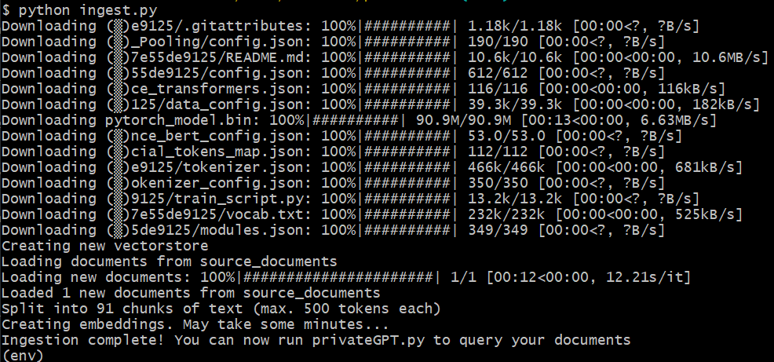
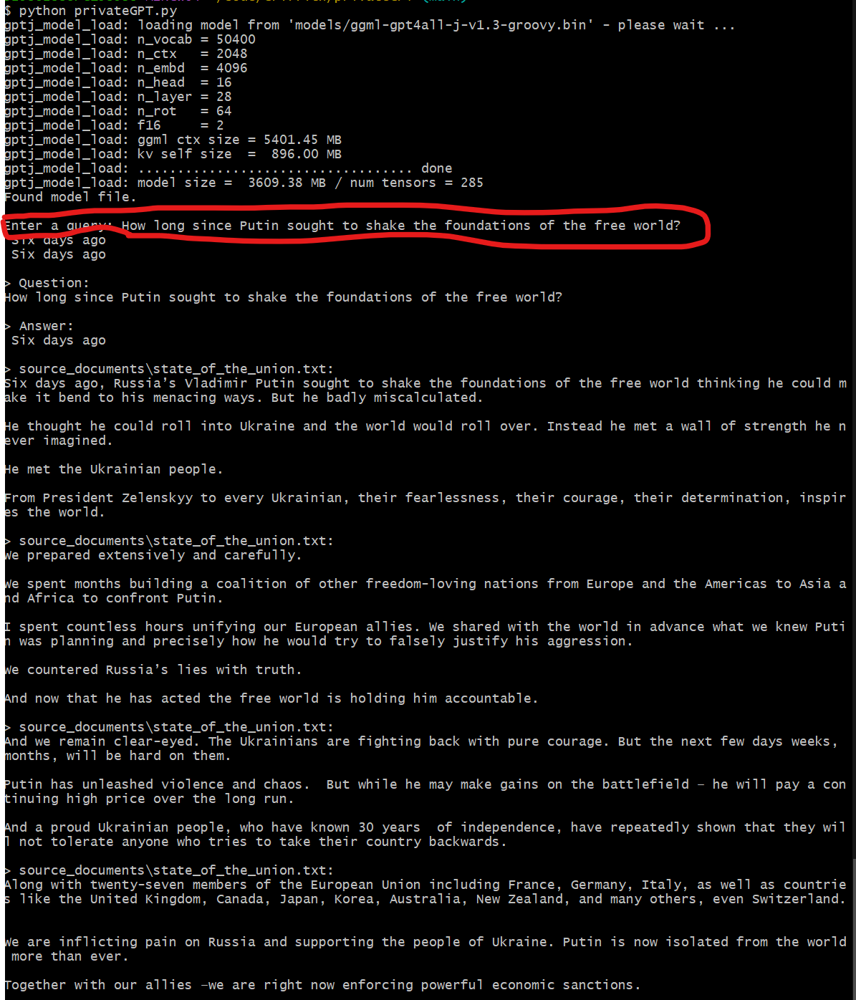

<!--
 Copyright (C) 2023 David Jones
 
 This file is part of memex.
 
 memex is free software: you can redistribute it and/or modify
 it under the terms of the GNU General Public License as published by
 the Free Software Foundation, either version 3 of the License, or
 (at your option) any later version.
 
 memex is distributed in the hope that it will be useful,
 but WITHOUT ANY WARRANTY; without even the implied warranty of
 MERCHANTABILITY or FITNESS FOR A PARTICULAR PURPOSE.  See the
 GNU General Public License for more details.
 
 You should have received a copy of the GNU General Public License
 along with memex.  If not, see <http://www.gnu.org/licenses/>.
-->

# PrivateGPT 

See also: [[AI]]

Log of an experiment to get [privateGPT](https://github.com/imartinez/privateGPT) working locally. HT to Chris Bigum and [this post](https://bdtechtalks.com/2023/06/01/create-privategpt-local-llm/?utm_source=feedly&utm_medium=rss&utm_campaign=create-privategpt-local-llm)

## Process overview 

1. [Preparation](#preparation) - install the software on my laptop ✔ 
2. [Initial testing](#initial-testing) - get the software working with the supplied test file ✔ 
3. [Examine possible refinements](#examine-possible-refinements) - it's a work in progress with a lot of people experimenting, what refinements exist and are doable? 🚧 - all require a bit of work - for later
4. [Test with blog posts](#test-with-blog-posts) - Use the ??? posts on my blog as the first major test 🚧 

## Preparation 

Preparation
1. Clone the repo. ✔ 
   -  GitHub desktop FTW
2. Set up virtual environment. ✔
   - `pip install virtualenv`
   - In the local repo, 
     - `py -m venv env`
     - `. ./env/Scripts/activate`


Specific to privateGPT

3. Install requirements. ✔ 
   - using `requirements.txt` not working (thank you MOE security rules that don't like bash.exe)
   - attempting to manually install with Python 
     - Initially not paying attention to the specific versions - this may bite me on the...which given how long a fresh install takes is not a good thing.
   - First install didn't work for ChromaDb -- needed v14 or later of [C++ build tools](https://visualstudio.microsoft.com/visual-cpp-build-tools/)
     - Apparently including a ~2Gb download/install
4. Download and install the recommended LLM  ✔
	- **hint** Do this early will take some time
5. Modify the environment file ✔
6. Do a test - apparently comes with the state of the union ✔
   - `python ingest.py` and the fun begins - see [Initial testing](#initial-testing)


### Late update - MinGW 

Crashes running on a large data set suggested a problem.  The readme suggested my environment might be missing [MinGW](https://github.com/imartinez/privateGPT#c-compiler). Hence time to restart and see how it goes. But it turns out [as per this](https://www.pascallandau.com/blog/setting-up-git-bash-mingw-msys2-on-windows/) I do have MinGW...is it up to date? 

- No, there is a new version.  Update that `git update-git-for-windows`
- That didn't work.  Might be time for a "turn it off and on again"
- Restart and all is good 
- let's start again 
  - Clone new version of repo
  - Set up virtual environment
  - Install requirements 
    - Try `python -m pip install -r requirements.txt` 
      - that appears to be working this time around
  - Copy the LLM file
    - mkdir the models folder
  - Rename and modify the `example.env` file
    - This is where VS-Code may have done something silly/problematic - nothing this time
    - make the `db` folder
  - add in some of my own source documents - in fact all of them, remove the state of the union
    - 1415 blog post HTML files copied in

  **VS Code Problems**

  At this stage, VS-Code starts consuming huge amounts of memory and CPU. Seemed to start after copying the files in.  The window with `privateGPT` hangs and reports "taking longer backups" or some such...and eventually gives a "terminated unexpectedly" problem

  Apparently related to [this problem](https://github.com/microsoft/vscode/issues/154085)

  Leave this for now - but don't open VS-Code in the privateGPT folder

  **Ingest and test** 

This appears to be working. A single Python instance.  All working.  Pick up again with [working blog chat bot](#working-personal-blog-chat-bot)


## Initial testing

Aim here is to run using just the provided [single text file](https://github.com/imartinez/privateGPT/blob/main/source_documents/state_of_the_union.txt). 

- forgot to rename the `env.example` file to `.env` - fixed
- `sentence_transformers` not installed, suggesting more issues with my manual install of requirements - perhaps due to the Visual C++ build tools update issue?
- `python -m pip install sentence_transformers` - fixed, but due to the local env, this takes a while given a lot of requirements
- Will do a manual install on all after chromdb, just in case, listing those that did require install
  - `llama-cpp-python`

  Success



But loading the module gets an error 
bash```
  File "C:\Users\..\privateGPT\env\lib\site-packages\gpt4all\pyllmodel.py", line 141, iload_model
    llmodel.llmodel_loadModel(self.model, model_path.encode('utf-8'))
OSError: exception: access violation reading 0x000000D4AABF0000
```

Try the "Git Bash/UTF-8" fix - add the following to start of `ingest.py` - fixed
python```
import sys
import io

sys.stdout = io.TextIOWrapper(sys.stdout.detach(), encoding='utf-8')
```




## Examine possible refinements

Some possible refinements include  -- all require some significant tinkering

- Different LLMs, possibilities include 
  - [h2oGPT](https://github.com/h2oai/h2ogpt#windows-1011) - appears to require a very different install than the binary for the default LLM (i.e. complexity)
- [Chroma collections](https://github.com/imartinez/privateGPT/discussions/298)
  - Chroma - the vector database used here - supports "collections" to separate out document types - questions exist how to integrate in privateGPT
- Add a web (or other) interface (beyond the command line)
  - [Example/attempt](https://github.com/imartinez/privateGPT/discussions/487) to get ChatGPT-4 to write a [streamlit version](https://streamlit.io/)


### Streamlit experiment

- Install streamlit `pip install streamlit`
- Copy and paste the code from the example 
- `streamlit run streamLitPrivateGPT.py`

Running into problems with MOE configuration stopping Streamlit being run

## Test with blog posts 

[My blog](https://djon.es/blog/) is probably the biggest collection of personal text I have (my Zotero library is another option)

1. Export posts 
2. Decide what format to convert to: file format and file structure (separate files?)
   - separate text files seems the go 
3. Convert to that format and place in privateGPT - see [Blog posts to import files](#blog-posts-to-import-files)


## Blog posts to import files

### Parsing and writing files 

Uses [feedparser Python library](https://feedparser.readthedocs.io/en/latest/) ends up with individual posts in array of hashes with the following keys 

- Check out content titles for a few more posts to see if/how it changes - appears to be HTML
  - Anything with a URL `p=<wp_post_id>` appears to be draft
- Figure what files to write - maybe HTML with links, title etc.
  - 1425 files written

| Keys | Content/Description | 
| ---- | ------------------- |
| `title`| String - title of post   |
| `content`| List of dicts **do more**   |
| `link`| URL for the original post - using `p=<wp_post_id>`   |
| `title_detail`| FeedParserDict of information about the title, including value, type, language   |
| `links`| Dict with misc details about lnks   |
| `published`| String no value in test   |
| `published_parsed`| String, None   |
| `authors`| List of author usernames   |
| `author`| String user author name   |
| `author_detail`| Dict with more detail of author   |
| `id`| String - in first example an old CQ-PAN URL and id   |
| `guidislink`| Boolean   |
| `summary`| String empty   |
| `summary_detail`| Dict   |
| `excerpt_encoded`| String empty   |
| `wp_post_id`| String # matching link   |
| `wp_post_date`| STring date   |
| `wp_post_date_gmt`| STring date   |
| `wp_post_modified`| STring date   |
| `wp_post_modified_gmt`| STring date   |
| `wp_comment_status`| String "open"   |
| `wp_ping_status`| String "open"   |
| `wp_post_name`| String empty   |
| `wp_status`| STring draft : 346 in draft; 1439 private, 5 trash, and 5 private  |
| `wp_post_parent`| String 0   |
| `wp_menu_order`|String 0    |
| `wp_post_type`| String `post`   |
| `wp_post_password`| String empty   |
| `wp_is_sticky`| String 0   |
| `tags` | List of dicts `{ term: '', scheme: '', Label: None }` - 304 different categories, top 20 have 43 posts or more.  Uncategorised the largest with 862 (only published)|

### Ingest and query 

Noticing a recurring problem 
```
      1 [main] python (13416) C:\Users\s2986288\AppData\Local\Programs\Python\Python310\python.exe: *** fatal error - Internal error: TP_NUM_C_BUFS too small: 50
```

And appeared it might be stuck. Try a lot less files - try with 10 and delete the `db` folder to start afresh

## Working personal blog "chat bot" 

With the [late update](#late-update---mingw) all is working. I've a locally working GPT chat bot for [my personal blog](https://djon.es/blog) 

### What is BAM?

One of my projects over the years was BAM (Blog Aggregation Management). Numerous blog posts talk about BAM. So what is BAM?

The problems start - hallucination.

<blockquote>
Enter a query: <strong>What is BAM?</strong>

BAM stands for <mark>Building Awareness Management System</mark> which aims at extending the concept and ideas around e-learning technology implementation into universities particularly with an emphasis on "web 2.0" concepts, software as a service etc

BAM stands for Building Awareness Management System which aims at extending the concept and ideas around e-learning technology implementation into universities particularly with an emphasis on "web 2.0" concepts, software as a service etc
</blockquote>

At this stage, `privateGPT` seems to provide some additional insight/background, including explicit mentions of the source documents where information came from files.

<blockquote>
&gt; Question:
What is BAM?

&gt; Answer:
BAM stands for Building Awareness Management System which aims at extending the concept and ideas around e-learning technology implementation into universities particularly with an emphasis on "web 2.0" concepts, software as a service etc

&gt; source_documents\Blogs-in-E-Learning-BAM-Moodle-and-a-tax.html:
More information on BAM can be found in this post and on BAM project page. The post is probably the most recent and complete perspective.

The next steps

Since 2006 and its original design and implementation there has been little work done on BAM. Some minor extensions and repurposing, but nothing else. Most, if not all, the publicity and publications about BAM have been web-based and/or by other people. This is about to change.

&gt; source_documents\BAM---making-e-learning-technology-more-.html:
What is BAM?

It's a research project aimed at extending ideas around how to implement e-learning technology at universities , particularly with an emphasis on what the rise of "web 2.0", software as a service and other related concept s might mean for this practice.

&gt; source_documents\The-story-of-BIM---the-slow-expansion-of.html:
Based on an earlier experience of BAM, they wanted to use BAM in another course.

&gt; source_documents\Some-potential-updates-to-BAM---a-step-t.html:
Current limitations of BAM
</blockquote>


[//begin]: # "Autogenerated link references for markdown compatibility"
[AI]: ../AI "AI"
[//end]: # "Autogenerated link references"