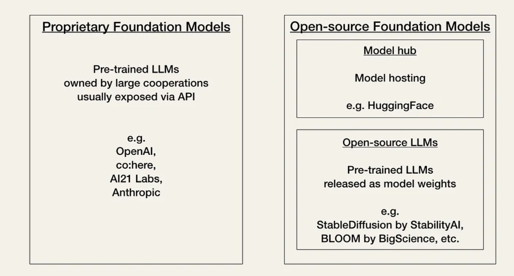

<!--
 Copyright (C) 2023 David Jones
 
 This file is part of memex.
 
 memex is free software: you can redistribute it and/or modify
 it under the terms of the GNU General Public License as published by
 the Free Software Foundation, either version 3 of the License, or
 (at your option) any later version.
 
 memex is distributed in the hope that it will be useful,
 but WITHOUT ANY WARRANTY; without even the implied warranty of
 MERCHANTABILITY or FITNESS FOR A PARTICULAR PURPOSE.  See the
 GNU General Public License for more details.
 
 You should have received a copy of the GNU General Public License
 along with memex.  If not, see <http://www.gnu.org/licenses/>.
-->

# LLM types

See also: [[AI]] 

## Choice between proprietary or open source foundation models

[Source](https://towardsdatascience.com/getting-started-with-langchain-a-beginners-guide-to-building-llm-powered-applications-95fc8898732c)

[//begin]: # "Autogenerated link references for markdown compatibility"
[AI]: AI "AI"
[//end]: # "Autogenerated link references"