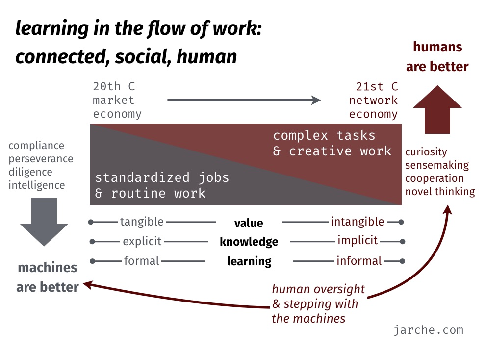

# Automation

- [[rpa-suitable-tasks]]
## Machine learning's crumbling foundations

[Article](https://doctorow.medium.com/machine-learnings-crumbling-foundations-bd11efa22b0) article from Cory Doctrow.

Starts with argument that ML "is rife with all forms of statistical malpractice". Uses failure of COVID ML models to the failure to do that hard work 
> Obtaining good data and/or cleaning up bad data is tediuous, repetitive grunt-work. It's unglamorous, time-consuming, and low-waged. Cleaning data is the equivalent of sterilizing surgical implements - vital, high-skilleed, and invisible unless someone fails to do it.
> It's work performed by anonyous, low-waged adjucts to the surgeon, who is the start of the show and how gets credit for the success of the operation

Echoes here of the automation we're doing of "ed design" work.

Links to this to "an age-old problem in automation, pre-dating computer science and even computers". Back to "scientific management" and their reliance on stats and KPIs, rather than [thick description](http://hypergeertz.jku.at/GeertzTexts/Thick_Description.htm)

> This empiricism-washing sleight of hand is endemic to ML's claims of neutrality

Mentions early-2000s move to "let domain experts produce their own tools"..."a call to seize the means of computation and program, rather than being programmed". A call that didn't happen and ended in "a week call for domain experts to be included in production"

ML has a disdain for qualitative expertise of domain experts.

### Implications

At some level RPA is an attempt to help domain experts produce their own tools, but also a recognition that standard IT has not been able to keep up with the qualitiative experience of IT users. What was meant to be a time-saving tool ends up unable to deal with the realities of context and hence the lived experience is inefficient.

But dealing with that complexity is hard, unloved, and not seen as important

## Five ways people can adapt to automation and intelligent machines

Harold Jarche [summarises](https://jarche.com/2017/02/only-humans-need-apply-review/) from [Only Humans Need Apply](https://www.amazon.com/gp/product/0062438611/) (from Thomas Davenport) idenetification of five ways (stepping) that people can adapt to automation and intelligent machines
- Step-up: directing the machine-augmented world (creativity) 
- Step-in: using machines to augment work (deep thinking) 
- Step-aside: doing human work that machines are not suited for (empathy) 
- Step narrowly: specializing narrowly in a field too small for augmentation (passion) 
- Step forward: developing new augmentation systems (curiosity)

And adds the following image, perhaps helping locate the work we're doing.

## Only Humans Need Apply

Initial search for related resources

- [Humans need not apply](https://www-degruyter-com.libraryproxy.griffith.edu.au/document/doi/10.12987/9780300216417/html)

## Robot Process Automation

- [Robotic AUtomation Process - The operating system for the digital enterprise](https://ideas.repec.org/a/vrs/poicbe/v12y2018i1p54-69n6.html)
	- nice metaphor, appears to provide overview of the field
	- it's citations could be useful

[//begin]: # "Autogenerated link references for markdown compatibility"
[rpa-suitable-tasks]: rpa-suitable-tasks "rpa-suitable-tasks"
[//end]: # "Autogenerated link references"