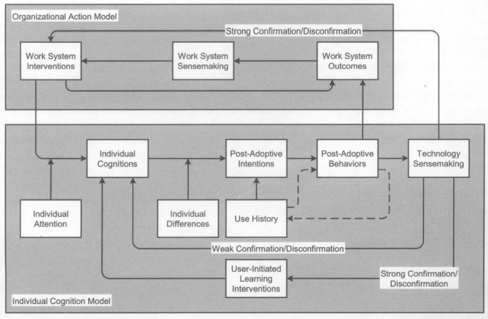

# Post adoptive behaviours

Jasperson et al (2005)
> advocate that organizations strongly consider capturing users’ post-adoptive behaviors, overtime, at a feature level of analysis (as well as the outcomes associated with these behaviors). It is only through analyzing a community’s usage patterns at a level of detail sufficient to enable individual learning (regarding both the IT application and work system) to be exposed, along with the outcomes associated with this learning, that the expectation gaps required to devise and direct interventions can themselves be exposed. Without such richness in available data, it is unlikely that organizations will realize significant improvements in their capability to manage the post-adoptive life cycle (p. 549)

    
## References

Jasperson, S., Carter, P. E., & Zmud, R. W. (2005). A Comprehensive Conceptualization of Post-Adaptive Behaviors Associated with Information Technology Enabled Work Systems. *MIS Quarterly*, *29*(3), 525-557.

## Related

- [[bricolage]]
- [Anyone capturing users' post-adoptive behaviours for the LMS? Implications?](https://djon.es/blog/2015/10/31/anyone-capturing-users-post-adoptive-behaviours-for-the-lms-implications/) - blog post 
[//begin]: # "Autogenerated link references for markdown compatibility"
[bricolage]: ../bricolage.md "Bricolage"
[//end]: # "Autogenerated link references"