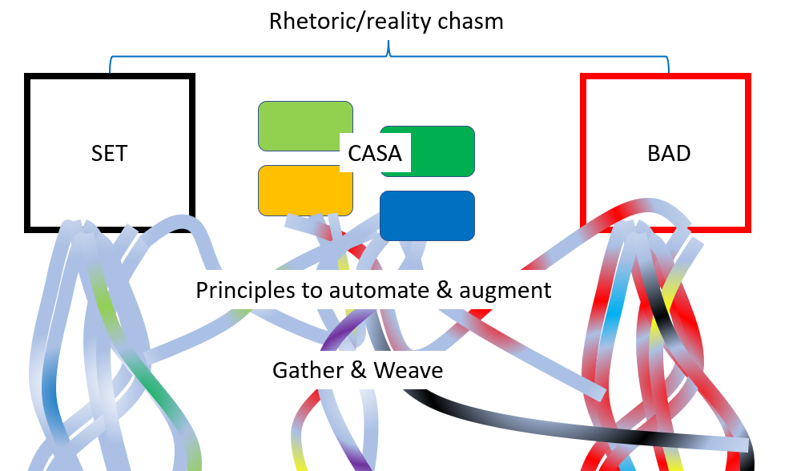

<!--
 Copyright (C) 2023 David Jones
 
 This file is part of memex.
 
 memex is free software: you can redistribute it and/or modify
 it under the terms of the GNU General Public License as published by
 the Free Software Foundation, either version 3 of the License, or
 (at your option) any later version.
 
 memex is distributed in the hope that it will be useful,
 but WITHOUT ANY WARRANTY; without even the implied warranty of
 MERCHANTABILITY or FITNESS FOR A PARTICULAR PURPOSE.  See the
 GNU General Public License for more details.
 
 You should have received a copy of the GNU General Public License
 along with memex.  If not, see <http://www.gnu.org/licenses/>.
-->

# The relationships between BAD/SET, CASA, and Gather/Weave

Over the last 10+ years colleagues and I have been reflecting on experiences trying to stretch the [[iron-triangle]]. That work has resulted in three different abstractions/mini-theories:

1. The [[bad]]/set (Bricolage, Affordances, Distribution / Strategic, Established, Tree-like) framework (Jones & Clark, 2014) and [related blog posts](https://djon.es/blog/category/bad/)
2. [[casa]] - Context Appropriate Scaffolding Assessmblages (Jones, Lawson, Beer, & Jones, 2018; Jones, 2019) and [related blog posts](https://djon.es/blog/category/casa/)
3. The idea of [[gather-weave-augment]] ([Jones, 2022](https://djon.es/blog/2022/10/10/orchestrating-entangled-relations-to-stretch-the-iron-triangle-observations-from-an-lms-migration/#poster); [Booten, Cook, & Jones, 2023](https://djon.es/blog/2023/02/09/gathers-weavers-and-augmenters-three-principles-for-dynamic-and-sustainable-delivery-of-quality-learning-and-teaching/))

The following arises from a realisation that these are related. The following is a first attempt to make that relationship explicit.

## Where and why?

This all takes place within the challenge of helping higher education institutions (HEI) grow access to higher education while maximising both quality and cost efficiency (i.e. stretch the [[iron-triangle]]). The assumption is that [[design-for-learning]] is the way to achieve this. Ellis & Goodyear (2019) identify design for learning is key for quality and student satisfaction. Goodyear (2015) argues that seeing teaching as design for learning is an effective way to stretch the iron triangle. Flowing from that is the idea that HEI's should be focused on supporting teaching as design. 

How does a HEI support teaching as design to stretch the iron triangle?

Increasingly, I'm wondering 

1. If these ideas may apply to the broader challenge of digital transformation within similar types of organisations? 
2. How to focus these principles more on [[digital-humanism]] than more corporate worries?

## BAD/SET - The current situation

The [[bad]]/SET mindsets describe two (arguably) incommensurable approaches to supporting design for learning/stretch the iron triangle. The SET mindset describes most of how/what institutions do to stretch the iron triangle. The BAD mindset describes how/what individual teachers/teaching do. We argued that there is a chasm between these two approaches and a need to interweave both (Jones & Clark, 2014)

An approach that appears to resonate (duplicate) points from [[complexity-leadership]]

## CASA - One way to bridge the gap (interweave BAD/SET)

As the name suggests - contextually-appropriate scaffolding assemblages (CASA) - are collections of practices, processes, technologies etc designed to help support a L&T activities. Collections that follow the [CASA design principles](https://djon.es/blog/2019/08/08/exploring-knowledge-reuse-in-design-for-digital-learning-tweaks-h5p-constructive-templates-and-casa/#initial-design-principles-adr-stage-4) are thought to be more effective at interweaving the SET and BAD approaches.

## How to automate/augment gathering and weaving 

The [[gather-weave-augment]] idea is based on the observation that [[design-for-learning]] needs to draw on expert knowledge from numerous fields, including contextual knowledge. That the core of supporting and doing [[design-for-learning]] is sustainably and effectively gathering and weaving disparate strands of knowledge into contextual meaningful designs. As suggested by [[entangled-pedagogy]] the ability to orchestrate these disparate strands is a key enabler.

Our recent work (Jones, 2022; Cook et al, 2023) was driven by the limitations and inefficiencies of current practices for gathering and weaving. Limitations that arguably arise because of the limitations of the BAD and SET mindsets. A failure to effectively interweave those mindsets. The most obvious symptom of this failed interweaving was the failure to effectively leverage digital technologies to automate and augment/amplify the necessary gathering and weaving. Leading us to develop a nascent set of principles for doing just that.

## References 

Ellis, R. A., & Goodyear, P. (2019). *The Education Ecology of Universities: Integrating Learning, Strategy and the Academy*. Routledge.

Jones, D., Lawson, C., Beer, C., & Jones, H. (2018). Context-Appropriate Scaffolding Assemblages: A generative learning analytics platform for end-user development and participatory design. *Companion sProceedings of the 8th International Conference on Learning Analytics and Knowledge*.

Goodyear, P. (2015). Teaching As Design. *HERDSA Review of Higher Education*, *2*, 27--50.

## References

[//begin]: # "Autogenerated link references for markdown compatibility"
[iron-triangle]: ../Design/iron-triangle "Iron Triangle"
[bad]: bad "BAD - Bricolage Affordances Distribution"
[casa]: casa "Contextually Appropriate Scaffolding Assemblages (CASA)"
[gather-weave-augment]: ../Design/gather-weave-augment "Gather, Weave, and Augment"
[design-for-learning]: ../Design/design-for-learning "Design for learning"
[digital-humanism]: ../computing/digital-humanism "Digital humanism"
[complexity-leadership]: ../Distribution/complexity-leadership "Complexity Leadership"
[entangled-pedagogy]: ../Distribution/entangled-pedagogy "Entangled Pedagogy"
[//end]: # "Autogenerated link references"