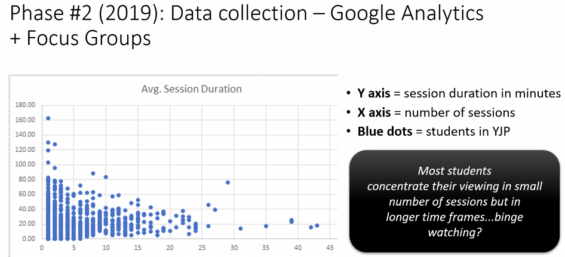

# ASCILITE 2022 - Day 3

## Connecting students with ‘industry’: A pilot implementation of authentic assessment tasks in business education

[paper](https://publications.ascilite.org/index.php/APUB/article/view/172)

Good example of an attempt to re-design assessment to add authenticity...more data required

Abstract
> Universities are continuing to encourage academics to implement more authentic assessment strategies into their teaching and learning activities to ensure that students are work-ready on graduation. Connecting students with the expectations of industry through these assessments encourages students to identify key competencies which need to be strengthened in order to ensure they are employable upon graduation. Since COVID-19 struck in early 2020, we have all had to consider how technology can assist in connecting people to continue to be able to work. This is no truer than with students and teaching staff as well as connecting students with industry. This paper reports on the implementation of a new authentic assessment project for business students where students worked both face-to-face and online to complete a major work-based project.

## Bridging education to employment through virtual experience placement

[paper](https://publications.ascilite.org/index.php/APUB/article/view/215)

Abstract
> The transition from education to employment is a pivotal point for students. Workplace experience can play a key role in a student’s transition to full-time work. Despite the important role in bridging the gap between education and employment, students’ participation in workintegrated learning (WIL) experiences varies significantly across disciplines. Through participant surveys, we examined students’ reasons for, and benefits of, undertaking WIL opportunities online through Forage: a platform facilitating access to virtual and simulated placements in partnership with employer organisations. Virtual and simulated WIL experiences have gained interest, particularly during the COVID-19 pandemic. Our findings show that virtual or simulated WIL experiences are inclusive opportunities that can assist students, including those studying in areas with a historically low prevalence of WIL, in both career and organisation exploration

[Forage](http://www.theforage.com/) - free for students 

Library of job simulations that can be used.   A simulation gives detail about working in a particular company and engage in tasks.  Tasks are given via multimedia resources which apparently include real staff.  Students complete the task and can get access to a sample model answer which is annotated....apparently completed by a real staff.  The students are asked to reflect on their performance.

Will provide certificates from company also connection with LinkedIn

Reporting on data from millions of students from Forage (provided to researchers). Forage also ran survey.

  

  

## The Youth Justice Portal and Transformative Digital Education in Criminology

[paper](https://publications.ascilite.org/index.php/APUB/article/view/106)

Abstract
> The ideas in this paper explore how learning design intentions developed by academics, practitioners and learning designers, intersect with students’ development of pre-professional identities (PPI) in the field of youth justice. We propose a theoretical framework built on Activity Theory that situates the learning environment as a set of two activity systems – teachers and students – that come together through a boundary object called the ‘Youth Justice Portal’. The portal is the main avenue through which teaching, and learning takes place, and we examine how the technical and theoretical framework that we have adopted can be applied in open-ended domains that require the development of students’ PPI. The practical implications related to the adoption of the model in disciplines which require placement-based learning opportunities are discussed.

Seeking a digital form of WIL. - [Youth Justice Portal](https://lf.westernsydney.edu.au/p/videowall/2/index.html?d=data/youth-justice.json)

Data is in JSON - portal is portable and scaleable.  Nodes are semantic categories. 

At first glance it is a portal to a series of videos.   But it is used as a form of dialogic learning - displacing the lecture.

  

- Some binge viewing going on
- Also during assessment
- Not matching the learning design of the portal

Activity theory used to disconnect

  

Scalability - data divorced from 'presentation' layer is seen as a contribution
